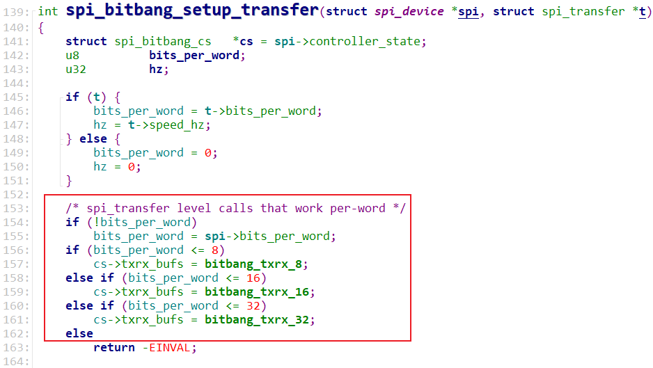
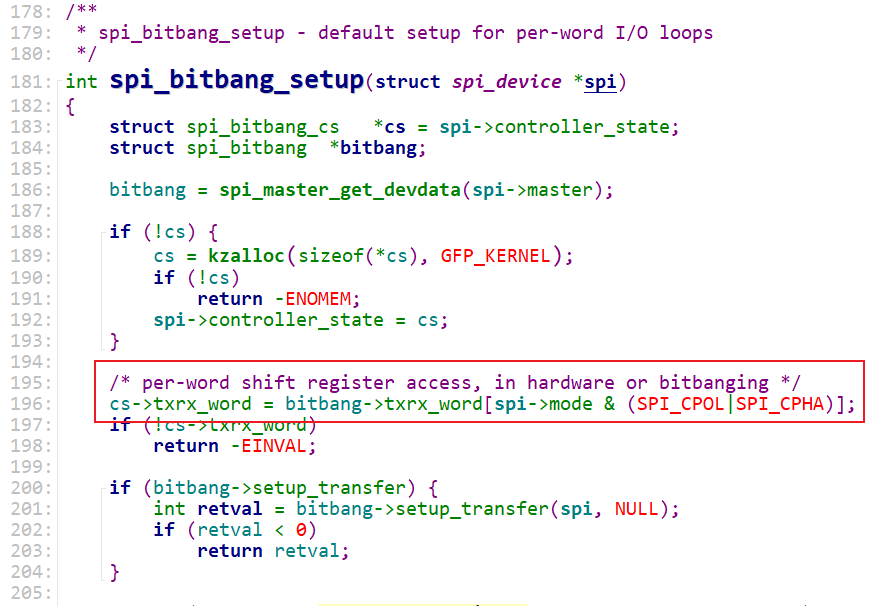
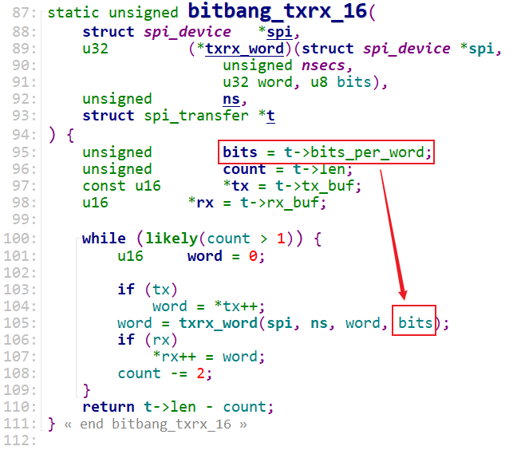
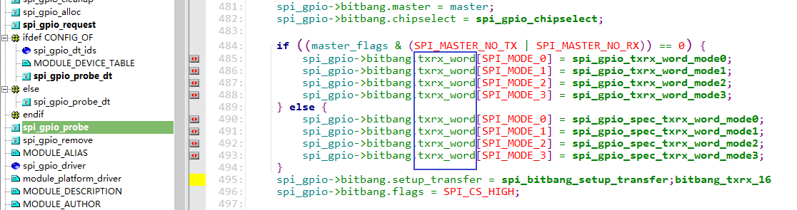
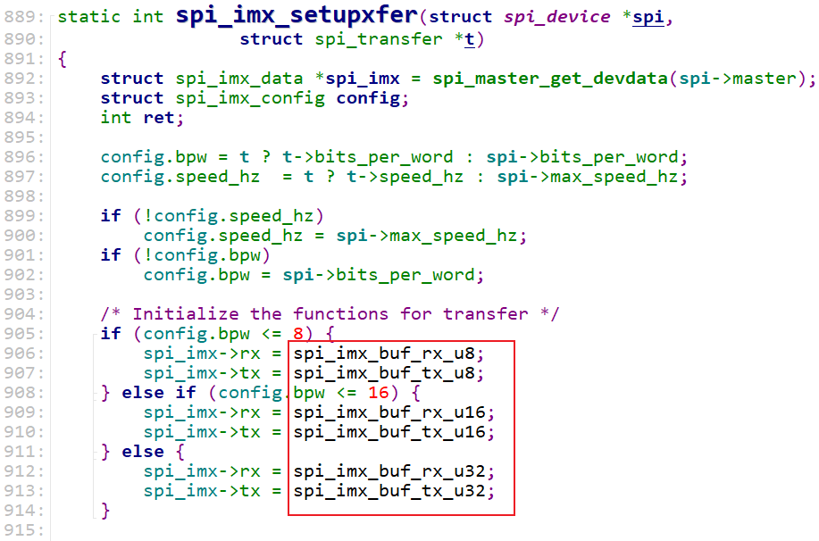

# 临时笔记 #

参考资料：

* 内核头文件：`include\linux\spi\spi.h`


## 1. SPI Master

文件：`drivers\spi\spi-gpio.c`

```c
	spi_gpio = spi_master_get_devdata(master);

	master = spi_alloc_master(...);

	master->bits_per_word_mask = SPI_BPW_RANGE_MASK(1, 32);
	master->flags = master_flags;
	master->bus_num = pdev->id;
	master->num_chipselect = num_devices;
	master->setup = spi_gpio_setup;
	master->cleanup = spi_gpio_cleanup;

	status = of_get_named_gpio(np, "cs-gpios", i);
	spi_gpio->cs_gpios[i] = status;

	spi_gpio->bitbang.master = master;
	spi_gpio->bitbang.chipselect = spi_gpio_chipselect;

	if ((master_flags & (SPI_MASTER_NO_TX | SPI_MASTER_NO_RX)) == 0) {
		spi_gpio->bitbang.txrx_word[SPI_MODE_0] = spi_gpio_txrx_word_mode0;
		spi_gpio->bitbang.txrx_word[SPI_MODE_1] = spi_gpio_txrx_word_mode1;
		spi_gpio->bitbang.txrx_word[SPI_MODE_2] = spi_gpio_txrx_word_mode2;
		spi_gpio->bitbang.txrx_word[SPI_MODE_3] = spi_gpio_txrx_word_mode3;
	} else {
		spi_gpio->bitbang.txrx_word[SPI_MODE_0] = spi_gpio_spec_txrx_word_mode0;
		spi_gpio->bitbang.txrx_word[SPI_MODE_1] = spi_gpio_spec_txrx_word_mode1;
		spi_gpio->bitbang.txrx_word[SPI_MODE_2] = spi_gpio_spec_txrx_word_mode2;
		spi_gpio->bitbang.txrx_word[SPI_MODE_3] = spi_gpio_spec_txrx_word_mode3;
	}
	spi_gpio->bitbang.setup_transfer = spi_bitbang_setup_transfer;
	spi_gpio->bitbang.flags = SPI_CS_HIGH;

	status = spi_bitbang_start(&spi_gpio->bitbang);

```


## 2. spi_bitbang_start

```c
	if (master->transfer || master->transfer_one_message)
		return -EINVAL;

	master->prepare_transfer_hardware = spi_bitbang_prepare_hardware;
	master->unprepare_transfer_hardware = spi_bitbang_unprepare_hardware;
	master->transfer_one = spi_bitbang_transfer_one;
	master->set_cs = spi_bitbang_set_cs;

	if (!bitbang->txrx_bufs) {
		bitbang->use_dma = 0;
		bitbang->txrx_bufs = spi_bitbang_bufs;
		if (!master->setup) {
			if (!bitbang->setup_transfer)
				bitbang->setup_transfer =
					 spi_bitbang_setup_transfer;
			master->setup = spi_bitbang_setup;
			master->cleanup = spi_bitbang_cleanup;
		}
	}

	ret = spi_register_master(spi_master_get(master));

```


## 3. spi_register_master

```c
	status = of_spi_register_master(master);

	/* If we're using a queued driver, start the queue */
	if (master->transfer)
		dev_info(dev, "master is unqueued, this is deprecated\n");
	else {
		status = spi_master_initialize_queue(master);
		if (status) {
			device_del(&master->dev);
			goto done;
		}
	}

```


## 4. spi_master_initialize_queue

```c
static int spi_master_initialize_queue(struct spi_master *master)
{
	int ret;

	master->transfer = spi_queued_transfer;
	if (!master->transfer_one_message)
		master->transfer_one_message = spi_transfer_one_message;

	/* Initialize and start queue */
	ret = spi_init_queue(master);
	if (ret) {
		dev_err(&master->dev, "problem initializing queue\n");
		goto err_init_queue;
	}
	master->queued = true;
	ret = spi_start_queue(master);
	if (ret) {
		dev_err(&master->dev, "problem starting queue\n");
		goto err_start_queue;
	}

	return 0;

err_start_queue:
	spi_destroy_queue(master);
err_init_queue:
	return ret;
}

```


## 5. spi_init_queue

```c
	kthread_init_worker(&master->kworker);
	master->kworker_task = kthread_run(kthread_worker_fn,
					   &master->kworker, "%s",
					   dev_name(&master->dev));

	kthread_init_work(&master->pump_messages, spi_pump_messages);

```


## 6. spi_start_queue

```c
	kthread_queue_work(&master->kworker, &master->pump_messages);
```


## 7. SPI传输

```c
spi_sync
    __spi_sync
    	message->complete = spi_complete;
		
		if (master->transfer == spi_queued_transfer) {
            status = __spi_queued_transfer(spi, message, false);
				list_add_tail(&msg->queue, &master->queue);
			__spi_pump_messages(master, false);            
                kthread_queue_work(&master->kworker,
                           &master->pump_messages);
            		spi_pump_messages
                        __spi_pump_messages(master, true);
            				ret = master->transfer_one_message(master, master->cur_msg);
            					spi_transfer_one_message
									spi_set_cs(msg->spi, true);
									reinit_completion(&master->xfer_completion);
									ret = master->transfer_one(master, msg->spi, xfer);
            								spi_bitbang_transfer_one
												status = bitbang->txrx_bufs(spi, transfer);
            										spi_bitbang_bufs
                                    ms = wait_for_completion_timeout(&master->xfer_completion,
                                                     msecs_to_jiffies(ms));	                     									spi_finalize_current_message(master);
			wait_for_completion(&done);            
        } else {
            status = spi_async_locked(spi, message);
            	__spi_async
                    return master->transfer(spi, message);
        }
```


## 8. spi_bitbang_bufs

```c
	return cs->txrx_bufs(spi, cs->txrx_word, nsecs, t);
```







## 9. bitbang_txrx_16




上图里的txrx_word来自哪里？spi_master在传输spi_transfer之前要设置。

对于SPI GPIO：




对于IMX：

