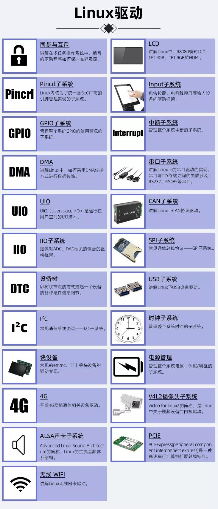
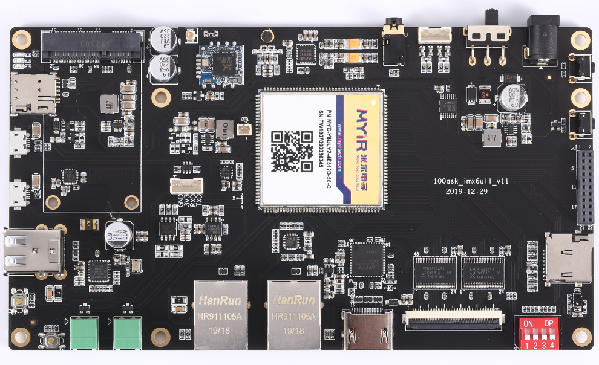
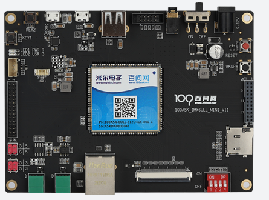
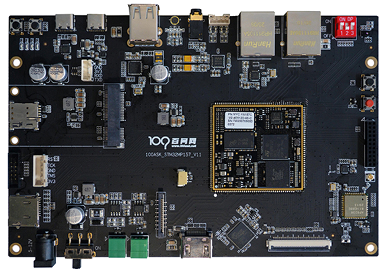

# Linux驱动开发与使用大全
## 1. 课程介绍

这是连载课程，会涉及如下内容：




## 2. 适用单板

本教程支持三款开发板：100ASK_IMX6ULL pro、100ASK_IMX6ULL mini emmc、100ASK_STM32MP157  pro。

* 100ASK_IMX6ULL pro：全功能版




* 100ASK_IMX6ULL mini emmc

  


* 100ASK_STM32MP157  pro：全功能版

  


## 3. 资料下载

先去https://gitforwindows.org/下载Windows版本的git工具。

安装、启动Git Bash。

然后执行命令：

```
git clone https://e.coding.net/weidongshan/linux/doc_and_source_for_drivers.git
```


为了方便记忆，上述地址都放在百问网下载中心：http://download.100ask.net/


## 4. 观看视频

* 官网：http://www.100ask.net
* 微信小程序：搜“韦东山”

  

## 5. 更新记录

* 2020.06.18 完结"同步与互斥"

* 2021.01.05 正式启动"驱动大全"的录制，发布"LCD驱动"

* 2021.01.11 发布"LCD驱动"：07\_硬件\_8080接口LCD时序分析、08\_硬件\_TFT-RGB接口LCD时序分析 

* 2021.01.14 发布"LCD驱动"：09\_硬件\_IMX6ULL的LCD控制器、09\_硬件\_STM32MP157的LCD控制器 

* 2021.01.15 发布"LCD驱动"：10\_分析内核自带的LCD驱动程序\_基于IMX6ULL

* 2021.01.20 发布"LCD驱动"：10\_分析内核自带的LCD驱动程序\_基于STM32MP157

* 2021.01.21 发布"LCD驱动"：11\_编程\_LCD驱动程序框架\_使用设备树

* 2021.01.21  发布"LCD驱动"：12\_编程\_引脚配置\_基于IMX6ULL

* 2021.01.22  发布"LCD驱动"：12\_编程\_配置引脚\_基于STM32MP157

* 2021.01.23  发布"LCD驱动"：13\_编程\_时钟配置\_基于IMX6ULL

* 2021.01.25  发布"LCD驱动"：13\_编程\_时钟配置\_基于STM32MP157

* 2021.01.25  发布"LCD驱动"：14\_编程\_LCD控制器配置之获得LCD参数\_通用

* 2021.01.27  发布"LCD驱动"：15\_编程\_配置LCD控制器之寄存器操作\_基于IMX6ULL

* 2021.01.28  发布"LCD驱动"：16\_上机实验\_基于IMX6ULL

* 2021.01.29  发布"LCD驱动"：17\_单Buffer的缺点与改进方法

* 2021.02.01  发布"LCD驱动"：18\_编写使用多buffer的应用程序

* 2021.02.03  发布"LCD驱动"：
  * 15\_编程_配置LCD控制器之寄存器操作\_基于STM32MP157
  * 16\_上机实验\_基于STM32MP157
  * 18\_STM32MP157内核自带的LCD驱动不支持多buffer
  
* 2021.02.20 发布"I2C系统"：01_I2C视频介绍

* 2021.02.22 发布"I2C系统"：02_I2C协议

* 2021.02.23 发布"I2C系统"：03_I2C系统的重要结构体

* 2021.02.24 发布"I2C系统"：
  
  * 发布新教程：03_SMBus协议
  
* 把之前的`03_I2C系统的重要结构体`改名为`04_I2C系统的重要结构体`
  
* 2021.02.25 发布"I2C系统"：

  * 修改：03_SMBus协议，增加了I2C Block Read/Write
  * 新增：05\_无需编写驱动直接访问设备\_I2C-Tools介绍
  * 新增：06_编写APP直接访问EEPROM
  
* 2021.02.27 发布"I2C系统"：
  
  * 07_通用驱动i2c-dev分析
  * 08_I2C系统驱动程序模型
  
* 2021.03.01 发布"I2C系统"：09_编写设备驱动之i2c_driver
  
* 2021.03.01 发布"I2C系统"：10_编写设备驱动之i2c_client
  
* 2021.03.05 发布"I2C系统"：11_I2C_Adapter驱动框架讲解与编写
  
* 2021.03.11 发布"I2C系统"：12\_完善虚拟的I2C_Adapter驱动并模拟EEPROM
  
* 2021.03.12 发布"I2C系统"：13_使用GPIO模拟I2C的驱动程序分析
  
* 2021.03.13 发布"I2C系统"：

  ```shell
  14_使用GPIO操作I2C设备_基于IMX6ULL
  14_使用GPIO操作I2C设备_基于STM32MP157
  ```

* 2021.03.15 完结"I2C系统"，发布：15_具体芯片的I2C_Adapter驱动分析

* 2021.03.23 发布"Input子系统"：01_Input子系统视频介绍

* 2021.03.23 发布"Input子系统"：

  ```shell
  02_先学习输入系统应用编程
  APP_01.输入系统框架及调试
  APP_02.现场编程读取获取输入设备信息
  APP_03.查询_休眠唤醒_方式读取输入数据
  APP_04.POLL_SELECT_方式读取输入数据
  APP_05.异步通知方式读取输入数据
  APP_06.电阻屏和电容屏
  APP_07.tslib框架分析
  APP_08.tslib交叉编译与测试
  APP_09.编写基于tslib的测试程序
  ```
  
* 2021.03.25 发布"Input子系统"：DRV_01_Input子系统框架详解
  
* 2021.03.26 发布"Input子系统"：DRV_02_编写input_dev驱动框架
  
* 2021.03.29 发布"Input子系统"：
  
  ```shell
  DRV_03_编写最简单的触摸屏驱动程序之IRQ_基于QEMU
  DRV_04_编写最简单的触摸屏驱动程序之完善_基于QEMU
  ```
  
* 2021.03.31 发布"Input子系统"：
  
  ```shell
  DRV_05_GPIO按键驱动分析与使用
  DRV_06_I2C接口触摸屏驱动分析
  ```
  
* 2021.04.02 发布、完结"Input子系统"：DRV_07_UInput分析_用户态创建input_dev
  
* 2021.04.30 发布"Pinctrl子系统"：
  
  ```shell
  01_Pinctrl子系统视频介绍
  02_使用Pinctrl要掌握的重要概念
  ```
  
* 2021.04.30 发布"Pinctrl子系统"：
  
  ```shell
  03_Pinctrl子系统使用示例_基于IMX6ULL
  03_Pinctrl子系统使用示例_基于STM32MP157
  ```
  
  
  
* 2021.05.06 发布"Pinctrl子系统"：04_Pinctrl子系统主要数据结构
  
* 2021.05.12 发布"Pinctrl子系统"：
  
  ```shell
  05_Pincontroller构造过程情景分析_基于IMX6ULL
  05_Pincontroller构造过程情景分析_基于STM32MP157
  ```
  
* 2021.05.13 发布"Pinctrl子系统"：
  
  ```shell
  06_client端使用pinctrl过程的情景分析_基于IMX6ULL
  06_client端使用pinctrl过程的情景分析_基于STM32MP157
  ```
  
* 2021.05.14 发布"Pinctrl子系统"：
  
  ```shell
  07_编写虚拟的Pinctrl驱动程序之实现框架
  08_编写虚拟的Pinctrl驱动程序之设置pinctrl_desc
  09_编写虚拟的Pinctrl驱动程序之处理设备树
  ```
  
* 2021.05.15 完结"Pinctrl子系统"：
  
  ```shell
  10_调试虚拟的Pinctrl驱动程序
  ```
  
  
  
* 2021.05.26 开始发布"GPIO子系统": 
  
  ```shell
  01_GPIO子系统视频介绍
  02_使用GPIO子系统要掌握的重要概念
  03_基于GPIO子系统的LED驱动程序
  04_在100ASK_IMX6ULL上机实验
  04_在100ASK_STM32MP157上机实验
  ```
  
* 2021.05.27 发布"GPIO子系统": 
  
  ```shell
  05_GPIO子系统层次与数据结构
  ```
  
* 2021.05.28 发布"GPIO子系统": 

  ```shell
  06_IMX6ULL的GPIO驱动源码分析
  06_STM32MP157的GPIO驱动源码分析
  07_编写一个虚拟GPIO控制器的驱动程序
  08_调试与使用虚拟的GPIO控制器
  ```
  
* 2021.05.29 完结"GPIO子系统": 

  ```shell
  09_GPIO子系统与Pinctrl子系统的交互
  10_编程_GPIO使用Pinctrl
  11_GPIO子系统的sysfs接口
  ```

* 2021.06.12 发布"Interrupt子系统"

  ```shell
  01_异常与中断的概念及处理流程
  02_进程线程中断的核心_栈
  03_Linux系统对中断处理的演进
  04_Linux中断系统中的重要数据结构
  05_在设备树中指定中断_在代码中获得中断
  06_编写使用中断的按键驱动程序
  07_IMX6ULL设备树修改及上机实验
  07_STM32MP157设备树修改及上机实验
  ```

* 2021.06.25 发布"Interrupt子系统"

  ```shell
  08_中断相关的其他驱动程序
  09_中断的硬件框架
  10_GIC介绍与编程
  ```
  
* 2021.06.26 发布"Interrupt子系统"

  ```shell
   11_异常向量表的安装与调用
  ```
  
* 2021.06.28 发布"Interrupt子系统"

  ```shell
  12_GIC驱动程序对中断的处理流程
  13_GIC驱动程序分析
  ```

* 2021.07.03  发布"Interrupt子系统"

  ```shell
  14_两类中断控制器处理流程_链式和层级
  15_链式中断控制器驱动程序编写
  ```

* 2021.07.04  发布"Interrupt子系统"

  ```shell
  16_legacy方式代码的上机实验
  ```

* 2021.07.05  发布"Interrupt子系统"

  ```shell
  17_链式中断控制器驱动程序编写_linear方式
  18_层级中断控制器驱动程序编写
  19_层级中断控制器驱动程序上机实验
  ```

* 2021.07.12  发布"UART子系统"

  ```shell
  01_UART子系统视频介绍
  02_硬件知识_UART硬件介绍
  ```

* 2021.07.14  发布"UART子系统"

  ```shell
  03_TTY体系中设备节点的差别
  ```
  
* 2021.07.16 发布"UART子系统"

  ```shell
  04_TTY驱动程序框架
  ```

* 2021.07.19 发布"UART子系统"

  ```shell
  5a_在STM32MP157上做串口实验的准备工作
  05_Linux串口应用编程_回环
  06_Linux串口应用编程_GPS
  ```

* 2021.07.21 发布"UART子系统"

  ```shell
  07_字符设备驱动程序的另一种注册方法
  ```
  
* 2021.07.22 发布"UART子系统"

  ```shell
  08_UART驱动情景分析_注册
  ```

* 2021.07.26 发布"UART子系统"

  ```shell
  09_UART驱动情景分析_open
  10_UART驱动情景分析_read
  11_UART驱动情景分析_write
  ```

* 2021.07.30 发布"UART子系统"

  ```shell
  12_UART驱动调试方法
  13_编写虚拟UART驱动程序_框架
  ```
  
* 2021.08.02 发布"UART子系统"

  ```shell
  14_编写虚拟UART驱动程序_实现uart_ops
  ```

* 2021.08.04 发布"UART子系统"

  ```shell
  15_编写虚拟UART驱动程序_实现数据传输
  ```
  
* 2021.08.06 发布"UART子系统"

  ```shell
  16_编写虚拟UART驱动程序_调试
  ```
  
* 2021.08.12 发布"UART子系统"

  ```shell
  17_printk执行过程
  ```

* 2021.08.16 发布"UART子系统"

  ```shell
  18_console驱动注册过程
  19_编写console驱动
  20_early_printk和earlycon
  ```
  
* 2021.08.17 完结"UART子系统"

  ```shell
  21_RS485简单讲解
  ```
  
* 2021.10.11 发布"PCI和PCIe子系统"

  ```shell
  01_从软件开发角度看待PCI和PCIe
  ```
  
* 2021.10.29 发布"PCI和PCIe子系统"

  ```shell
  02_PCI设备的访问方法_非桥设备(type0)
  ```
  
* 2021.11.01 发布"PCI和PCIe子系统"

  ```shell
  03_PCI设备的访问方法_桥设备(type1)
  ```
  
* 2021.11.11 发布"PCI和PCIe子系统"

  ```shell
  04_从软件角度看PCIe设备的硬件结构
  ```
  
* 2021.11.18 发布"PCI和PCIe子系统"

  ```shell
  05_PCIe设备的配置过程
  ```

* 2021.11.30 发布"PCI和PCIe子系统"

  ```shell
  06_PCIe路由方式
  ```
  
* 2021.12.29 发布"PCI和PCIe子系统"

  ```shell
  07_PCI驱动程序框架
  ```
  
* 2021.12.31 发布"PCI和PCIe子系统"

  ```shell
  08_RK3399_PCIe芯片手册解读
  ```
  
* 2022.01.02 发布"PCI和PCIe子系统"

  ```shell
  09_RK3399_PCIe_Host驱动分析_地址映射
  ```
  
* 2022.01.06 发布"PCI和PCIe子系统"

  ```shell
  10_RK3399_PCIe_Host驱动分析_设备枚举
  ```
  
* 2022.01.17 发布"PCI和PCIe子系统"

  ```shell
  11_INTx_MSI_MSIX三种中断机制分析
  ```
  
* 2022.01.20 发布"PCI和PCIe子系统"

  ```shell
  12_INTx中断机制源码分析
  ```
  
* 2022.01.25 发布"PCI和PCIe子系统"

  ```shell
  13_GICv3_LPI机制
  ```
  
* 2022.01.26 完结"PCI和PCIe子系统"

  ```shell
  14_MSI_MSI-X中断之体验与使用
  15_MSI_MSI-X中断之源码分析
  16_怎么编写PCIe设备驱动程序
  ```

* 2021.02.16 发布"SPI子系统"：

  ```shell
  01_SPI视频概述
  02_SPI协议介绍
  ```
  
* 2021.02.24 发布"SPI子系统"：

  ```shell
  03_SPI总线设备驱动模型
  ```

* 2021.03.07 发布"SPI子系统"：

  ```shell
  04_SPI设备树处理过程
  ```

* 2021.03.09 发布"SPI子系统"：

  ```shell
  05_spidev的使用(SPI用户态API)
  ```

* 2021.03.10 发布"SPI子系统"：

  ```shell
  06_使用spidev操作SPI_DAC模块
  ```

  

## 6. 联系方式

* 官网：http://www.100ask.net

* 淘宝：http://100ask.taobao.com

* 微信小程序：搜“韦东山”

* 公众号：
  

  


```

```