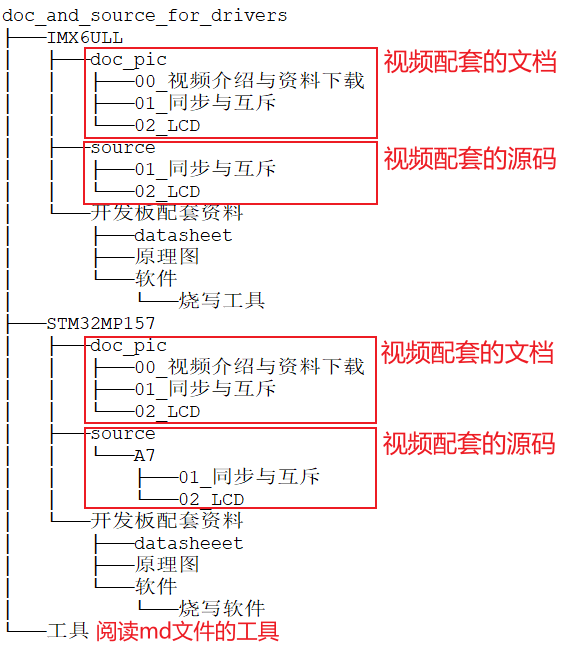
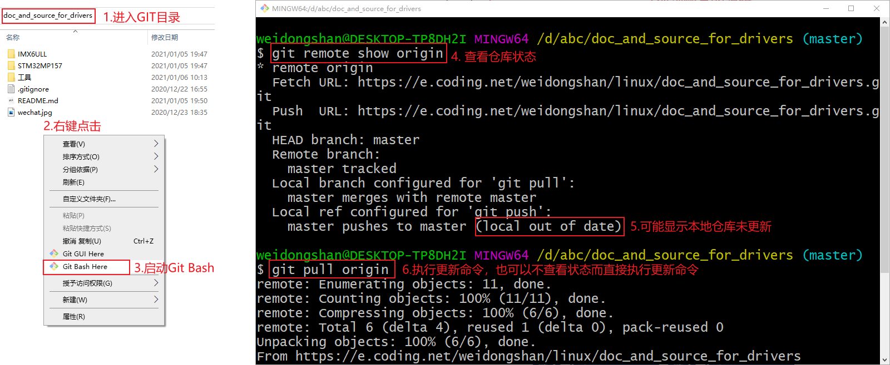
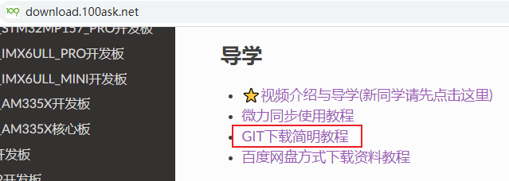

## 视频学习与资料下载

### 1. 准备工作

先去https://gitforwindows.org/下载Windows版本的git工具。


### 2. 想从单片机入门

请根据"单片机RTOS必备/硬件编程"的视频进行学习：

* 官网：http://www.100ask.net
* 微信小程序：搜"韦东山"，找到"韦东山嵌入式随身课堂"


### 3. 不想从单片机入门

#### 3.1 先搭建环境、学习入门课程

请根据"Linux系列教程之快速入门"的视频进行学习：

* 官网：http://www.100ask.net
* 微信小程序：搜"韦东山"，找到"韦东山嵌入式随身课堂"


#### 3.2 再学习驱动大全

##### 3.2.1 前先下载资料

  启动Git Bash后执行命令：

```
git clone https://e.coding.net/weidongshan/linux/doc_and_source_for_drivers.git
```

这个地址可以从下载中心看到：http://download.100ask.net
下载到的GIT仓库内容如下：



##### 3.2.2 更新GIT仓库

本教程是连载的，GIT仓库会随时更新。
你下载到GIT仓库后，最好不要修改里面的内容。
要更新GIT仓库，如下图操作即可：



上图中涉及的GIT命令为：

```shell
git remote show origin  // 查看状态
git pull origin         // 更新GIT仓库
```


GIT命令更详细的教程，可以参考：



##### 3.2.3 学习视频

然后照着"Linux系列教程之驱动大全"的视频学习：

  * 官网：http://www.100ask.net
  * 微信小程序：搜"韦东山"，找到"韦东山嵌入式随身课堂"


