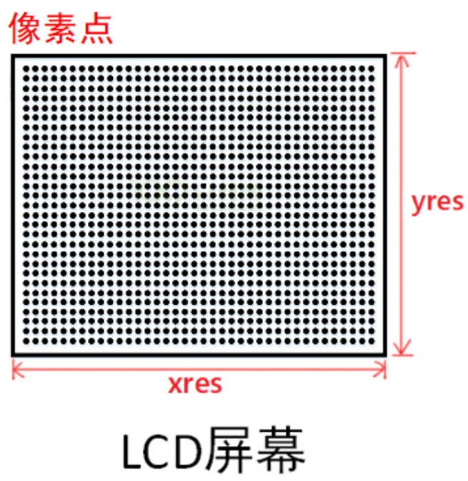
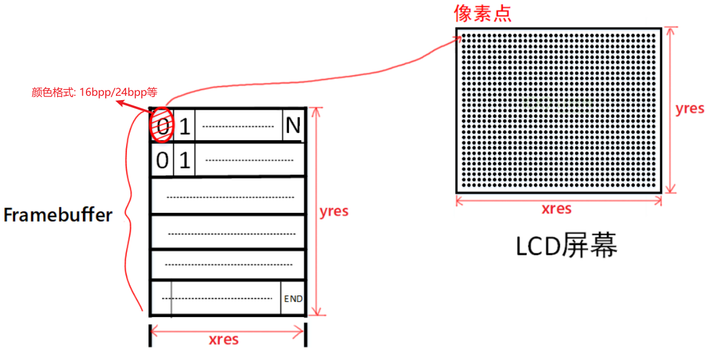
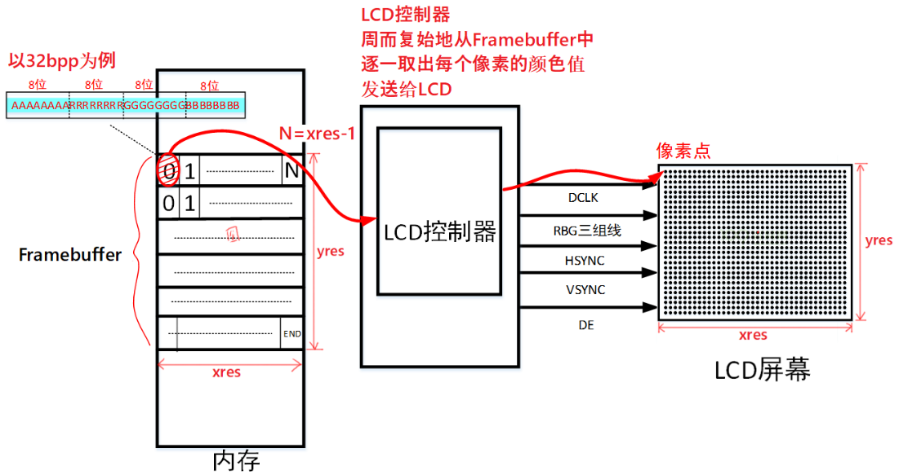
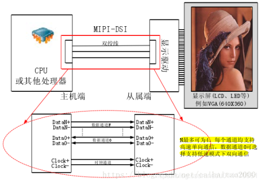

## 不同接口的LCD硬件操作原理

参考资料：

* MIPI-DSI、MIPI-CSI、LVDS等接口解析：https://blog.csdn.net/u014470361/article/details/88891255
* ILI9488驱动芯片数据手册.pdf

### 1. 应用工程师眼里看到的LCD

LCD由一个一个像素组成：每行有xres个像素，有yres行，它的分辨率是：xres * yres。

只要我们能控制任意一个像素的颜色，就可以在LCD上绘制文字、图片。

#### 1.1 像素的颜色怎么表示

用红绿蓝三颜色来表示，可以用24位数据来表示红绿蓝，也可以用16位等等格式，比如：

* bpp：bits per pixel，每个像素用多少位来表示
* 24bpp：实际上会用到32位，其中8位未使用，其余24位中分别用8位表示红(R)、绿(G)、蓝(B)
* 16bpp：有rbg565，rgb555
  * rgb565：用5位表示红、6位表示绿、5位表示蓝
  * rgb555：16位数据中用5位表示红、5位表示绿、5位表示蓝，浪费一位

#### 1.2 怎么把颜色发给LCD

假设每个像素的颜色用16位来表示，那么一个LCD的所有像素点假设有xres * y res个，
需要的内存为：xres * yres * 16 / 8，也就是要设置所有像素的颜色，需要这么大小的内存。
这块内存就被称为framebuffer：

* Framebuffer中每块数据对应一个像素
* 每块数据的大小可能是16位、32位，这跟LCD上像素的颜色格式有关
* 设置好LCD硬件后，只需要把颜色数据写入Framebuffer即可

### 2. 驱动工程师眼里看到的LCD

驱动工程师对LCD的理解要深入硬件，比如要回答这几个问题：

* Framebuffer在哪里？
* 谁把Framebuffer中的数据发给LCD？

#### 2.1 统一的LCD硬件模型

#### 2.2 MCU常用的8080接口LCD模组

#### 2.3 MPU常用的TFT RGB接口

#### 2.4 有一个MIPI标准

**MIPI**表示`Mobile Industry Processor Interface`，即移动产业处理器接口。是MIPI联盟发起的为移动应用处理器制定的开放标准和一个规范。主要是手机内部的接口（摄像头、显示屏接口、射频/基带接口）等标准化，从而减少手机内部接口的复杂程度及增加设计的灵活性。

对于LCD，MIPI接口可以分为3类：

* MIPI-DBI (Display Bus Interface)  
  
  * 既然是Bus(总线)，就是既能发送数据，也能发送命令，常用的8080接口就属于DBI接口。
  
  * Type B (i-80 system), 8-/9-/16-/18-/24-bit bus  
  * Type C (Serial data transfer interface, 3/4-line SPI)  
* MIPI-DPI (Display Pixel Interface)  
  
  * Pixel(像素)，强调的是操作单个像素，在MPU上的LCD控制器就是这种接口
  
  * Supports 24 bit/pixel (R: 8-bit, G: 8-bit, B: 8-bit)
  * Supports 18 bit/pixel (R: 6-bit, G: 6-bit, B: 6-bit)
  * Supports 16 bit/pixel (R: 5-bit, G: 6-bit, B: 5-bit)  
  
* MIPI-DSI (Display Serial Interface)  
  * Serial，相比于DBI、DPI需要使用很多接口线，DSI需要的接口线大为减少
  * Supports one data lane/maximum speed 500Mbps
  * Supports DSI version 1.01
  * Supports D-PHY version 1.00  
    

