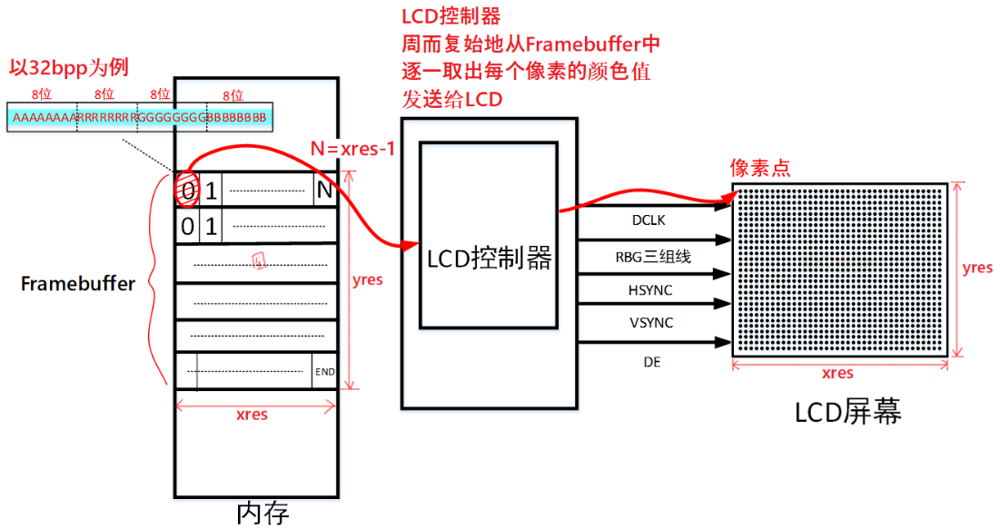

## 最简单的LCD驱动\_基于QEMU

本节视频对应源码在GIT仓库中，位置如下(这2个文件是完全一样的)：

```shell
doc_and_source_for_drivers\STM32MP157\source\A7\03_LCD\02_lcd_drv_qemu\lcd_drv.c
或：
doc_and_source_for_drivers\IMX6ULL\source\03_LCD\02_lcd_drv_qemu\lcd_drv.c
```

目前百问网主推的开发板是IMX6ULL、STM32MP157。
但是也推出了一块虚拟的开发板：IMX6ULL_QEMU，原因有2：

* 降低学习成本
  * 初学阶段，可以不买开发板，使用QEMU即可入门。
* 深入学习内核及驱动
  * 使用QEMU可以非常方便地调试内核、查看驱动程序执行过程
  * 有助于深入研究内核及驱动


后面的视频里，会使用QEMU来讲解某些驱动程序。
**注意**：

* 使用QEMU不是必须的
* QEMU只是提供另一个角度的学习方法，比如：
  * LCD驱动：使用QEMU可以时，可以简化硬件的操作
  * 中断子系统：可以跟踪调用过程
* 你可以只看QEMU相关的视频，不使用QEMU来操作
* 在真实的开发板上讲解的内容，会覆盖QEMU视频的知识

### 1. 为什么要用QEMU

Linux驱动 = 驱动框架 + 硬件操作。
如果硬件操作足够简单，我们就可以把精力放在驱动程序的框架上，这才是Linux的核心。
看看真实的LCD连线：


对于硬件操作，你至少要做这些事情：

* 设置引脚用于LCD
* 阅读LCD手册，阅读LCD控制器手册，根据LCD参数设置LCD控制器
  * 设置LCD控制器时，你还需要了解所用的主控芯片的时钟系统
* 分配Framebuffer，把Framebuffer地址告诉LCD控制器

总之，非常复杂。如果你换了芯片，这些工作又得重来一次。
如果你本身已经对阅读芯片手册很熟悉，对硬件操作很熟悉，那么学习时没必要把时间浪费在这方面。
使用QEMU，虚拟出一款简单的LCD控制器，可以简化硬件操作，让我们把精力放在驱动框架上。


### 2. LCD相关的芯片手册

#### 2.1 虚拟的LCD控制器手册

百问网修改了QEMU的源码，实现了一个虚拟的LCD控制器，它的操作很简单。
只有4个寄存器，手册如下：

| 地址       | 寄存器       | 说明                             |
| ---------- | ------------ | -------------------------------- |
| 0x021C8000 | fb_base_phys | 用于设置Framebuffer的物理地址    |
| 0x021C8004 | fb_xres      | 用于设置Framebuffer的X方向分辨率 |
| 0x021C8008 | fb_yres      | 用于设置Framebuffer的Y方向分辨率 |
| 0x021C800C | fb_bpp       | 用于设置Framebuffer中像素的位宽  |


#### 2.2虚拟的LCD芯片参数

目前这款虚拟的LCD分辨率为500x300,16bpp。暂时未支持其他参数。


### 3. 修改LCD驱动程序添加硬件操作


### 4. 下载、安装、运行QEMU

参考：`http://wiki.100ask.org/Qemu`


### 5. 下载、编译内核

参考：`http://wiki.100ask.org/Qemu`


### 6. 替换LCD驱动程序