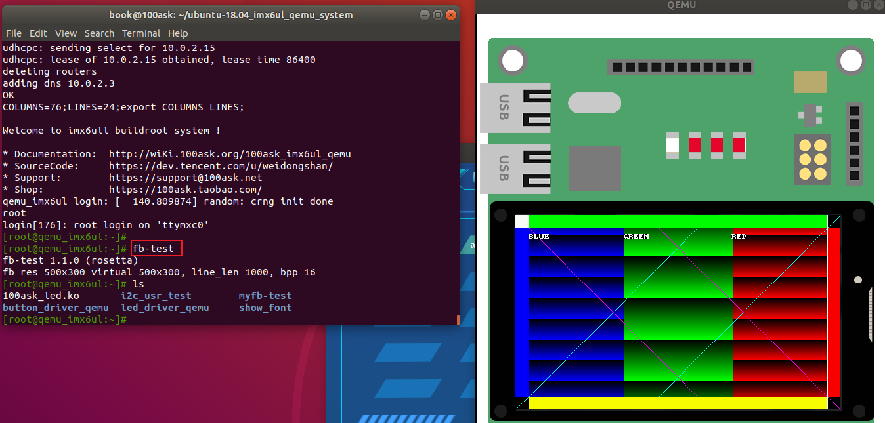

## 上机实验\_基于QEMU

前提：**安装了VMware，运行百问网提供的Ubuntu 18.04**
本节视频对应源码在GIT仓库中，位置如下(这2个文件是完全一样的)：

```shell
doc_and_source_for_drivers\STM32MP157\source\A7\03_LCD\03_lcd_drv_qemu_ok\lcd_drv.c
或：
doc_and_source_for_drivers\IMX6ULL\source\03_LCD\03_lcd_drv_qemu_ok\lcd_drv.c
```


### 1. 下载、安装、运行QEMU

参考：`http://wiki.100ask.org/Qemu`

#### 1.1 下载百问网制作的QEMU

* 下载

在Ubuntu 18.04系统中，执行如下命令，可以得到一个目录`ubuntu-18.04_imx6ul_qemu_system`：

```shell
git  clone  https://e.coding.net/weidongshan/ubuntu-18.04_imx6ul_qemu_system.git
```


* 安装SDL

下载成功后，进入`ubuntu-18.04_imx6ul_qemu_system`目录，执行`install_sdl.sh`，如下所示：

```shell
cd ~/ubuntu-18.04_imx6ul_qemu_system/
book@100ask:~/ubuntu-18.04_imx6ul_qemu_system$ ls
imx6ull-system-image  install_sdl.sh  qemu  qemu-imx6ull-gui.sh  qemu-imx6ull-nogui.sh  README.md  ubuntu-18.04_sdl-package
book@100ask:~/ubuntu-18.04_imx6ul_qemu_system$ ./install_sdl.sh
```


#### 1.2 运行QEMU

必须在Ubunut的桌面环境下启动终端，执行`./qemu-imx6ull-gui.sh`，如下所示：

```shell
cd ~/ubuntu-18.04_imx6ul_qemu_system/
book@100ask:~/ubuntu-18.04_imx6ul_qemu_system$ ls
imx6ull-system-image  install_sdl.sh  qemu  qemu-imx6ull-gui.sh  qemu-imx6ull-nogui.sh  README.md  ubuntu-18.04_sdl-package
book@100ask:~/ubuntu-18.04_imx6ul_qemu_system$ ./qemu-imx6ull-gui.sh
```


#### 1.3 退出QEMU

如果在QEMU的GUI界面中发现鼠标无法移出来，可以按下"Ctrl + Alt + G"退出GUI界面。

要退出QEMU，在终端中同时按住Ctrl键、A键，然后同时松开，最后按下X键。


### 2. 下载、编译内核

参考：`http://wiki.100ask.org/Qemu`

#### 2.1 下载源码

在Ubuntu中执行如下命令：

```shell
book@100ask:~$ git clone https://e.coding.net/codebug8/repo.git
book@100ask:~$ mkdir -p 100ask_imx6ull-qemu && cd 100ask_imx6ull-qemu
book@100ask:~/100ask_imx6ull-qemu$ ../repo/repo init -u https://e.coding.net/weidongshan/manifests.git -b linux-sdk -m  imx6ull/100ask-imx6ull_qemu_release_v1.0.xml --no-repo-verify
book@100ask:~/100ask_imx6ull-qemu$ ../repo/repo sync -j4
```

下载成功后，可以得到如下内容：

```shell
book@100ask:~$ cd 100ask_imx6ull-qemu/
book@100ask:~/100ask_imx6ull-qemu$ ls
buildroot2019.02  linux-4.9.88  qemu  ToolChain
```


#### 2.2 设置工具链

执行如下命令：

```shell
export ARCH=arm
export CROSS_COMPILE=arm-linux-gnueabihf-
export PATH=$PATH:/home/book/100ask_imx6ull-qemu/ToolChain/gcc-linaro-6.2.1-2016.11-x86_64_arm-linux-gnueabihf/bin
```

我们并不是经常使用QEMU，所以就手工执行这些命令吧。
在一个终端里要编译内核的话，都需要手工执行上述命令。


#### 2.3 配置、编译内核

执行如下命令：

```shell
book@100ask:~/100ask_imx6ull-qemu$ cd linux-4.9.88
book@100ask:~/100ask_imx6ull-qemu/linux-4.9.88$ make mrproper
book@100ask:~/100ask_imx6ull-qemu/linux-4.9.88$ make 100ask_imx6ull_qemu_defconfig
book@100ask:~/100ask_imx6ull-qemu/linux-4.9.88$ make zImage
```


#### 2.4 在QEMU中使用新的zImage

把编译出来的zImage复制到QEMU目录`ubuntu-18.04_imx6ul_qemu_system/imx6ull-system-image`即可：

```shell
book@100ask:~$ cd ~/ubuntu-18.04_imx6ul_qemu_system/
book@100ask:~/ubuntu-18.04_imx6ul_qemu_system$ cp ~/100ask_imx6ull-qemu/linux-4.9.88/arch/arm/boot/zImage  imx6ull-system-image/
```

然后重新启动QEMU。


### 3. 替换LCD驱动程序

QEMU所用的内核里已经带有LCD驱动程序了，要测试我们编写的驱动程序，需要做2件事：

* 把 lcd_drv.c 放到内核目录`linux-4.9.88/drivers/video/fbdev`

* 修改`linux-4.9.88/drivers/video/fbdev/Makefile`，如下：

  ```shell
  #obj-y += 100ask_qemu_fb.o
  obj-y += lcd_drv.o
  ```

  最后，即可重新执行`make zImage`编译内核，内核里就含有新的驱动程序了。


### 4. 测试

使用新内核启动QEMU后，执行fb-test及可测试。

