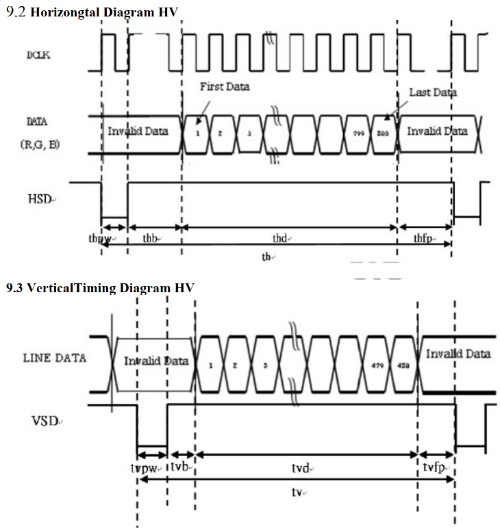

## 硬件\_TFT-RGB接口LCD时序分析

参考资料，GIT仓库里：

* * TFT-RGB LCD

  * 接口原理图：
    * `IMX6ULL\开发板配套资料\原理图\Base_board\100ask_imx6ull_v1.1.pdf``
    * ``STM32MP157\开发板配套资料\原理图\01_Base_board(底板)\100ASK_STM32MP157_PRO_V11_底板原理图.pdf`

  * LCD数据手册(这2个文件是一样的)：
    * `IMX6ULL\开发板配套资料\datasheet\Base_board\100ask_imx6ull底板_规格书\7.0-13SPEC(7寸1024600TN-RGB).pdf``
    * `STM32MP157\开发板配套资料\datasheeet\03_7寸LCD模块\LCD数据手册7.0-13SPEC(7寸1024600TN-RGB).pdf`

### 1. 接口原理图

#### 1.1 TFT-RGB接口原理图

### 2. TFT-RGB接口时序图

#### 2.1 LCD时序图

#### 2.2 LCD控制器时序图

