## 硬件\_STM32MP157的LCD控制器

参考资料，GIT仓库里：

* `STM32MP157\开发板配套资料\datasheeet\02_Core_board(核心板)\CPU\CPU开发参考手册\DM00327659.pdf`
  
* `《35 LCD-TFT display controller (LTDC)》`
  
* STM32MP157的LCD裸机程序

  * `STM32MP157\source\A7\03_LCD\05_参考的裸机源码\03_font_test`

    

### 1. LCD控制器模块介绍

#### 1.1 硬件框图

STM32MP157的LCD控制器名称为LTDC(LCD-TFT display controller)，主要特性如下：

* 有两个图层，每个图层内部FIFO为64*64bit；
* 可编程时序以应对不同的显示屏；
* 可编程极性，例如各同步信号，数据使能；
* 支持高达8种不同的像素格式，本章节实现的像素格式为ARGB8888与RGB565；
* 可编程的窗口位置及窗口尺寸

上图是LCD控制器框图。
我们在内存中划出一块内存，称之为显存，软件把数据写入显存：

* AXI interface：把数据从显存读到FIFO
* Layer FIFO：每个layer都有一个64x64-bit的FIFO
* PFC： pixel format converter，把从显存得到的数据转为RGB888的数据
* Blending, dithering unit and timings generator  ：图像合并、抖动显示、时序产生

设置好LCD控制器之后，它会通过AXI总线协议从显存把RGB数据读入FIFO，经过处理后再到达LCD接口(LCD Interface)。
LCD控制器有3个时钟域：

* AXI clock domain (ltdc_aclk)
  This domain contains the LCD-TFT AXI master interface for data transfer from the
  memories to the Layer FIFO and the frame buffer configuration register

* APB clock domain (ltdc_pclk): 
  This domain contains the global configuration registers and the interrupt register.

* Pixel clock domain (LCD_CLK)：
  This domain contains the pixel data generation, the layer configuration register as well
  as the LCD-TFT interface signal generator. The LCD_CLK output should be configured
  following the panel requirements. The LCD_CLK is generated from a specific PLL
  output (refer to the reset and clock control section)

  

#### 1.2 数据传输与处理

* 框图：

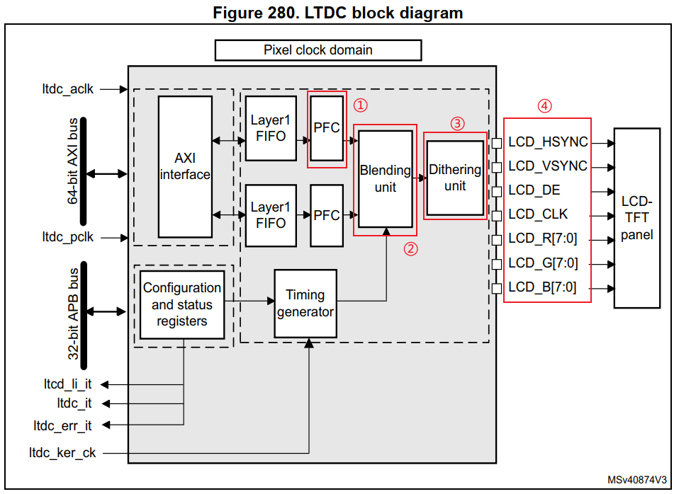

* PFC： pixel format converter
  LCD控制器读入Framebuffer中的数据后，会把它转为ARGB8888的格式。
  比如显存中数据格式为RGB565，其中的5位红颜色会被转换为8位，方法如下：

  * 假设原来是这5位R4R3R2R1R0
  * 使用MSB位来填充为8位，结果为：R4R3R2R1R0**R4R3R2**

* Blending
  STM32MP157支持2个图层，还有一个背景色。这3部分总是混合后再输出给LCD，即使某个关闭了某个图层，它的数据(默认颜色)也会被混合。

  如果某个图层被关闭了，不想混合它的默认颜色，可以设置**blending factors **(混合因子)。

  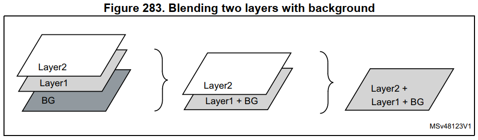

* Dithering
  不涉及，感兴趣的可以参考：

  * https://zhuanlan.zhihu.com/p/33637225

    

* LCD接口
  把内部处理后的数据，驱动到LCD上去。涉及时序控制。

  

#### 1.3 时序控制

看寄存器说明。

### 2. LCD控制器寄存器简介

查看任何芯片的LCD控制器寄存器时，记住几个要点：

① 怎么把LCD的信息告诉LCD控制器：即分辨率、行列时序、像素时钟等；
② 怎么把显存地址、像素格式告诉LCD控制器。

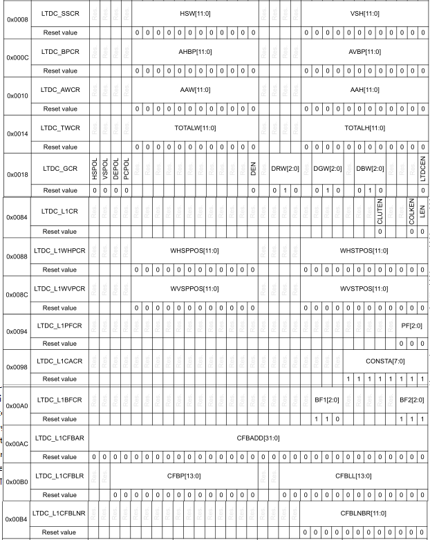

上图是我们将要使用到的寄存器，下面逐个讲解这些寄存器，在后续的LCD控制编程实验会用到。

#### 2.1 LTDC_SSCR寄存器

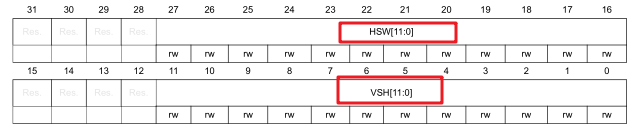

HSW：水平同步信号宽度thp；
VSH：垂直同步信号宽度tvp。

#### 2.2 LTDC_BPCR寄存器

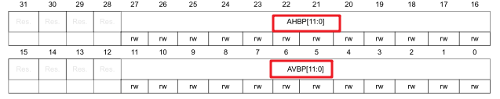

AHBP：水平同步信号宽度thp + 水平方向的后沿thb - 1；
AVBP：垂直同步信号宽度tvp + 垂直方向的后沿tvb - 1 。

#### 2.3 LTDC_AWCR寄存器

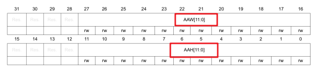

AAW：水平同步信号宽度thp + 水平方向的后沿thb + 水平方向的有效像素xres - 1；
AAH：垂直同步信号宽度tvp + 垂直方向的后沿tvb + 垂直方向的有效像素yres - 1 。

#### 2.4 LTDC_TWCR寄存器

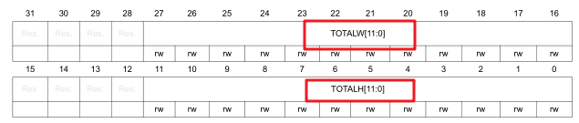

TOTALW：水平方向的总像素个数；
TOTALH：垂直方向的总像素个数。

#### 2.5 LTDC_GCR寄存器

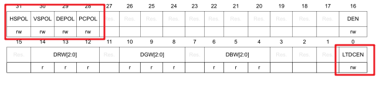

HSPOL：水平同步信号的有效极性；
VSPOL：垂直方向信号的有效极性；
DEPOL：数据有效信号的有效极性；
PCPOL：像素时钟的有效极性；
LTDCEN：LCD控制器使能位 。

#### 2.6 LTDC_L1WHPCR寄存器

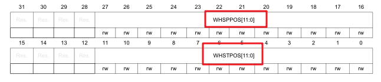

WHSPPOS：水平方向窗口像素停止位置，
即：水平同步信号宽度thp+ 水平方向后沿thb+ 水平方向有效像素xres -1；

WHSTPOS：水平方向窗口像素开始位置，
即： 水平同步信号宽度thp+ 水平方向后沿thb；

#### 2.7 LTDC_L1WVPCR寄存器

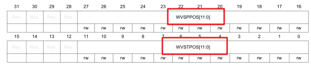

WVSPPOS：垂直方向窗口像素停止位置，
即：垂直同步信号宽度tvp+ 垂直方向后沿tvb+ 垂直方向有效像素yres -1；

WVSTPOS：垂直方向窗口像素开始位置，
即：垂直同步信号宽度tvp+ 垂直方向后沿tvb。

#### 2.8 LTDC_L1PFCR寄存器

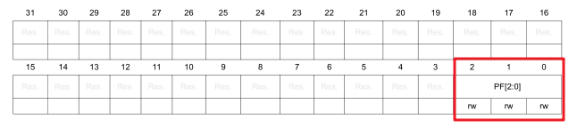

PF：像素格式，取值如下：
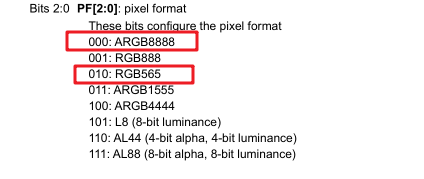

#### 2.9 LTDC_L1CACR寄存器

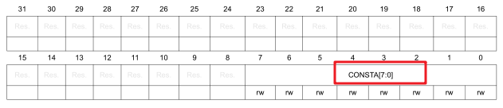

CONSTA：透明度常数
用来设置混合图像时，所使用的透明度常数。
实际使用的常数为：CONSTA/255。
也就是，如果设置为255，则透明度常数为255/255 = 1 。

#### 2.10 LTDC_L1BFCR寄存器

LTDC layer x blending factors configuration register，用于设置：混合图像因子。

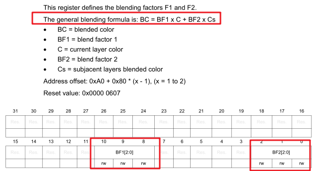

BF1：系数因子1；
BF2：系数因子2。

视频里举例说明。

#### 2.11 LTDC_L1CFBAR寄存器

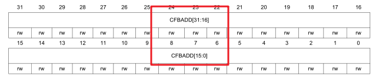

CFBADD：设置LAYER1（图层1）的显存地址。

#### 2.12 LTDC_L1CFBLR寄存器

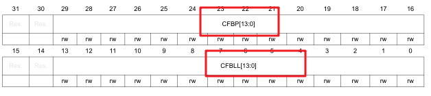

CFBP：Framebuffer中一行像素所占据的字节数
CFBLL：Framebuffer中一行像素所占据的字节数+7

#### 2.13 LTDC_L1CFBLNR寄存器

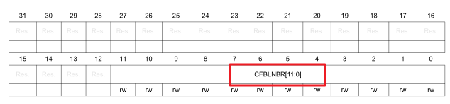

CFBLNBR：垂直方向的有效行数，即yres。

#### 2.14 LTDC_L1CR寄存器

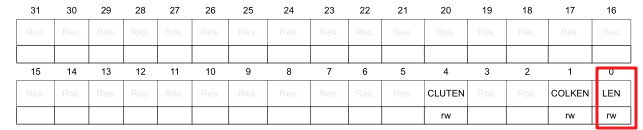