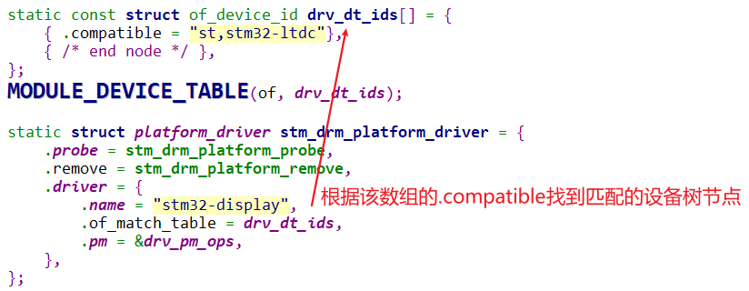
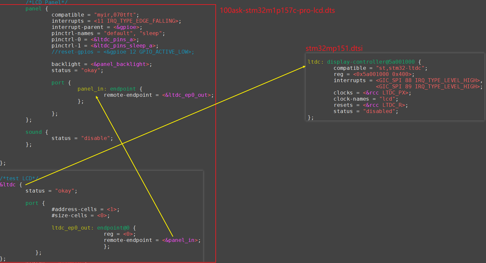
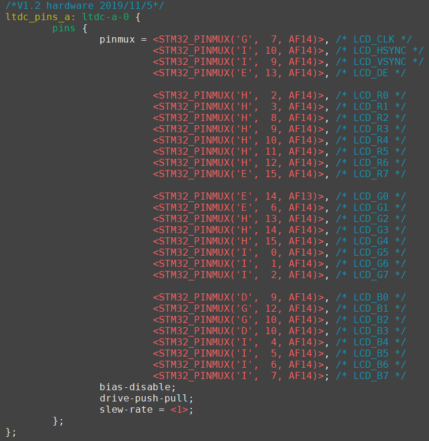
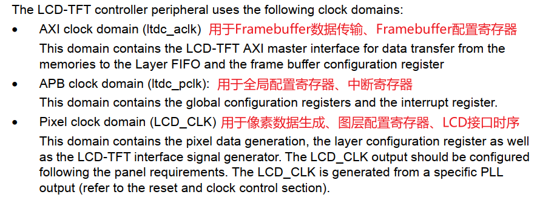
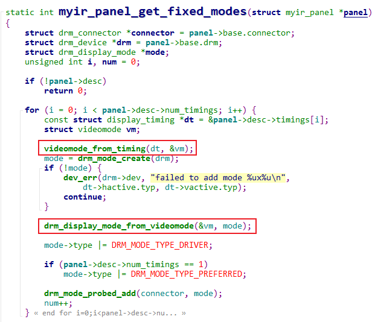
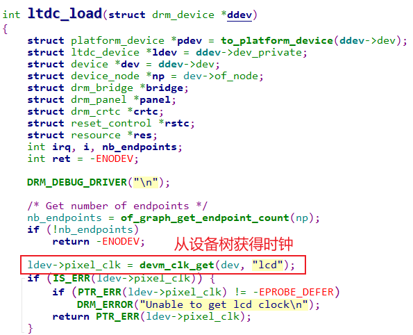
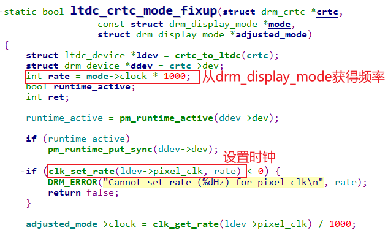
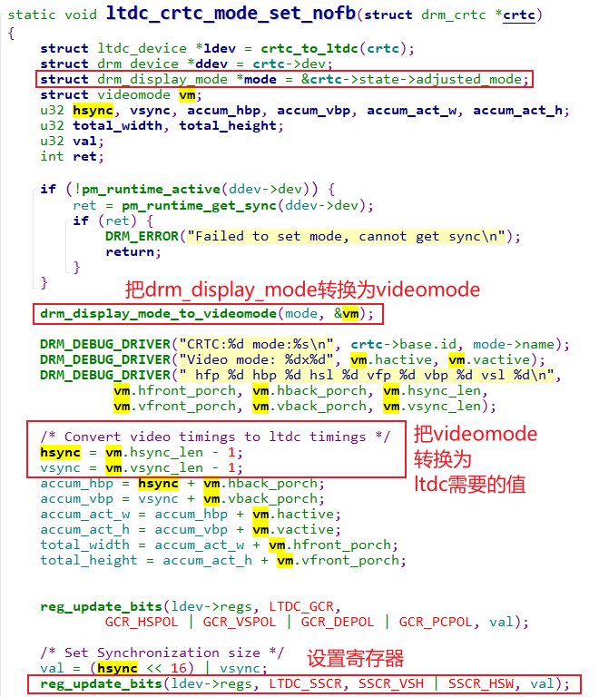

## 分析内核自带的LCD驱动程序\_基于STM32MP157

参考资料，GIT仓库里：

* `STM32MP157\开发板配套资料\datasheeet\02_Core_board(核心板)\CPU\CPU开发参考手册\DM00327659.pdf`
* `《35 LCD-TFT display controller (LTDC)》`
* STM32MP157的LCD裸机程序

  * `STM32MP157\source\A7\03_LCD\05_参考的裸机源码\03_font_test`

* 内核自带的STM32MP157 LCD驱动程序
  * 驱动源码：
  
    * LCD相关：`Linux-5.4\drivers\gpu\drm\panel\panel-myir070tft.c`
    * LCD控制器相关：`Linux-5.4\drivers\gpu\drm\stm\ltdc.c`
    * GPU相关：`Linux-5.4\drivers\gpu\drm\stm\drv.c`
  * 设备树：
    * `Linux-5.4/arch/arm/boot/dts/100ask-stm32m1p157c-pro-lcd.dts`
    * `Linux-5.4/arch/arm/boot/dts/stm32mp151.dtsi`
    * `Linux-5.4/arch/arm/boot/dts/stm32mp157-ya157c-pinctrl.dtsi`
  
* **注意**: 
  * STM32MP157的LCD驱动，不是纯粹的Framebuffer驱动，它是GPU的驱动
  * GPU驱动不是本节重点
  * 本节课程只是基于Framebuffer进行分析
### 1. 驱动程序框架

Linux驱动程序 = 驱动程序框架 + 硬件编程。
在前面已经基于QEMU编写了LCD驱动程序，对LCD驱动程序的框架已经分析清楚。

核心就是：

* 分配fb_info
* 设置fb_info
* 注册fb_info
* 硬件相关的设置


但是，STM32MP157的LCD驱动程序，是另一套框架：GPU/DRM，
它也会涉及Framebuffer，但是没有那么直接。


#### 1.1 入口函数注册platform_driver



#### 1.2 设备树有对应节点



#### 1.3 probe函数分析

文件：

```c
stm_drm_platform_probe
    drm_fbdev_generic_setup
    	drm_fbdev_client_hotplug
    		drm_fb_helper_initial_config
    			__drm_fb_helper_initial_config_and_unlock
    				register_framebuffer
```


### 2. 编写硬件相关的代码

我们只需要针对STM32MP157的编写硬件相关的代码，涉及3部分：

* GPIO设置
  * LCD引脚
  * 背光引脚
* 时钟设置
  * 确定LCD控制器的时钟
  * 根据LCD的DCLK计算相关时钟
* LCD控制器本身的设置
  * 比如设置Framebuffer的地址
  * 设置Framebuffer中数据格式、LCD数据格式
  * 设置时序

#### 2.1 GPIO设置

有两种方法：

* 直接读写相关寄存器
* 使用设备树，在设备树中设置pinctrl
  * 本课程专注于LCD，所以使用pinctrl简化程序

设备树`Linux-5.4/arch/arm/boot/dts/stm32mp157-ya157c-pinctrl.dtsi`：



#### 2.2 时钟设置

STM32MP157的LCD控制器涉及3个时钟：



代码里直接使用时钟子系统的代码。

* 在代码里指定LCD频率

  * 文件：Linux-5.4\drivers\gpu\drm\panel\panel-myir070tft.c

  * 代码：

    ```c
    static const struct display_timing myir_070tft_timing = {
    /*      .pixelclock = { 33300000, 33300000, 33300000 },
            .hactive = { 800, 800, 800 },
            .hfront_porch = {  210, 210, 210 },
            .hback_porch = { 46, 46, 46 },
            .hsync_len = { 40, 40, 40 },
    
            .vactive = { 480, 480, 480 },
            .vfront_porch = { 22, 22, 22 },
            .vback_porch = { 23, 23, 23 },
            .vsync_len = { 1, 1, 1 },
    */
    
       // 100ask
    
            .pixelclock = {50000000,50000000,50000000},
            .hactive = {1024,1024,1024},
            .hfront_porch = {160,160,160},
            .hback_porch = {140,140,140},
            .hsync_len = {20,20,20},
            .vactive = {600,600,600},
            .vfront_porch = {12,12,12},
            .vback_porch = {20,20,20},
            .vsync_len = {3,3,3},
            //.flags = DISPLAY_FLAGS_DE_LOW,
    
    
    };
    
    ```

* display_timing变为videomode，videomode变为drm_display_mode

  * 文件：Linux-5.4\drivers\gpu\drm\panel\panel-myir070tft.c
  * 代码：
    

* 在设备树里指定LCD控制器的时钟

  * 文件：Linux-5.4/arch/arm/boot/dts/stm32mp151.dtsi

  * 代码：

    ```shell
                   ltdc: display-controller@5a001000 {
                            compatible = "st,stm32-ltdc";
                            reg = <0x5a001000 0x400>;
                            interrupts = <GIC_SPI 88 IRQ_TYPE_LEVEL_HIGH>,
                                         <GIC_SPI 89 IRQ_TYPE_LEVEL_HIGH>;
                            clocks = <&rcc LTDC_PX>;
                            clock-names = "lcd";
                            resets = <&rcc LTDC_R>;
                            status = "disabled";
                    };
    ```

    

* 怎么获得时钟源，然后去设置dot clk？

  * 文件：Linux-5.4\drivers\gpu\drm\stm\ltdc.c

  * 代码：

    * 获得时钟

      

    * 设置时钟

    

  

#### 2.3 LCD控制器的配置
以设置LCD时序为例。

* 在代码里指定LCD频率、各类时序参数

  * 文件：Linux-5.4\drivers\gpu\drm\panel\panel-myir070tft.c

  * 代码：

    ```c
    static const struct display_timing myir_070tft_timing = {
    /*      .pixelclock = { 33300000, 33300000, 33300000 },
            .hactive = { 800, 800, 800 },
            .hfront_porch = {  210, 210, 210 },
            .hback_porch = { 46, 46, 46 },
            .hsync_len = { 40, 40, 40 },
    
            .vactive = { 480, 480, 480 },
            .vfront_porch = { 22, 22, 22 },
            .vback_porch = { 23, 23, 23 },
            .vsync_len = { 1, 1, 1 },
    */
    
       // 100ask
    
            .pixelclock = {50000000,50000000,50000000},
            .hactive = {1024,1024,1024},
            .hfront_porch = {160,160,160},
            .hback_porch = {140,140,140},
            .hsync_len = {20,20,20},
            .vactive = {600,600,600},
            .vfront_porch = {12,12,12},
            .vback_porch = {20,20,20},
            .vsync_len = {3,3,3},
            //.flags = DISPLAY_FLAGS_DE_LOW,
    
    
    };
    
    ```

* display_timing变为videomode，videomode变为drm_display_mode

  * 文件：Linux-5.4\drivers\gpu\drm\panel\panel-myir070tft.c
  * 代码：
    

* 根据drm_display_mode设置寄存器

  * 文件：Linux-5.4\drivers\gpu\drm\stm\ltdc.c
  * 代码：

  