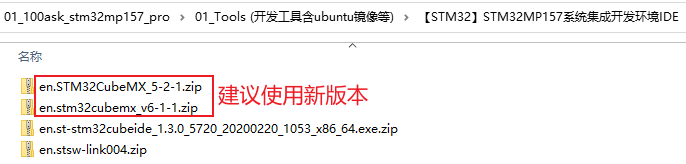

## 编程\_配置引脚\_基于STM32MP157

参考资料，GIT仓库里：

* 芯片资料
  
  * `STM32MP157\开发板配套资料\datasheeet\02_Core_board(核心板)\CPU\CPU开发参考手册\DM00327659.pdf`
    * `《35 LCD-TFT display controller (LTDC)》`
  
* STM32MP157的LCD裸机程序

  * `STM32MP157\source\A7\03_LCD\05_参考的裸机源码\03_font_test`

* 内核自带的STM32MP157 LCD驱动程序
  * 驱动源码：
  
    * LCD相关：`Linux-5.4\drivers\gpu\drm\panel\panel-myir070tft.c`
    * LCD控制器相关：`Linux-5.4\drivers\gpu\drm\stm\ltdc.c`
    * GPU相关：`Linux-5.4\drivers\gpu\drm\stm\drv.c`
  * 设备树：
    * `Linux-5.4/arch/arm/boot/dts/stm32mp157c-100ask-512d-lcd-v1.dts`
    * `Linux-5.4/arch/arm/boot/dts/stm32mp151.dtsi`
    * `Linux-5.4/arch/arm/boot/dts/stm32mp15-pinctrl.dtsi`
  
* 本节视频编写好的代码
  
  * `STM32MP157\source\A7\03_LCD\07_lcd_drv_pin_config_use_devicetree`
  
* 引脚配置工具/设备树生成工具

  * 打开：http://download.100ask.net/
  * 找到开发板："100ASK_STM32MP157_PRO开发板"
  * 下载开发板配套资料
  * 下载完后，工具在如下目录里：

  

### 1. 硬件相关的操作

LCD驱动程序的核心就是：

* 分配fb_info
* 设置fb_info
* 注册fb_info
* 硬件相关的设置

硬件相关的设置又可以分为3部分：
  * 引脚设置
  * 时钟设置
  * LCD控制器设置

### 2. 引脚配置

主要使用pinctrl子系统把引脚配置为LCD功能，对于背光引脚等使用GPIO子系统的函数控制它的输出电平。

#### 2.1 使用pinctrl配置LCD引脚

#### 2.2 使用GPIO子系统控制背光