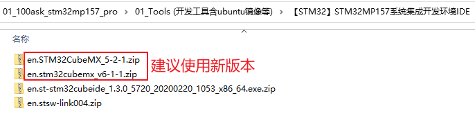

## 编程\_配置时钟\_基于STM32MP157

参考资料，GIT仓库里：

* 芯片资料
  
  * `STM32MP157\开发板配套资料\datasheeet\02_Core_board(核心板)\CPU\CPU开发参考手册\DM00327659.pdf`
    * `《35 LCD-TFT display controller (LTDC)》`
  
* STM32MP157的LCD裸机程序

  * `STM32MP157\source\A7\03_LCD\05_参考的裸机源码\03_font_test`

* 内核自带的STM32MP157 LCD驱动程序
  * 驱动源码：
  
    * LCD相关：`Linux-5.4\drivers\gpu\drm\panel\panel-myir070tft.c`
    * LCD控制器相关：`Linux-5.4\drivers\gpu\drm\stm\ltdc.c`
    * GPU相关：`Linux-5.4\drivers\gpu\drm\stm\drv.c`
  * 设备树：
    * `Linux-5.4/arch/arm/boot/dts/stm32mp157c-100ask-512d-lcd-v1.dts`
    * `Linux-5.4/arch/arm/boot/dts/stm32mp151.dtsi`
    * `Linux-5.4/arch/arm/boot/dts/stm32mp15-pinctrl.dtsi`
  
* 本节视频编写好的代码
  
  * `STM32MP157\source\A7\03_LCD\08_lcd_drv_clk_config_use_devicetree`
  
* 引脚配置工具/设备树生成工具

  * 打开：http://download.100ask.net/
  * 找到开发板："100ASK_STM32MP157_PRO开发板"
  * 下载开发板配套资料
  * 下载完后，工具在如下目录里：

  

### 1. 硬件相关的操作

LCD驱动程序的核心就是：

* 分配fb_info
* 设置fb_info
* 注册fb_info
* 硬件相关的设置


硬件相关的设置又可以分为3部分：
  * 引脚设置
  * 时钟设置
  * LCD控制器设置


### 2. 分析内核自带的驱动程序

#### 2.1 芯片手册


#### 2.2 设备树

参考：`arch/arm/boot/dts/stm32mp151.dtsi`

```shell
                ltdc: display-controller@5a001000 {
                        compatible = "st,stm32-ltdc";
                        reg = <0x5a001000 0x400>;
                        interrupts = <GIC_SPI 88 IRQ_TYPE_LEVEL_HIGH>,
                                     <GIC_SPI 89 IRQ_TYPE_LEVEL_HIGH>;
                        clocks = <&rcc LTDC_PX>;
                        clock-names = "lcd";
                        resets = <&rcc LTDC_R>;
                        status = "disabled";
                };
```

里面只定义了1个时钟：

* LTDC_PX：Pixel clock，用于LCD接口，设置为LCD手册上的参数
* axi：AXI clock，不用设置？
* apb：APB clock，不用设置？


#### 2.3 代码

内核代码：`drivers/gpu/drm/stm/ltdc.c`

* 获得时钟

  ```c
  	ldev->pixel_clk = devm_clk_get(dev, "lcd");
  	if (IS_ERR(ldev->pixel_clk)) {
  		if (PTR_ERR(ldev->pixel_clk) != -EPROBE_DEFER)
  			DRM_ERROR("Unable to get lcd clock\n");
  		return PTR_ERR(ldev->pixel_clk);
  	}
  ```
  
* 设置频率

  ```c
  	if (clk_set_rate(ldev->pixel_clk, rate) < 0) {
  		DRM_ERROR("Cannot set rate (%dHz) for pixel clk\n", rate);
  		return false;
  	}
  ```

* 使能时钟

  ```c
  	if (clk_prepare_enable(ldev->pixel_clk)) {
  		DRM_ERROR("Unable to prepare pixel clock\n");
  		return -ENODEV;
  	}
  ```
  
  

### 3. 自己写代码