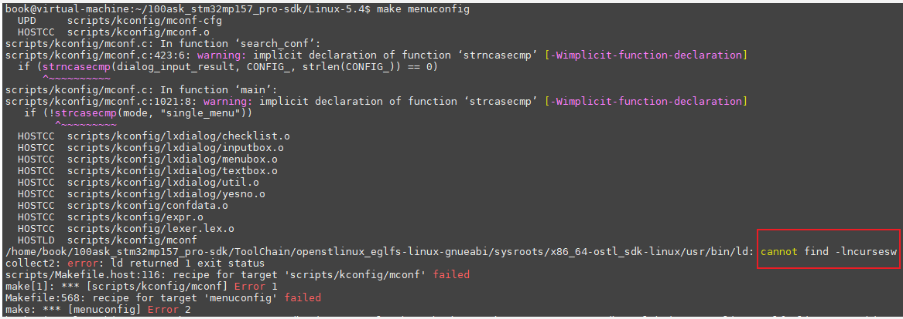
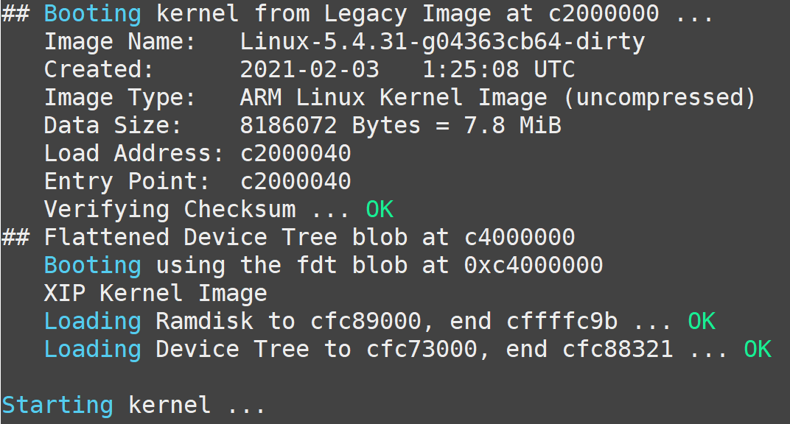
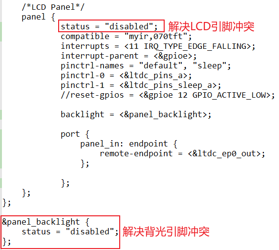
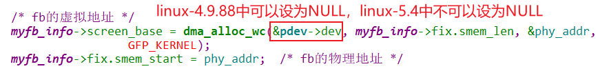

## 上机实验\_基于STM32MP157

参考资料，GIT仓库里：

* 芯片资料
  
  * `STM32MP157\开发板配套资料\datasheeet\02_Core_board(核心板)\CPU\CPU开发参考手册\DM00327659.pdf`
    * `《35 LCD-TFT display controller (LTDC)》`
  
* STM32MP157的LCD裸机程序

  * `STM32MP157\source\A7\03_LCD\05_参考的裸机源码\03_font_test`

* 内核自带的STM32MP157 LCD驱动程序
  * 驱动源码：
  
    * LCD相关：`Linux-5.4\drivers\gpu\drm\panel\panel-myir070tft.c`
    * LCD控制器相关：`Linux-5.4\drivers\gpu\drm\stm\ltdc.c`
    * GPU相关：`Linux-5.4\drivers\gpu\drm\stm\drv.c`
  * 设备树：
    * `Linux-5.4/arch/arm/boot/dts/stm32mp157c-100ask-512d-lcd-v1.dts`
    * `Linux-5.4/arch/arm/boot/dts/stm32mp151.dtsi`
    * `Linux-5.4/arch/arm/boot/dts/stm32mp15-pinctrl.dtsi`
  
* 本节视频测试通过的代码
  
  * `STM32MP157\source\A7\03_LCD\11_lcd_drv_stm32mp157_ok`
  
* 搭建开发环境
* 视频：https://www.100ask.net/
    * 《Linux系列教程之快速入门》之《【第2篇】环境搭建、Linux基本操作、工具使用》
  * 文档：` git clone https://e.coding.net/weidongshan/01_all_series_quickstart.git`
    * 《嵌入式Linux应用开发完全手册\_韦东山全系列视频文档全集V2.8.pdf》

### 1. 要做的事情

* 去除内核自带的驱动程序

* 加入我们编写的驱动程序、设备树文件

* 重新编译内核、设备树

* 上机测试：使用编译出来的内核、设备树启动板子

  

### 2. 去除内核自带的驱动程序
* 设置工具链

  ```shell
  source /home/book/100ask_stm32mp157_pro-sdk/ToolChain/openstlinux_eglfs-linux-gnueabi/environment-setup-cortexa7t2hf-neon-vfpv4-ostl-linux-gnueabi
  export ARCH=arm
  export CROSS_COMPILE=arm-ostl-linux-gnueabi-
  ```

* 配置内核使用STM32MP157默认配置

  ```shell
  ~/100ask_stm32mp157_pro-sdk/$ cd Linux-5.4
  ~/100ask_stm32mp157_pro-sdk/Linux-5.4$ make 100ask_stm32mp157_pro_defconfig  
  ```
* 去掉自带的驱动程序：执行`make menuconfig`，如下配置内核
  ```shell
  Device Drivers  --->
      Graphics support  ---> 
          < > DRM Support for STMicroelectronics SoC Series // 输入N
  ```

  

* 解决可能出现的问题

  * 如果执行`make menuconfnig`出现如下问题：

    
    
  * 就先执行以下命令：

    ```shell
    sudo apt install  lib32ncursesw5  lib32ncursesw5-dev
    ```
  
    

### 3. 加入新驱动程序、设备树
* 复制驱动程序：
  * 把`11_lcd_drv_stm32mp157_ok\lcd_drv.c`放到内核源码目录`drivers/video/fbdev`
  * 备份内核自带设备树文件：`arch/arm/boot/dts/stm32mp157c-100ask-512d-lcd-v1.dts`
  * 把`11_lcd_drv_stm32mp157_ok\stm32mp157c-100ask-512d-lcd-v1.dts`放到内核源码目录`arch/arm/boot/dts/`

* 修改内核文件：
  * 修改：`drivers/video/fbdev/Makefile`，使用我们提供的lcd_drv.c，如下：

  ```shell
obj-y             += lcd_drv.o
  ```


### 4. 重新编译内核、设备树

**以下命令在Ubuntu中执行。**

* 设置工具链

  ```shell
  source /home/book/100ask_stm32mp157_pro-sdk/ToolChain/openstlinux_eglfs-linux-gnueabi/environment-setup-cortexa7t2hf-neon-vfpv4-ostl-linux-gnueabi
  export ARCH=arm
  export CROSS_COMPILE=arm-ostl-linux-gnueabi-
  ```

* 配置、编译

  ```shell
  ~/100ask_stm32mp157_pro-sdk/$ cd Linux-5.4
  ~/100ask_stm32mp157_pro-sdk/Linux-5.4$ 
  ~/100ask_stm32mp157_pro-sdk/Linux-5.4$ make uImage LOADADDR=0xC2000040 
  ~/100ask_stm32mp157_pro-sdk/Linux-5.4$ make dtbs
  ```

* 得到
  * 内核：`arch/arm/boot/uImage`
  * 设备树文件：`arch/arm/boot/dts/stm32mp157c-100ask-512d-lcd-v1.dtb`
  
* 复制到NFS目录：

  ```shell
  $ cp arch/arm/boot/uImage ~/nfs_rootfs/
  $ cp arch/arm/boot/dts/stm32mp157c-100ask-512d-lcd-v1.dtb ~/nfs_rootfs/
  ```

  

### 5. 上机测试

**以下命令在开发板中执行。**

#### 5.1 更换内核、设备树

* 挂载NFS

  * vmware使用NAT(假设windowsIP为192.168.1.100)

    ```shell
    [root@100ask:~]# mount -t nfs -o nolock,vers=3,port=2049,mountport=9999 
    192.168.1.100:/home/book/nfs_rootfs /mnt
    ```

  * vmware使用桥接，或者不使用vmware而是直接使用服务器：假设Ubuntu IP为192.168.1.137

    ```shell
    [root@100ask:~]#  mount -t nfs -o nolock,vers=3 192.168.1.137:/home/book/nfs_rootfs /mnt
    ```

* 确定单板上内核、设备树保存在哪里

  由于版本变化，STM32MP157单板上烧录的系统可能有细微差别，在开发板上执行`cat /proc/mounts`后，
  可以得到两种结果(见下图)：

  * 保存内核、设备树的分区，挂载在/boot目录下：无需特殊操作
  * 保存内核、设备树的分区，挂载在/mnt目录下
    * 在视频里、后面文档里，都是更新/boot目录下的文件，所以要先执行以下命令重新挂载：
      * `mount  /dev/mmcblk2p2  /boot`


  

* 更新单板文件

  ```shell
  [root@100ask:~]# cp /mnt/uImage /boot
  [root@100ask:~]# cp /mnt/stm32mp157c-100ask-512d-lcd-v1.dtb /boot
  [root@100ask:~]# sync
  ```

* 重启开发板观察现象

  * 如果可以看到企鹅LOGO，就表示正常
  
  * 如果在终端中可以查看到存在`/dev/fb0`节点，也表示正常
  
    
  

#### 5.2 板子无法启动，使用uboot下载内核、设备树

使用新内核、设备树启动单板时，打印`Starting kernel`后就再无输出，串口信息如下：


这表示内核或设备树有问题，只能使用uboot来下载其他内核、设备树来调试。

重启开发板，按住空格进入uboot，在uboot使用nfs命令下载uImage、设备树来启动开发板。

* 以下命令适用于：vmware使用桥接

```shell
=> setenv ipaddr 192.168.1.112                 //设置开发板的IP地址。
=> nfs c4000000 192.168.1.137:/home/book/nfs_rootfs/stm32mp157c-100ask-512d-lcd-v1.dtb
=> nfs c4100000 192.168.1.137:/home/book/nfs_rootfs/uImage
=> setenv bootargs root=/dev/mmcblk2p3  rw 
=> bootm c4100000 - 0xc4000000 
```


* 以下命令使用于：vmware使用NAT，并且先启动tftpd64，在tftpd64所设置目录下放入uImage和设备树文件

```shell
=> setenv serverip 192.168.1.100     //设置服务器的IP地址，这里指的是Ubuntu主机IP
=> setenv ipaddr 192.168.1.112       //设置开发板的IP地址。
=> tftpboot 0xc4000000 stm32mp157c-100ask-512d-lcd-v1.dtb
=> tftpboot c4100000 uImage
=> setenv bootargs root=/dev/mmcblk2p3  rw 
=> bootm c4100000 - 0xc4000000 
```


#### 5. 问题所在

* 设备树中引脚冲突，如下修改




* 驱动程序函数使用方法有变化

