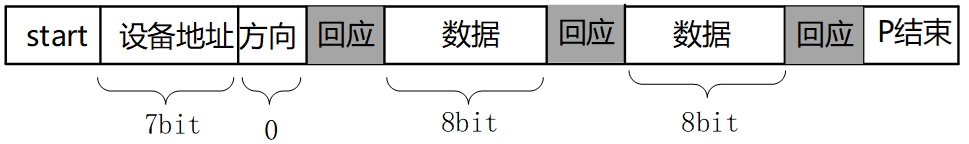

## I2C协议

参考资料：

* i2c_spec.pdf

### 1. 硬件连接

I2C在硬件上的接法如下所示，主控芯片引出两条线SCL,SDA线，在一条I2C总线上可以接很多I2C设备，我们还会放一个上拉电阻（放一个上拉电阻的原因以后我们再说）。

### 2. 传输数据类比

怎么通过I2C传输数据，我们需要把数据从主设备发送到从设备上去，也需要把数据从从设备传送到主设备上去，数据涉及到双向传输。

举个例子：

体育老师：可以把球发给学生，也可以把球从学生中接过来。

* 发球：
  * 老师：开始了(start)
  * 老师：A！我要发球给你！(地址/方向)
  * 学生A：到！(回应)
  * 老师把球发出去（传输）
  * A收到球之后，应该告诉老师一声（回应）
  * 老师：结束（停止）

* 接球：
  * 老师：开始了(start)
  * 老师：B！把球发给我！(地址/方向)
  * 学生B：到！
  * B把球发给老师（传输）
  * 老师收到球之后，给B说一声，表示收到球了（回应）
  * 老师：结束（停止）

我们就使用这个简单的例子，来解释一下IIC的传输协议：

* 老师说开始了，表示开始信号(start)
* 老师提醒某个学生要发球，表示发送地址和方向(address/read/write)
* 老师发球/接球，表示数据的传输
* 收到球要回应：回应信号(ACK)
* 老师说结束，表示IIC传输结束(P)

### 3. IIC传输数据的格式

#### 3.1 写操作

流程如下：

* 主芯片要发出一个start信号
* 然后发出一个设备地址(用来确定是往哪一个芯片写数据)，方向(读/写，0表示写，1表示读)
* 从设备回应(用来确定这个设备是否存在)，然后就可以传输数据
* 主设备发送一个字节数据给从设备，并等待回应
* 每传输一字节数据，接收方要有一个回应信号（确定数据是否接受完成)，然后再传输下一个数据。
* 数据发送完之后，主芯片就会发送一个停止信号。

下图：白色背景表示"主→从"，灰色背景表示"从→主"

#### 3.2 读操作

流程如下：

* 主芯片要发出一个start信号
* 然后发出一个设备地址(用来确定是往哪一个芯片写数据)，方向(读/写，0表示写，1表示读)
* 从设备回应(用来确定这个设备是否存在)，然后就可以传输数据

* 从设备发送一个字节数据给主设备，并等待回应
* 每传输一字节数据，接收方要有一个回应信号（确定数据是否接受完成)，然后再传输下一个数据。
* 数据发送完之后，主芯片就会发送一个停止信号。

下图：白色背景表示"主→从"，灰色背景表示"从→主"

#### 3.3 I2C信号

I2C协议中数据传输的单位是字节，也就是8位。但是要用到9个时钟：前面8个时钟用来传输8数据，第9个时钟用来传输回应信号。传输时，先传输最高位(MSB)。

* 开始信号（S）：SCL为高电平时，SDA山高电平向低电平跳变，开始传送数据。
* 结束信号（P）：SCL为高电平时，SDA由低电平向高电平跳变，结束传送数据。
* 响应信号(ACK)：接收器在接收到8位数据后，在第9个时钟周期，拉低SDA
* SDA上传输的数据必须在SCL为高电平期间保持稳定，SDA上的数据只能在SCL为低电平期间变化

I2C协议信号如下：

#### 3.4 协议细节

* 如何在SDA上实现双向传输？
  主芯片通过一根SDA线既可以把数据发给从设备，也可以从SDA上读取数据，连接SDA线的引脚里面必然有两个引脚（发送引脚/接受引脚）。

* 主、从设备都可以通过SDA发送数据，肯定不能同时发送数据，怎么错开时间？
  在9个时钟里，
  前8个时钟由主设备发送数据的话，第9个时钟就由从设备发送数据；
  前8个时钟由从设备发送数据的话，第9个时钟就由主设备发送数据。
* 双方设备中，某个设备发送数据时，另一方怎样才能不影响SDA上的数据？
  设备的SDA中有一个三极管，使用开极/开漏电路(三极管是开极，CMOS管是开漏，作用一样)，如下图：
  

真值表如下：

从真值表和电路图我们可以知道：

* 当某一个芯片不想影响SDA线时，那就不驱动这个三极管
* 想让SDA输出高电平，双方都不驱动三极管(SDA通过上拉电阻变为高电平)
* 想让SDA输出低电平，就驱动三极管

从下面的例子可以看看数据是怎么传的（实现双向传输）。
举例：主设备发送（8bit）给从设备

* 前8个clk
  * 从设备不要影响SDA，从设备不驱动三极管
  * 主设备决定数据，主设备要发送1时不驱动三极管，要发送0时驱动三极管

* 第9个clk，由从设备决定数据
  * 主设备不驱动三极管
  * 从设备决定数据，要发出回应信号的话，就驱动三极管让SDA变为0
  * 从这里也可以知道ACK信号是低电平

从上面的例子，就可以知道怎样在一条线上实现双向传输，这就是SDA上要使用上拉电阻的原因。

为何SCL也要使用上拉电阻？
在第9个时钟之后，如果有某一方需要更多的时间来处理数据，它可以一直驱动三极管把SCL拉低。
当SCL为低电平时候，大家都不应该使用IIC总线，只有当SCL从低电平变为高电平的时候，IIC总线才能被使用。
当它就绪后，就可以不再驱动三极管，这是上拉电阻把SCL变为高电平，其他设备就可以继续使用I2C总线了。

对于IIC协议它只能规定怎么传输数据，数据是什么含义由从设备决定。

 

