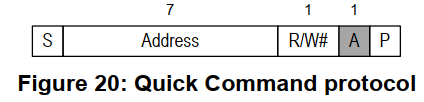
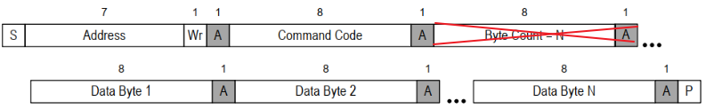

## SMBus协议

参考资料：

* Linux内核文档：`Documentation\i2c\smbus-protocol.rst`

* SMBus协议：

  * http://www.smbus.org/specs/
* `SMBus_3_0_20141220.pdf`
* I2CTools: `https://mirrors.edge.kernel.org/pub/software/utils/i2c-tools/`

### 1. SMBus是I2C协议的一个子集

SMBus: System Management Bus，系统管理总线。
SMBus最初的目的是为智能电池、充电电池、其他微控制器之间的通信链路而定义的。
SMBus也被用来连接各种设备，包括电源相关设备，系统传感器，EEPROM通讯设备等等。
SMBus 为系统和电源管理这样的任务提供了一条控制总线，使用 SMBus 的系统，设备之间发送和接收消息都是通过 SMBus，而不是使用单独的控制线，这样可以节省设备的管脚数。
SMBus是基于I2C协议的，SMBus要求更严格，SMBus是I2C协议的子集。


SMBus有哪些更严格的要求？跟一般的I2C协议有哪些差别？

* VDD的极限值不一样

  * I2C协议：范围很广，甚至讨论了高达12V的情况
  * SMBus：1.8V~5V

* 最小时钟频率、最大的`Clock Stretching `

  * Clock Stretching含义：某个设备需要更多时间进行内部的处理时，它可以把SCL拉低占住I2C总线

  * I2C协议：时钟频率最小值无限制，Clock Stretching时长也没有限制
  * SMBus：时钟频率最小值是10KHz，Clock Stretching的最大时间值也有限制

* 地址回应(Address Acknowledge)

  * 一个I2C设备接收到它的设备地址后，是否必须发出回应信号？
  * I2C协议：没有强制要求必须发出回应信号
  * SMBus：强制要求必须发出回应信号，这样对方才知道该设备的状态：busy，failed，或是被移除了

* SMBus协议明确了数据的传输格式
  * I2C协议：它只定义了怎么传输数据，但是并没有定义数据的格式，这完全由设备来定义
  * SMBus：定义了几种数据格式(后面分析)

* REPEATED START Condition(重复发出S信号)
  * 比如读EEPROM时，涉及2个操作：
    * 把存储地址发给设备
    * 读数据
  * 在写、读之间，可以不发出P信号，而是直接发出S信号：这个S信号就是`REPEATED START`
  * 如下图所示
    
* SMBus Low Power Version 
  * SMBus也有低功耗的版本


### 2. SMBus协议分析

对于I2C协议，它只定义了怎么传输数据，但是并没有定义数据的格式，这完全由设备来定义。
对于SMBus协议，它定义了几种数据格式。


**注意**：

* 下面文档中的`Functionality flag`是Linux的某个I2C控制器驱动所支持的功能。
* 比如`Functionality flag: I2C_FUNC_SMBUS_QUICK`，表示需要I2C控制器支持`SMBus Quick Command`

#### 2.1 symbols(符号)

```shell
S     (1 bit) : Start bit(开始位)
Sr    (1 bit) : 重复的开始位
P     (1 bit) : Stop bit(停止位)
R/W#  (1 bit) : Read/Write bit. Rd equals 1, Wr equals 0.(读写位)
A, N  (1 bit) : Accept and reverse accept bit.(回应位)
Address(7 bits): I2C 7 bit address. Note that this can be expanded as usual to
                get a 10 bit I2C address.
                (地址位，7位地址)
Command Code  (8 bits): Command byte, a data byte which often selects a register on
                the device.
                (命令字节，一般用来选择芯片内部的寄存器)
Data Byte (8 bits): A plain data byte. Sometimes, I write DataLow, DataHigh
                for 16 bit data.
                (数据字节，8位；如果是16位数据的话，用2个字节来表示：DataLow、DataHigh)
Count (8 bits): A data byte containing the length of a block operation.
				(在block操作总，表示数据长度)
[..]:           Data sent by I2C device, as opposed to data sent by the host
                adapter.
                (中括号表示I2C设备发送的数据，没有中括号表示host adapter发送的数据)
```


#### 2.2 SMBus Quick Command



只是用来发送一位数据：R/W#本意是用来表示读或写，但是在SMBus里可以用来表示其他含义。
比如某些开关设备，可以根据这一位来决定是打开还是关闭。

```shell
Functionality flag: I2C_FUNC_SMBUS_QUICK
```


#### 2.3 SMBus Receive Byte


I2C-tools中的函数：i2c_smbus_read_byte()。
读取一个字节，Host adapter接收到一个字节后不需要发出回应信号(上图中N表示不回应)。

```shell
Functionality flag: I2C_FUNC_SMBUS_READ_BYTE
```


#### 2.4 SMBus Send Byte


I2C-tools中的函数：i2c_smbus_write_byte()。
发送一个字节。

```shell
Functionality flag: I2C_FUNC_SMBUS_WRITE_BYTE
```


#### 2.5 SMBus Read Byte


I2C-tools中的函数：i2c_smbus_read_byte_data()。

先发出`Command Code`(它一般表示芯片内部的寄存器地址)，再读取一个字节的数据。
上面介绍的`SMBus Receive Byte`是不发送Comand，直接读取数据。

```shell
Functionality flag: I2C_FUNC_SMBUS_READ_BYTE_DATA
```


#### 2.6 SMBus Read Word


I2C-tools中的函数：i2c_smbus_read_word_data()。

先发出`Command Code`(它一般表示芯片内部的寄存器地址)，再读取2个字节的数据。

```shell
Functionality flag: I2C_FUNC_SMBUS_READ_WORD_DATA
```


#### 2.7 SMBus Write Byte


I2C-tools中的函数：i2c_smbus_write_byte_data()。

先发出`Command Code`(它一般表示芯片内部的寄存器地址)，再发出1个字节的数据。

```shell
Functionality flag: I2C_FUNC_SMBUS_WRITE_BYTE_DATA
```


#### 2.8 SMBus Write Word


I2C-tools中的函数：i2c_smbus_write_word_data()。

先发出`Command Code`(它一般表示芯片内部的寄存器地址)，再发出1个字节的数据。

```shell
Functionality flag: I2C_FUNC_SMBUS_WRITE_WORD_DATA
```


#### 2.9 SMBus Block Read


I2C-tools中的函数：i2c_smbus_read_block_data()。

先发出`Command Code`(它一般表示芯片内部的寄存器地址)，再发起度操作：

* 先读到一个字节(Block Count)，表示后续要读的字节数
* 然后读取全部数据

```shell
Functionality flag: I2C_FUNC_SMBUS_READ_BLOCK_DATA
```


#### 2.10 SMBus Block Write


I2C-tools中的函数：i2c_smbus_write_block_data()。

先发出`Command Code`(它一般表示芯片内部的寄存器地址)，再发出1个字节的`Byte Conut`(表示后续要发出的数据字节数)，最后发出全部数据。

```shell
Functionality flag: I2C_FUNC_SMBUS_WRITE_BLOCK_DATA
```


#### 2.11 I2C Block Read

在一般的I2C协议中，也可以连续读出多个字节。
它跟`SMBus Block Read`的差别在于设备发出的第1个数据不是长度N，如下图所示：


I2C-tools中的函数：i2c_smbus_read_i2c_block_data()。

先发出`Command Code`(它一般表示芯片内部的寄存器地址)，再发出1个字节的`Byte Conut`(表示后续要发出的数据字节数)，最后发出全部数据。

```shell
Functionality flag: I2C_FUNC_SMBUS_READ_I2C_BLOCK
```


#### 2.12 I2C Block Write

在一般的I2C协议中，也可以连续发出多个字节。
它跟`SMBus Block Write`的差别在于发出的第1个数据不是长度N，如下图所示：



I2C-tools中的函数：i2c_smbus_write_i2c_block_data()。

先发出`Command Code`(它一般表示芯片内部的寄存器地址)，再发出1个字节的`Byte Conut`(表示后续要发出的数据字节数)，最后发出全部数据。

```shell
Functionality flag: I2C_FUNC_SMBUS_WRITE_I2C_BLOCK
```


#### 2.13 SMBus Block Write - Block Read Process Call

先写一块数据，再读一块数据。

```shell
Functionality flag: I2C_FUNC_SMBUS_BLOCK_PROC_CALL
```


#### 2.14 Packet Error Checking (PEC)

PEC是一种错误校验码，如果使用PEC，那么在P信号之前，数据发送方要发送一个字节的PEC码(它是CRC-8码)。

以`SMBus Send Byte`为例，下图中，一个未使用PEC，另一个使用PEC：


### 3. SMBus和I2C的建议

因为很多设备都实现了SMBus，而不是更宽泛的I2C协议，所以优先使用SMBus。
即使I2C控制器没有实现SMBus，软件方面也是可以使用I2C协议来模拟SMBus。
所以：Linux建议优先使用SMBus。