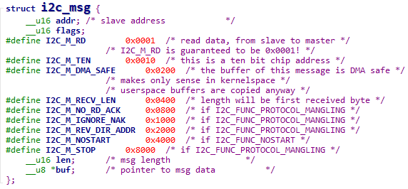

## I2C系统的重要结构体

参考资料：

* Linux驱动程序: `drivers/i2c/i2c-dev.c`
* I2CTools: `https://mirrors.edge.kernel.org/pub/software/utils/i2c-tools/`


### 1. I2C硬件框架


### 2. I2C传输协议

* 写操作


* 读操作


### 3. Linux软件框架


### 4. 重要结构体

使用一句话概括I2C传输：APP通过I2C Controller与I2C Device传输数据。

在Linux中：

* 怎么表示I2C Controller

  * 一个芯片里可能有多个I2C Controller，比如第0个、第1个、……

  * 对于使用者，只要确定是第几个I2C Controller即可

  * 使用i2c_adapter表示一个I2C BUS，或称为I2C Controller

  * 里面有2个重要的成员：

    * nr：第几个I2C BUS(I2C Controller)

    * i2c_algorithm，里面有该I2C BUS的传输函数，用来收发I2C数据

  * i2c_adapter

  

  * i2c_algorithm
    

* 怎么表示I2C Device

  * 一个I2C Device，一定有**设备地址**
  * 它连接在哪个I2C Controller上，即对应的i2c_adapter是什么
  * 使用i2c_client来表示一个I2C Device
    

* 怎么表示要传输的数据

  * 在上面的i2c_algorithm结构体中可以看到要传输的数据被称为：i2c_msg
  * i2c_msg
    

  * i2c_msg中的flags用来表示传输方向：bit 0等于I2C_M_RD表示读，bit 0等于0表示写

  * 一个i2c_msg要么是读，要么是写

  * 举例：设备地址为0x50的EEPROM，要读取它里面存储地址为0x10的一个字节，应该构造几个i2c_msg？

    * 要构造2个i2c_msg

    * 第一个i2c_msg表示写操作，把要访问的存储地址0x10发给设备

    * 第二个i2c_msg表示读操作

    * 代码如下

      ```c
      u8 data_addr = 0x10;
      i8 data;
      struct i2c_msg msgs[2];
      
      msgs[0].addr   = 0x50;
      msgs[0].flags  = 0;
      msgs[0].len    = 1;
      msgs[0].buf    = &data_addr;
      
      msgs[1].addr   = 0x50;
      msgs[1].flags  = I2C_M_RD;
      msgs[1].len    = 1;
      msgs[1].buf    = &data;
      ```

### 5. 内核里怎么传输数据

使用一句话概括I2C传输：

* APP通过I2C Controller与I2C Device传输数据

* APP通过i2c_adapter与i2c_client传输i2c_msg

* 内核函数i2c_transfer

  * i2c_msg里含有addr，所以这个函数里不需要i2c_client

  

