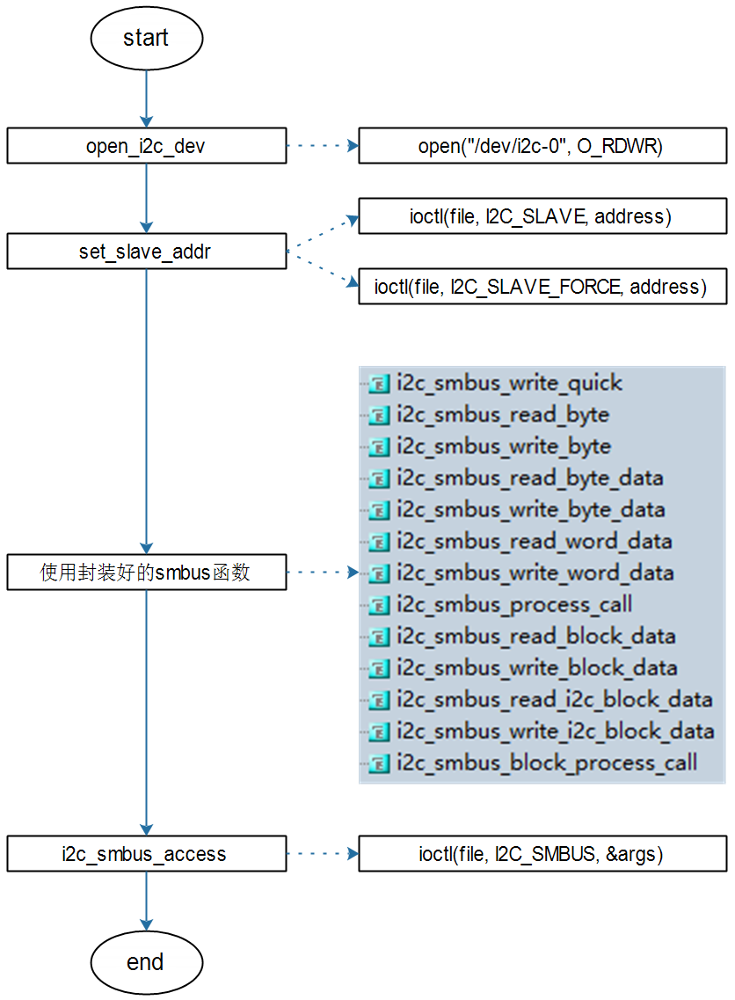

## 无需编写驱动直接访问设备\_I2C-Tools介绍

参考资料：

* Linux驱动程序: `drivers/i2c/i2c-dev.c`
* I2C-Tools-4.2: `https://mirrors.edge.kernel.org/pub/software/utils/i2c-tools/`
* AP3216C：
  * `git clone https://e.coding.net/weidongshan/01_all_series_quickstart.git`
  * 该GIT仓库中的文件《嵌入式Linux应用开发完全手册_韦东山全系列视频文档全集.pdf》
    * 第10.1篇，第十六章 I2C编程

### 1. I2C硬件连接


### 2. 无需编写驱动程序即可访问I2C设备

APP访问硬件肯定是需要驱动程序的，
对于I2C设备，内核提供了驱动程序`drivers/i2c/i2c-dev.c`，通过它可以直接使用下面的I2C控制器驱动程序来访问I2C设备。
框架如下：


i2c-tools是一套好用的工具，也是一套示例代码。


### 3. 体验I2C-Tools

使用一句话概括I2C传输：APP通过I2C Controller与I2C Device传输数据。
所以使用I2C-Tools时也需要指定：

* 哪个I2C控制器(或称为I2C BUS、I2C Adapter)
* 哪个I2C设备(设备地址)
* 数据：读还是写、数据本身

#### 3.1 交叉编译

* 在Ubuntu设置交叉编译工具链

  * STM32MP157

    ```shell
    export ARCH=arm
    export CROSS_COMPILE=arm-buildroot-linux-gnueabihf-
    export PATH=$PATH:/home/book/100ask_stm32mp157_pro-sdk/ToolChain/arm-buildroot-linux-gnueabihf_sdk-buildroot/bin
    ```

  * IMX6ULL

    ```shell
    export ARCH=arm
    export CROSS_COMPILE=arm-linux-gnueabihf-
    export PATH=$PATH:/home/book/100ask_imx6ull-sdk/ToolChain/gcc-linaro-6.2.1-2016.11-x86_64_arm-linux-gnueabihf/bin
    ```

    

* 修改I2C-Tools的Makefile指定交叉编译工具链

  ```shell
  CC      ?= gcc
  AR      ?= ar
  STRIP   ?= strip
  改为(指定交叉编译工具链前缀, 去掉问号)：
  CC      = $(CROSS_COMPILE)gcc
  AR      = $(CROSS_COMPILE)ar
  STRIP   = $(CROSS_COMPILE)strip
  ```

  在Makefile中，“?=”在第一次设置变量时才会起效果，如果之前设置过该变量，则不会起效果。

  

* 执行make即可

  * 执行make时，是动态链接，需要把libi2c.so也放到单板上
  * 想静态链接的话，执行：`make USE_STATIC_LIB=1`

#### 3.2 用法

* i2cdetect：I2C检测

  ```shell
  // 列出当前的I2C Adapter(或称为I2C Bus、I2C Controller)
  i2cdetect -l
  
  // 打印某个I2C Adapter的Functionalities, I2CBUS为0、1、2等整数
  i2cdetect -F I2CBUS
  
  // 看看有哪些I2C设备, I2CBUS为0、1、2等整数
  i2cdetect -y -a I2CBUS
  
  // 效果如下
  # i2cdetect -l
  i2c-1   i2c             STM32F7 I2C(0x40013000)                 I2C adapter
  i2c-2   i2c             STM32F7 I2C(0x5c002000)                 I2C adapter
  i2c-0   i2c             STM32F7 I2C(0x40012000)                 I2C adapter
  
  # i2cdetect -F 0
  Functionalities implemented by /dev/i2c-0:
  I2C                              yes
  SMBus Quick Command              yes
  SMBus Send Byte                  yes
  SMBus Receive Byte               yes
  SMBus Write Byte                 yes
  SMBus Read Byte                  yes
  SMBus Write Word                 yes
  SMBus Read Word                  yes
  SMBus Process Call               yes
  SMBus Block Write                yes
  SMBus Block Read                 yes
  SMBus Block Process Call         yes
  SMBus PEC                        yes
  I2C Block Write                  yes
  I2C Block Read                   yes
  
  // --表示没有该地址对应的设备, UU表示有该设备并且它已经有驱动程序,
  // 数值表示有该设备但是没有对应的设备驱动
  # i2cdetect -y -a 0  
       0  1  2  3  4  5  6  7  8  9  a  b  c  d  e  f
  00: 00 -- -- -- -- -- -- -- -- -- -- -- -- -- -- --
  10: -- -- -- -- -- -- -- -- -- -- UU -- -- -- 1e --
  20: -- -- UU -- -- -- -- -- -- -- -- -- -- -- -- --
  30: -- -- -- -- -- -- -- -- -- -- -- -- -- -- -- --
  40: -- -- -- -- -- -- -- -- -- -- -- -- -- -- -- --
  50: -- -- -- -- -- -- -- -- -- -- -- -- -- -- -- --
  60: -- -- -- -- -- -- -- -- -- -- -- -- -- -- -- --
  70: -- -- -- -- -- -- -- -- -- -- -- -- -- -- -- --
  ```

  

* i2cget：I2C读
  使用说明如下：

  ```shell
  # i2cget
  Usage: i2cget [-f] [-y] [-a] I2CBUS CHIP-ADDRESS [DATA-ADDRESS [MODE]]
    I2CBUS is an integer or an I2C bus name
    ADDRESS is an integer (0x03 - 0x77, or 0x00 - 0x7f if -a is given)
    MODE is one of:
      b (read byte data, default)
      w (read word data)
      c (write byte/read byte)
      Append p for SMBus PEC
  ```

  

  使用示例：

  ```shell
  // 读一个字节: I2CBUS为0、1、2等整数, 表示I2C Bus; CHIP-ADDRESS表示设备地址
  i2cget -f -y I2CBUS CHIP-ADDRESS
  
  // 读某个地址上的一个字节: 
  //    I2CBUS为0、1、2等整数, 表示I2C Bus
  //    CHIP-ADDRESS表示设备地址
  //    DATA-ADDRESS: 芯片上寄存器地址
  //    MODE：有2个取值, b-使用`SMBus Read Byte`先发出DATA-ADDRESS, 再读一个字节, 中间无P信号
  //                   c-先write byte, 在read byte，中间有P信号 
  i2cget -f -y I2CBUS CHIP-ADDRESS DATA-ADDRESS MODE  
  
  // 读某个地址上的2个字节: 
  //    I2CBUS为0、1、2等整数, 表示I2C Bus
  //    CHIP-ADDRESS表示设备地址
  //    DATA-ADDRESS: 芯片上寄存器地址
  //    MODE：w-表示先发出DATA-ADDRESS，再读2个字节
  i2cget -f -y I2CBUS CHIP-ADDRESS DATA-ADDRESS MODE  
  ```

* i2cset：I2C写
使用说明如下：
  
  ```shell
  # i2cset
  Usage: i2cset [-f] [-y] [-m MASK] [-r] [-a] I2CBUS CHIP-ADDRESS DATA-ADDRESS [VALUE] ... [MODE]
    I2CBUS is an integer or an I2C bus name
    ADDRESS is an integer (0x03 - 0x77, or 0x00 - 0x7f if -a is given)
    MODE is one of:
      c (byte, no value)
      b (byte data, default)
      w (word data)
    i (I2C block data)
      s (SMBus block data)
      Append p for SMBus PEC
  ```
  
  
  
  使用示例：
  
```shell
  // 写一个字节: I2CBUS为0、1、2等整数, 表示I2C Bus; CHIP-ADDRESS表示设备地址
  //           DATA-ADDRESS就是要写的数据
  i2cset -f -y I2CBUS CHIP-ADDRESS DATA-ADDRESS
  
  // 给address写1个字节(address, value):
  //           I2CBUS为0、1、2等整数, 表示I2C Bus; CHIP-ADDRESS表示设备地址
  //           DATA-ADDRESS: 8位芯片寄存器地址; 
  //           VALUE: 8位数值
  //           MODE: 可以省略，也可以写为b
  i2cset -f -y I2CBUS CHIP-ADDRESS DATA-ADDRESS VALUE [b]
  
  // 给address写2个字节(address, value):
  //           I2CBUS为0、1、2等整数, 表示I2C Bus; CHIP-ADDRESS表示设备地址
  //           DATA-ADDRESS: 8位芯片寄存器地址; 
  //           VALUE: 16位数值
  //           MODE: w
  i2cset -f -y I2CBUS CHIP-ADDRESS DATA-ADDRESS VALUE w
  
  // SMBus Block Write：给address写N个字节的数据
  //   发送的数据有：address, N, value1, value2, ..., valueN
  //   跟`I2C Block Write`相比, 需要发送长度N
  //           I2CBUS为0、1、2等整数, 表示I2C Bus; CHIP-ADDRESS表示设备地址
  //           DATA-ADDRESS: 8位芯片寄存器地址; 
  //           VALUE1~N: N个8位数值
  //           MODE: s
  i2cset -f -y I2CBUS CHIP-ADDRESS DATA-ADDRESS VALUE1 ... VALUEN s
  
  // I2C Block Write：给address写N个字节的数据
  //   发送的数据有：address, value1, value2, ..., valueN
  //   跟`SMBus Block Write`相比, 不需要发送长度N
  //           I2CBUS为0、1、2等整数, 表示I2C Bus; CHIP-ADDRESS表示设备地址
  //           DATA-ADDRESS: 8位芯片寄存器地址; 
  //           VALUE1~N: N个8位数值
  //           MODE: i
  i2cset -f -y I2CBUS CHIP-ADDRESS DATA-ADDRESS VALUE1 ... VALUEN i
  ```
  
* i2ctransfer：I2C传输(不是基于SMBus)
  使用说明如下：

  ```shell
  # i2ctransfer
  Usage: i2ctransfer [-f] [-y] [-v] [-V] [-a] I2CBUS DESC [DATA] [DESC [DATA]]...
    I2CBUS is an integer or an I2C bus name
    DESC describes the transfer in the form: {r|w}LENGTH[@address]
      1) read/write-flag 2) LENGTH (range 0-65535) 3) I2C address (use last one if omitted)
    DATA are LENGTH bytes for a write message. They can be shortened by a suffix:
      = (keep value constant until LENGTH)
      + (increase value by 1 until LENGTH)
      - (decrease value by 1 until LENGTH)
      p (use pseudo random generator until LENGTH with value as seed)
  
  Example (bus 0, read 8 byte at offset 0x64 from EEPROM at 0x50):
    # i2ctransfer 0 w1@0x50 0x64 r8
  Example (same EEPROM, at offset 0x42 write 0xff 0xfe ... 0xf0):
    # i2ctransfer 0 w17@0x50 0x42 0xff-
  ```

  使用举例：

  ```shell
  // Example (bus 0, read 8 byte at offset 0x64 from EEPROM at 0x50):
  # i2ctransfer -f -y 0 w1@0x50 0x64 r8
  
  // Example (bus 0, write 3 byte at offset 0x64 from EEPROM at 0x50):
  # i2ctransfer -f -y 0 w9@0x50 0x64 val1 val2 val3
  
  // Example 
  // first: (bus 0, write 3 byte at offset 0x64 from EEPROM at 0x50)
  // and then: (bus 0, read 3 byte at offset 0x64 from EEPROM at 0x50)
  # i2ctransfer -f -y 0 w9@0x50 0x64 val1 val2 val3 r3@0x50  
  # i2ctransfer -f -y 0 w9@0x50 0x64 val1 val2 val3 r3 //如果设备地址不变,后面的设备地址可省略
  ```

#### 3.3 使用I2C-Tools操作传感器AP3216C

百问网的开发板上有光感芯片AP3216C：


AP3216C是红外、光强、距离三合一的传感器，以读出光强、距离值为例，步骤如下：

* 复位：往寄存器0写入0x4
* 使能：往寄存器0写入0x3
* 读光强：读寄存器0xC、0xD得到2字节的光强
* 读距离：读寄存器0xE、0xF得到2字节的距离值

AP3216C的设备地址是0x1E，假设节在I2C BUS0上，操作命令如下：

* 使用SMBus协议

```shell
i2cset -f -y 0 0x1e 0 0x4
i2cset -f -y 0 0x1e 0 0x3
i2cget -f -y 0 0x1e 0xc w
i2cget -f -y 0 0x1e 0xe w
```


* 使用I2C协议

```shell
i2ctransfer -f -y 0 w2@0x1e 0 0x4
i2ctransfer -f -y 0 w2@0x1e 0 0x3
i2ctransfer -f -y 0 w1@0x1e 0xc r2
i2ctransfer -f -y 0 w1@0x1e 0xe r2
```


### 4. I2C-Tools的访问I2C设备的2种方式

I2C-Tools可以通过SMBus来访问I2C设备，也可以使用一般的I2C协议来访问I2C设备。
使用一句话概括I2C传输：APP通过I2C Controller与I2C Device传输数据。
在APP里，有这几个问题：

* 怎么指定I2C控制器？
  * i2c-dev.c提供为每个I2C控制器(I2C Bus、I2C Adapter)都生成一个设备节点：/dev/i2c-0、/dev/i2c-1等待
  * open某个/dev/i2c-X节点，就是去访问该I2C控制器下的设备
* 怎么指定I2C设备？
  * 通过ioctl指定I2C设备的地址
  * ioctl(file,  I2C_SLAVE, address)
    * 如果该设备已经有了对应的设备驱动程序，则返回失败
  * ioctl(file,  I2C_SLAVE_FORCE, address)
    * 如果该设备已经有了对应的设备驱动程序
    * 但是还是想通过i2c-dev驱动来访问它
    * 则使用这个ioctl来指定I2C设备地址
* 怎么传输数据？
  * 两种方式
  * 一般的I2C方式：ioctl(file, I2C_RDWR, &rdwr)
  * SMBus方式：ioctl(file, I2C_SMBUS, &args)


### 5. 源码分析

#### 5.1 使用I2C方式

示例代码：i2ctransfer.c


#### 5.2 使用SMBus方式

示例代码：i2cget.c、i2cset.c

