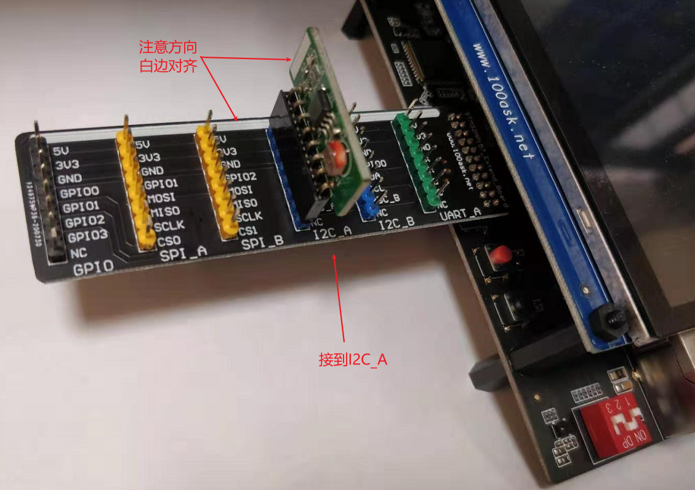
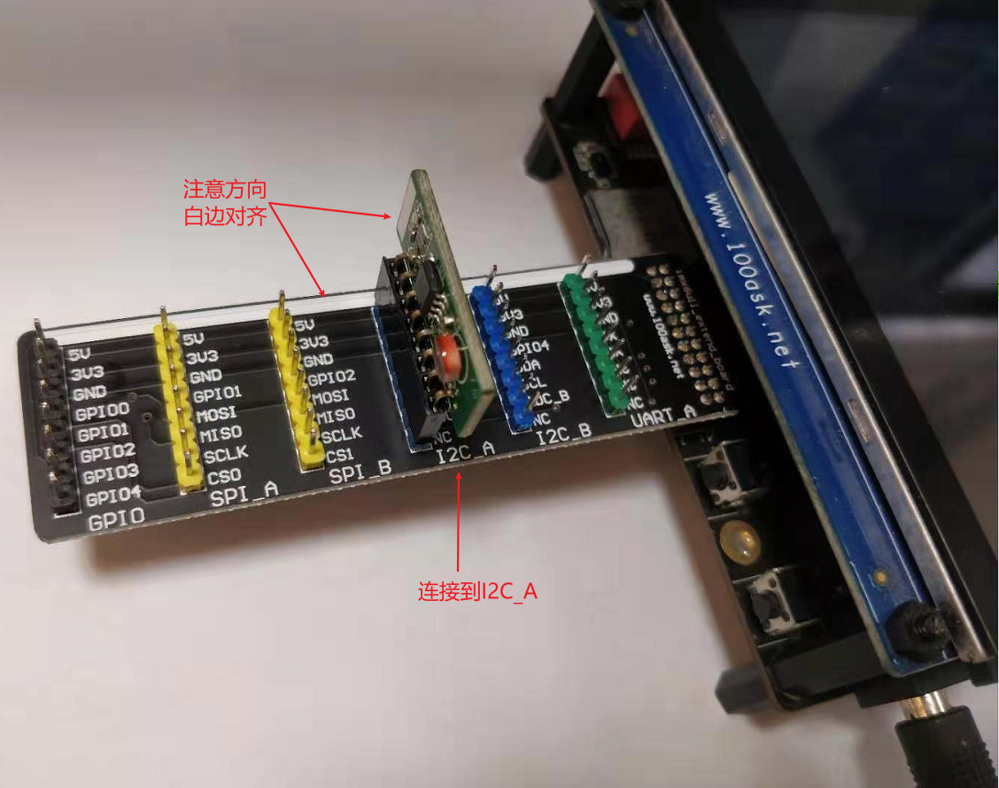
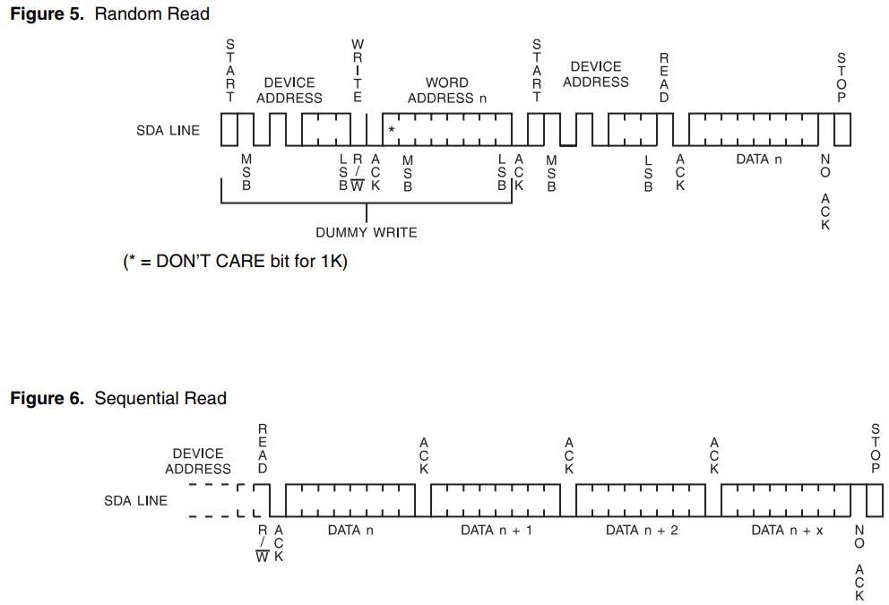
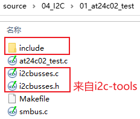
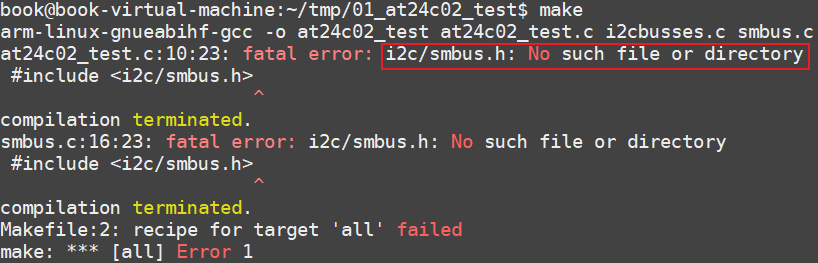

## 编写APP直接访问EEPROM

参考资料：

* Linux驱动程序: `drivers/i2c/i2c-dev.c`
* I2C-Tools-4.2: `https://mirrors.edge.kernel.org/pub/software/utils/i2c-tools/`
* AT24cxx.pdf

本节源码：GIT仓库中

* `doc_and_source_for_drivers\IMX6ULL\source\04_I2C\01_at24c02_test`
* `doc_and_source_for_drivers\STM32MP157\source\A7\04_I2C\01_at24c02_test`

### 1. 硬件连接

* STM32MP157的I2C模块连接方法
  

* IMX6ULL的I2C模块连接方法
  


### 2. AT24C02访问方法

#### 2.1 设备地址

从芯片手册上可以知道，AT24C02的设备地址跟它的A2、A1、A0引脚有关：


打开I2C模块的原理图(这2个文件是一样的)：

* `STM32MP157\开发板配套资料\原理图\04_Extend_modules(外设模块)\eeprom.zip\i2c_eeprom_module_v1.0.pdf`
* `IMX6ULL\开发板配套资料\原理图\Extend_modules\eeprom.zip\i2c_eeprom_module_v1.0.pdf`
* 如下：
  

从原理图可知，A2A1A0都是0，所以AT24C02的设备地址是：0b1010000，即0x50。


#### 2.2 写数据


#### 2.3 读数据

可以读1个字节，也可以连续读出多个字节。
连续读多个字节时，芯片内部的地址会自动累加。
当地址到达存储空间最后一个地址时，会从0开始。



### 3. 使用I2C-Tools的函数编程


### 4. 编译

#### 4.1 在Ubuntu设置交叉编译工具链

* STM32MP157

  ```shell
  export ARCH=arm
  export CROSS_COMPILE=arm-buildroot-linux-gnueabihf-
  export PATH=$PATH:/home/book/100ask_stm32mp157_pro-sdk/ToolChain/arm-buildroot-linux-gnueabihf_sdk-buildroot/bin
  ```

* IMX6ULL

  ```shell
  export ARCH=arm
  export CROSS_COMPILE=arm-linux-gnueabihf-
  export PATH=$PATH:/home/book/100ask_imx6ull-sdk/ToolChain/gcc-linaro-6.2.1-2016.11-x86_64_arm-linux-gnueabihf/bin
  ```

  

#### 4.2 使用I2C-Tools的源码



#### 4.3 编译

为IMX6ULL编译时，有如下错误：


这是因为IMX6ULL的工具链自带的include目录中，没有smbus.h。

需要我们自己提供这个头文件，解决方法：

* 提供头文件：
  

* 修改Makefile指定头文件目录

  ```shell
  all:
  	$(CROSS_COMPILE)gcc -I ./include -o at24c02_test at24c02_test.c i2cbusses.c smbus.c
  	
  ```

  


### 4.4 上机测试

**以下命令在开发板中执行。**

* 挂载NFS

  * vmware使用NAT(假设windowsIP为192.168.1.100)

    ```shell
    [root@100ask:~]# mount -t nfs -o nolock,vers=3,port=2049,mountport=9999 
    192.168.1.100:/home/book/nfs_rootfs /mnt
    ```

  * vmware使用桥接，或者不使用vmware而是直接使用服务器：假设Ubuntu IP为192.168.1.137

    ```shell
    [root@100ask:~]#  mount -t nfs -o nolock,vers=3 192.168.1.137:/home/book/nfs_rootfs /mnt
    ```


* 复制、执行程序

  ```shell
  [root@100ask:~]# cp /mnt/at24c02_test   /bin
  [root@100ask:~]# at24c02_test 0 w www.100ask.net
  [root@100ask:~]# at24c02_test 0 r
get data: www.100ask.net
  ```
  
  