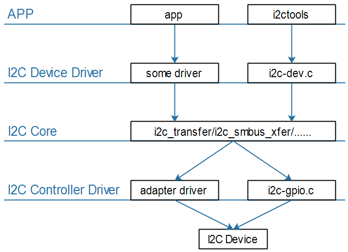
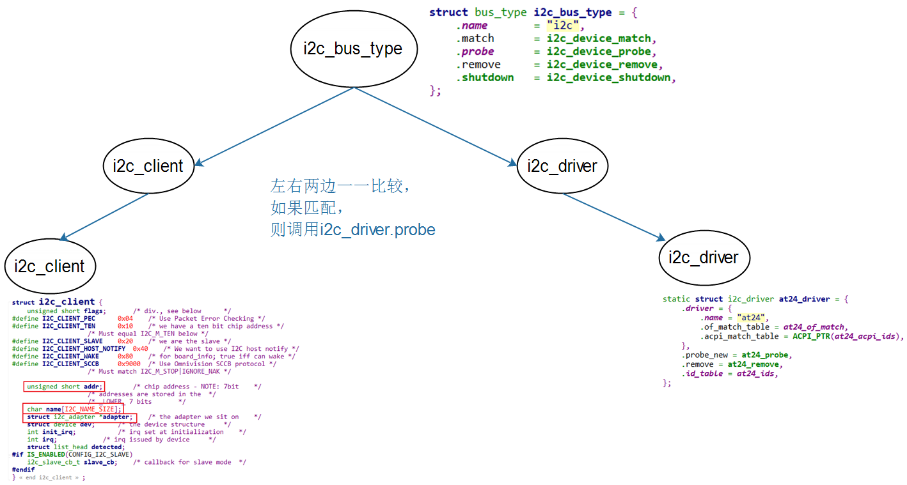

## I2C系统驱动程序模型

参考资料：

* Linux内核文档:
  * `Documentation\i2c\instantiating-devices.rst`
  * `Documentation\i2c\writing-clients.rst`
* Linux内核驱动程序示例:
  * `drivers/eeprom/at24.c`

### 1. I2C驱动程序的层次



I2C Core就是I2C核心层，它的作用：

* 提供统一的访问函数，比如i2c_transfer、i2c_smbus_xfer等
* 实现`I2C总线-设备-驱动模型`，管理：I2C设备(i2c_client)、I2C设备驱动(i2c_driver)、I2C控制器(i2c_adapter)


### 2. I2C总线-设备-驱动模型




#### 2.1 i2c_driver

i2c_driver表明能支持哪些设备：

* 使用of_match_table来判断
  * 设备树中，某个I2C控制器节点下可以创建I2C设备的节点
    * 如果I2C设备节点的compatible属性跟of_match_table的某项兼容，则匹配成功
  * i2c_client.name跟某个of_match_table[i].compatible值相同，则匹配成功
* 使用id_table来判断
  * i2c_client.name跟某个id_table[i].name值相同，则匹配成功

i2c_driver跟i2c_client匹配成功后，就调用i2c_driver.probe函数。


#### 2.2 i2c_client

i2c_client表示一个I2C设备，创建i2c_client的方法有4种：

* 方法1

  * 通过I2C bus number来创建

    ```c
    int i2c_register_board_info(int busnum, struct i2c_board_info const *info, unsigned len);
    ```

  * 通过设备树来创建

    ```shell
    	i2c1: i2c@400a0000 {
    		/* ... master properties skipped ... */
    		clock-frequency = <100000>;
    
    		flash@50 {
    			compatible = "atmel,24c256";
    			reg = <0x50>;
    		};
    
    		pca9532: gpio@60 {
    			compatible = "nxp,pca9532";
    			gpio-controller;
    			#gpio-cells = <2>;
    			reg = <0x60>;
    		};
    	};
    ```

* 方法2
  有时候无法知道该设备挂载哪个I2C bus下，无法知道它对应的I2C bus number。
  但是可以通过其他方法知道对应的i2c_adapter结构体。
  可以使用下面两个函数来创建i2c_client：

  * i2c_new_device

    ```c
      static struct i2c_board_info sfe4001_hwmon_info = {
    	I2C_BOARD_INFO("max6647", 0x4e),
      };
    
      int sfe4001_init(struct efx_nic *efx)
      {
    	(...)
    	efx->board_info.hwmon_client =
    		i2c_new_device(&efx->i2c_adap, &sfe4001_hwmon_info);
    
    	(...)
      }
    ```

    

  * i2c_new_probed_device

    ```c
      static const unsigned short normal_i2c[] = { 0x2c, 0x2d, I2C_CLIENT_END };
    
      static int usb_hcd_nxp_probe(struct platform_device *pdev)
      {
    	(...)
    	struct i2c_adapter *i2c_adap;
    	struct i2c_board_info i2c_info;
    
    	(...)
    	i2c_adap = i2c_get_adapter(2);
    	memset(&i2c_info, 0, sizeof(struct i2c_board_info));
    	strscpy(i2c_info.type, "isp1301_nxp", sizeof(i2c_info.type));
    	isp1301_i2c_client = i2c_new_probed_device(i2c_adap, &i2c_info,
    						   normal_i2c, NULL);
    	i2c_put_adapter(i2c_adap);
    	(...)
      }
    ```

  * 差别：

    * i2c_new_device：会创建i2c_client，即使该设备并不存在

    * i2c_new_probed_device：

      * 它成功的话，会创建i2c_client，并且表示这个设备肯定存在

      * I2C设备的地址可能发生变化，比如AT24C02的引脚A2A1A0电平不一样时，设备地址就不一样

      * 可以罗列出可能的地址

      * i2c_new_probed_device使用这些地址判断设备是否存在

        

        

* 方法3(不推荐)：由i2c_driver.detect函数来判断是否有对应的I2C设备并生成i2c_client

* 方法4：通过用户空间(user-space)生成
调试时、或者不方便通过代码明确地生成i2c_client时，可以通过用户空间来生成。
  
```c
  // 创建一个i2c_client, .name = "eeprom", .addr=0x50, .adapter是i2c-3
  # echo eeprom 0x50 > /sys/bus/i2c/devices/i2c-3/new_device
  
  // 删除一个i2c_client
  # echo 0x50 > /sys/bus/i2c/devices/i2c-3/delete_device
```

  

  ​      

  ​      