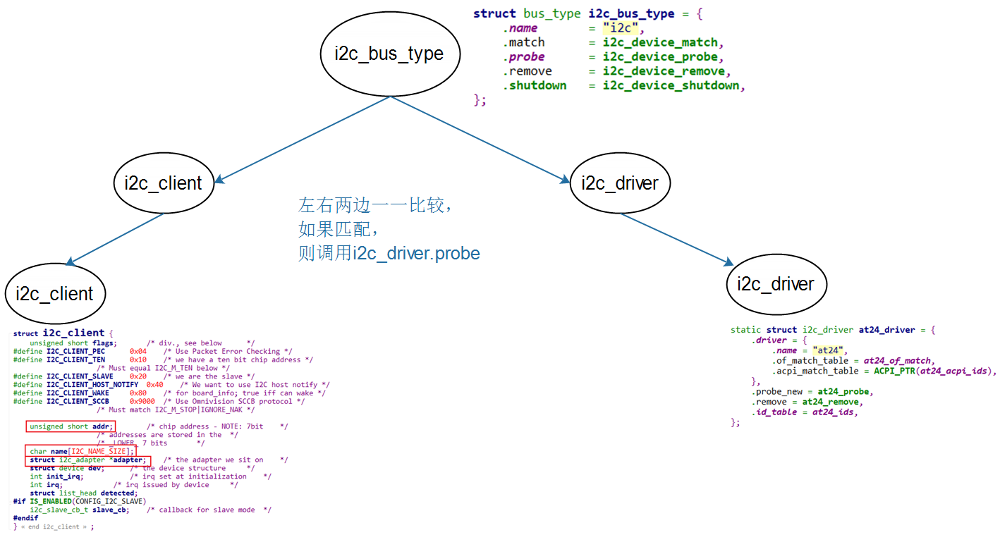

## 编写设备驱动之i2c_client

参考资料：

* Linux内核文档:
  * `Documentation\i2c\instantiating-devices.rst`
  * `Documentation\i2c\writing-clients.rst`
  
* Linux内核驱动程序示例:
  
  * `drivers/eeprom/at24.c`
  
* 本节代码：GIT仓库中

  * `IMX6ULL\source\04_I2C\03_ap3216c_ok`

  * `STM32MP157\source\A7\04_I2C\03_ap3216c_ok`

### 1. I2C总线-设备-驱动模型




### 2. 编译i2c_driver

* 增加Makefile

* 设置工具链

  * IMX6ULL
  
    ```shell
    export ARCH=arm
    export CROSS_COMPILE=arm-linux-gnueabihf-
    export PATH=$PATH:/home/book/100ask_imx6ull-sdk/ToolChain/gcc-linaro-6.2.1-2016.11-x86_64_arm-linux-gnueabihf/bin
    ```
  
  * STM32MP157
  
    ```shell
    source /home/book/100ask_stm32mp157_pro-sdk/ToolChain/openstlinux_eglfs-linux-gnueabi/environment-setup-cortexa7t2hf-neon-vfpv4-ostl-linux-gnueabi
    export ARCH=arm
    export CROSS_COMPILE=arm-ostl-linux-gnueabi-
    ```
  
    

* 编译

  

### 3. 编写测试程序

* 编程

* 设置工具链

  * IMX6ULL

    ```shell
    export ARCH=arm
    export CROSS_COMPILE=arm-linux-gnueabihf-
    export PATH=$PATH:/home/book/100ask_imx6ull-sdk/ToolChain/gcc-linaro-6.2.1-2016.11-x86_64_arm-linux-gnueabihf/bin
    ```

  * STM32MP157
    **注意**：对于STM32MP157，编译内核/驱动、编译APP的工具链不一样

    ```shell
    export ARCH=arm
    export CROSS_COMPILE=arm-buildroot-linux-gnueabihf-
    export PATH=$PATH:/home/book/100ask_stm32mp157_pro-sdk/ToolChain/arm-buildroot-linux-gnueabihf_sdk-buildroot/bin
    ```

    

* 编译

  ```shell
  // imx6ull
  arm-linux-gnueabihf-gcc -o ap3216c_drv_test ap3216c_drv_test.c
  
  // stm32mp157
  arm-buildroot-linux-gnueabihf-gcc -o ap3216c_drv_test ap3216c_drv_test.c
  ```
  
  
  
  

### 4. 多种方法生成i2c_client并测试

#### 4.1 在用户态生成

示例：

```shell
// 在I2C BUS0下创建i2c_client
# echo ap3216c 0x1e > /sys/bus/i2c/devices/i2c-0/new_device

// 删除i2c_client
# echo 0x1e > /sys/bus/i2c/devices/i2c-0/delete_device
```


#### 4.2 编写代码

* i2c_new_device
* i2c_new_probed_device
* i2c_register_board_info
  * 内核没有`EXPORT_SYMBOL(i2c_register_board_info)`
  * 使用这个函数的驱动必须编进内核里去


#### 4.3 使用设备树生成

在某个I2C控制器的节点下，添加如下代码：

```shell
		ap3216c@1e {
			compatible = "lite-on,ap3216c";
			reg = <0x1e>;
		};
```

##### 1. STM32MP157

  * 修改`arch/arm/boot/dts/stm32mp157c-100ask-512d-lcd-v1.dts`，添加如下代码：

    ```shell
    &i2c1 {
    		ap3216c@1e {
    			compatible = "lite-on,ap3216c";
    			reg = <0x1e>;
    		};
    };
    ```

    **注意**：设备树里i2c1就是I2C BUS0。

    

  * 编译设备树：
    在Ubuntu的STM32MP157内核目录下执行如下命令,
    得到设备树文件：`arch/arm/boot/dts/stm32mp157c-100ask-512d-lcd-v1.dtb`

    ```shell
    make dtbs
    ```

  * 复制到NFS目录：

    ```shell
    $ cp arch/arm/boot/dts/stm32mp157c-100ask-512d-lcd-v1.dtb ~/nfs_rootfs/
    ```

    

  * 确定设备树分区挂载在哪里

    由于版本变化，STM32MP157单板上烧录的系统可能有细微差别。
    在开发板上执行`cat /proc/mounts`后，可以得到两种结果(见下图)：

    * mmcblk2p2分区挂载在/boot目录下(下图左边)：无需特殊操作，下面把文件复制到/boot目录即可

    * mmcblk2p2挂载在/mnt目录下(下图右边)

      * 在视频里、后面文档里，都是更新/boot目录下的文件，所以要先执行以下命令重新挂载：
        * `mount  /dev/mmcblk2p2  /boot`

      

  * 更新设备树

    ```shell
    [root@100ask:~]# cp /mnt/stm32mp157c-100ask-512d-lcd-v1.dtb /boot
    [root@100ask:~]# sync
    ```

* 重启开发板

  

##### 2. IMX6ULL

  * 修改`arch/arm/boot/dts/100ask_imx6ull-14x14.dts`，添加如下代码：

    ```shell
    &i2c1 {
    		ap3216c@1e {
    			compatible = "lite-on,ap3216c";
    			reg = <0x1e>;
    		};
    };
    ```

    **注意**：设备树里i2c1就是I2C BUS0。

    

  * 编译设备树：
    在Ubuntu的IMX6ULL内核目录下执行如下命令,
    得到设备树文件：`arch/arm/boot/dts/100ask_imx6ull-14x14.dtb`

    ```shell
    make dtbs
    ```

  * 复制到NFS目录：

    ```shell
    $ cp arch/arm/boot/dts/100ask_imx6ull-14x14.dtb ~/nfs_rootfs/
    ```

  * 更新设备树

    ```shell
    [root@100ask:~]# cp /mnt/100ask_imx6ull-14x14.dtb /boot
    [root@100ask:~]# sync
    ```
    
* 重启开发板


#### 4.4 上机测试

**以下命令在开发板中执行。**

* 挂载NFS

  * vmware使用NAT(假设windowsIP为192.168.1.100)

    ```shell
    [root@100ask:~]# mount -t nfs -o nolock,vers=3,port=2049,mountport=9999 
    192.168.1.100:/home/book/nfs_rootfs /mnt
    ```

  * vmware使用桥接，或者不使用vmware而是直接使用服务器：假设Ubuntu IP为192.168.1.137

    ```shell
    [root@100ask:~]#  mount -t nfs -o nolock,vers=3 192.168.1.137:/home/book/nfs_rootfs /mnt
    ```


* 复制、执行程序

  看视频。
  
  * 先安装i2c_driver驱动

    ```shell
    // 对于IMX6ULL，想看到驱动打印信息，需要先执行
    echo "7 4 1 7" > /proc/sys/kernel/printk
    
    insmod /mnt/ap3216c_drv.ko
    ```
  
  * 在生成i2c_client
    有3种方法，前面介绍了：用户态生成、安装ap3216c_client驱动、使用设备树
  
  * 执行测试程序
  
    ```shell
    [root@100ask:~]# /mnt/ap3216c_drv_test
    APP read : 01 00 00 00 8f bf
    ```
  
    
  
  
  
  