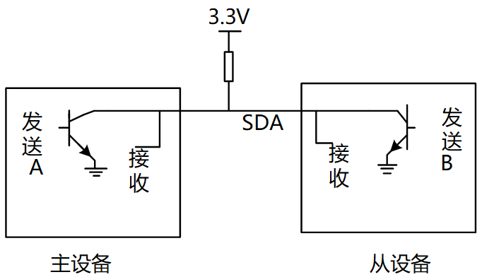
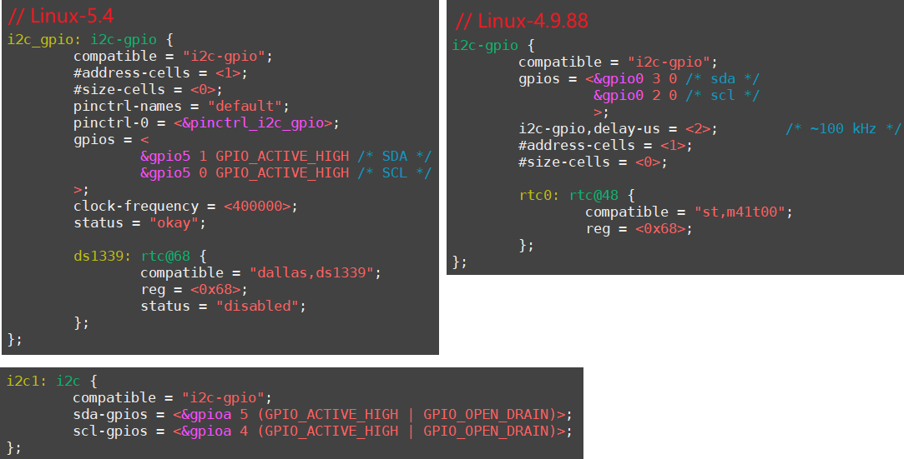
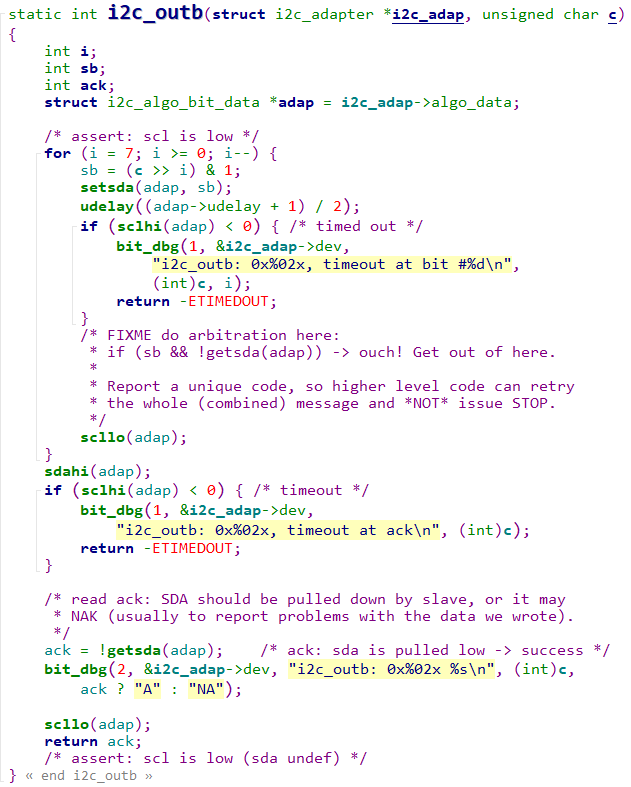

## 使用GPIO模拟I2C的驱动程序分析

参考资料：

* i2c_spec.pdf
* Linux文档
  * `Linux-5.4\Documentation\devicetree\bindings\i2c\i2c-gpio.yaml`
  * `Linux-4.9.88\Documentation\devicetree\bindings\i2c\i2c-gpio.txt`
* Linux驱动源码
  * `Linux-5.4\drivers\i2c\busses\i2c-gpio.c`
  * `Linux-4.9.88\drivers\i2c\busses\i2c-gpio.c`

### 1. 回顾I2C协议

#### 1.1 硬件连接

I2C在硬件上的接法如下所示，主控芯片引出两条线SCL,SDA线，在一条I2C总线上可以接很多I2C设备，我们还会放一个上拉电阻（放一个上拉电阻的原因以后我们再说）。

#### 1.2 I2C信号

I2C协议中数据传输的单位是字节，也就是8位。但是要用到9个时钟：前面8个时钟用来传输8数据，第9个时钟用来传输回应信号。传输时，先传输最高位(MSB)。

* 开始信号（S）：SCL为高电平时，SDA山高电平向低电平跳变，开始传送数据。
* 结束信号（P）：SCL为高电平时，SDA由低电平向高电平跳变，结束传送数据。
* 响应信号(ACK)：接收器在接收到8位数据后，在第9个时钟周期，拉低SDA
* SDA上传输的数据必须在SCL为高电平期间保持稳定，SDA上的数据只能在SCL为低电平期间变化

I2C协议信号如下：

#### 1.3 协议细节

* 如何在SDA上实现双向传输？
  主芯片通过一根SDA线既可以把数据发给从设备，也可以从SDA上读取数据，连接SDA线的引脚里面必然有两个引脚（发送引脚/接受引脚）。

* 主、从设备都可以通过SDA发送数据，肯定不能同时发送数据，怎么错开时间？
  在9个时钟里，
  前8个时钟由主设备发送数据的话，第9个时钟就由从设备发送数据；
  前8个时钟由从设备发送数据的话，第9个时钟就由主设备发送数据。
* 双方设备中，某个设备发送数据时，另一方怎样才能不影响SDA上的数据？
  设备的SDA中有一个三极管，使用开极/开漏电路(三极管是开极，CMOS管是开漏，作用一样)，如下图：
  

真值表如下：

从真值表和电路图我们可以知道：

* 当某一个芯片不想影响SDA线时，那就不驱动这个三极管
* 想让SDA输出高电平，双方都不驱动三极管(SDA通过上拉电阻变为高电平)
* 想让SDA输出低电平，就驱动三极管

从下面的例子可以看看数据是怎么传的（实现双向传输）。
举例：主设备发送（8bit）给从设备

* 前8个clk
  * 从设备不要影响SDA，从设备不驱动三极管
  * 主设备决定数据，主设备要发送1时不驱动三极管，要发送0时驱动三极管

* 第9个clk，由从设备决定数据
  * 主设备不驱动三极管
  * 从设备决定数据，要发出回应信号的话，就驱动三极管让SDA变为0
  * 从这里也可以知道ACK信号是低电平

从上面的例子，就可以知道怎样在一条线上实现双向传输，这就是SDA上要使用上拉电阻的原因。

为何SCL也要使用上拉电阻？
在第9个时钟之后，如果有某一方需要更多的时间来处理数据，它可以一直驱动三极管把SCL拉低。
当SCL为低电平时候，大家都不应该使用IIC总线，只有当SCL从低电平变为高电平的时候，IIC总线才能被使用。
当它就绪后，就可以不再驱动三极管，这是上拉电阻把SCL变为高电平，其他设备就可以继续使用I2C总线了。

### 2. 使用GPIO模拟I2C的要点

* 引脚设为GPIO
* GPIO设为输出、开极/开漏(open collector/open drain)
* 要有上拉电阻

 

### 3. 驱动程序分析

#### 3.1 平台总线设备驱动模型

#### 3.2 设备树

对于GPIO引脚的定义，有两种方法：

* 老方法：gpios
* 新方法：sda-gpios、scl-gpios

#### 3.3 驱动程序分析

##### 1. I2C-GPIO驱动层次

##### 2. 传输函数分析

看视频分析i2c_outb函数：`drivers\i2c\algos\i2c-algo-bit.c`

### 4. 怎么使用I2C-GPIO

设置设备数，在里面添加一个节点即可，示例代码看上面：

* compatible = "i2c-gpio";

* 使用pinctrl把 SDA、SCL所涉及引脚配置为GPIO、开极

  * 可选

* 指定SDA、SCL所用的GPIO

* 指定频率(2种方法)：
  * i2c-gpio,delay-us = <5>;	/* ~100 kHz */
  * clock-frequency = <400000>;
  
* #address-cells = <1>;

* #size-cells = <0>;

* i2c-gpio,sda-open-drain：

  * 它表示其他驱动、其他系统已经把SDA设置为open drain了
  * 在驱动里不需要在设置为open drain
  * 如果需要驱动代码自己去设置SDA为open drain，就不要提供这个属性

* i2c-gpio,scl-open-drain：

  * 它表示其他驱动、其他系统已经把SCL设置为open drain了
  * 在驱动里不需要在设置为open drain
  * 如果需要驱动代码自己去设置SCL为open drain，就不要提供这个属性

  