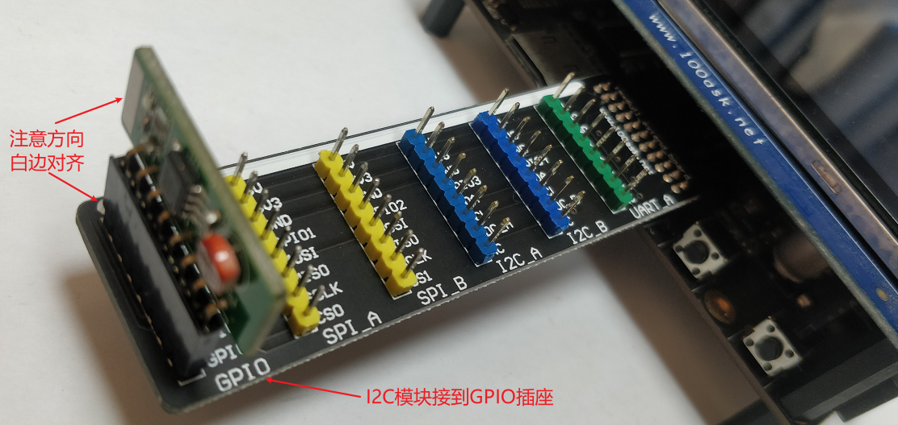
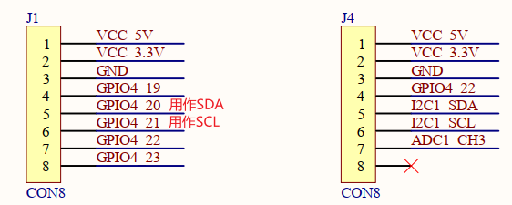

## 使用GPIO操作I2C设备_IMX6ULL

参考资料：

* i2c_spec.pdf
* Linux文档
  * `Linux-5.4\Documentation\devicetree\bindings\i2c\i2c-gpio.yaml`
  * `Linux-4.9.88\Documentation\devicetree\bindings\i2c\i2c-gpio.txt`
* Linux驱动源码
  * `Linux-5.4\drivers\i2c\busses\i2c-gpio.c`
  * `Linux-4.9.88\drivers\i2c\busses\i2c-gpio.c`
* 扩展板原理图：`imx6ull_extend_v10.pdf`
* 本节对应的代码：
  * `doc_and_source_for_drivers\IMX6ULL\source\04_I2C\07_i2c_gpio_dts_imx6ull`

### 1. 硬件连接

* IMX6ULL：把I2C模块接到GPIO
  


### 2. 根据原理图编写设备树

#### 2.1 原理图



#### 2.2 编写设备树

```shell
i2c_gpio_100ask {
	compatible = "i2c-gpio";
	gpios = <&gpio4 20 0 /* sda */
		     &gpio4 21 0 /* scl */
		    >;
	i2c-gpio,delay-us = <5>;	/* ~100 kHz */
	#address-cells = <1>;
	#size-cells = <0>;
};
```

把上述代码，放入`arch/arm/boot/dts/100ask_imx6ull-14x14.dts`的根节点下面。

### 3. 确认内核已经配置了I2C-GPIO

查看内核目录下的`.config`，如果未设置`CONFIG_I2C_GPIO`，上机实验时需要配置内核、编译I2C-GPIO驱动。


### 4. 上机实验

#### 4.1 设置工具链

* IMX6ULL

  ```shell
  export ARCH=arm
  export CROSS_COMPILE=arm-linux-gnueabihf-
  export PATH=$PATH:/home/book/100ask_imx6ull-sdk/ToolChain/gcc-linaro-6.2.1-2016.11-x86_64_arm-linux-gnueabihf/bin
  ```


#### 4.2 编译、替换设备树

  * 编译设备树：
    在Ubuntu的IMX6ULL内核目录下执行如下命令,
    得到设备树文件：`arch/arm/boot/dts/100ask_imx6ull-14x14.dtb`

    ```shell
    make dtbs
    ```

  * 复制到NFS目录：

    ```shell
    $ cp arch/arm/boot/dts/100ask_imx6ull-14x14.dtb ~/nfs_rootfs/
    ```

  * 开发板上挂载NFS文件系统

    * vmware使用NAT(假设windowsIP为192.168.1.100)

      ```shell
      [root@100ask:~]# mount -t nfs -o nolock,vers=3,port=2049,mountport=9999 
      192.168.1.100:/home/book/nfs_rootfs /mnt
      ```

    * vmware使用桥接，或者不使用vmware而是直接使用服务器：假设Ubuntu IP为192.168.1.137

      ```shell
      [root@100ask:~]#  mount -t nfs -o nolock,vers=3 192.168.1.137:/home/book/nfs_rootfs /mnt
      ```

* 更新设备树

    ```shell
    [root@100ask:~]# cp /mnt/100ask_imx6ull-14x14.dtb /boot
    [root@100ask:~]# sync
    ```

* 重启开发板

#### 4.3 编译I2C-GPIO驱动

##### 1. 配置内核

在IMX6ULL内核源码目录下执行`make menuconfig`命令，如下配置内核：

```shell
Device Drivers  --->
    I2C support  --->
        I2C Hardware Bus support  --->
            <M> GPIO-based bitbanging I2C      // 输入M，编译为模块        
```


##### 2. 编译模块

设置工具链后，在内核目录下执行：

```shell
make modules   // 得到 drivers/i2c/busses/i2c-gpio.ko
```


#### 5. 测试

在开发板上执行：

```shell
[root@100ask:~]# i2cdetect -l    // 加载i2c-gpio.ko前只看到2条I2C BUS
i2c-1   i2c             21a4000.i2c                             I2C adapter
i2c-0   i2c             21a0000.i2c                             I2C adapter
[root@100ask:~]#
[root@100ask:~]# insmod /mnt/i2c-gpio.ko   
[   45.067602] i2c-gpio i2c_gpio_100ask: using pins 116 (SDA) and 117 (SCL)
[root@100ask:~]# i2cdetect -l     // 加载i2c-gpio.ko后看到3条I2C BUS
i2c-1   i2c             21a4000.i2c                             I2C adapter
i2c-4   i2c             i2c_gpio_100ask                         I2C adapter
i2c-0   i2c             21a0000.i2c                             I2C adapter
[root@100ask:~]#
[root@100ask:~]# i2cdetect -y 4     // 检测到0x50的设备
     0  1  2  3  4  5  6  7  8  9  a  b  c  d  e  f
00:          -- -- -- -- -- -- -- -- -- -- -- -- --
10: -- -- -- -- -- -- -- -- -- -- -- -- -- -- -- --
20: -- -- -- -- -- -- -- -- -- -- -- -- -- -- -- --
30: -- -- -- -- -- -- -- -- -- -- -- -- -- -- -- --
40: -- -- -- -- -- -- -- -- -- -- -- -- -- -- -- --
50: 50 -- -- -- -- -- -- -- -- -- -- -- -- -- -- --
60: -- -- -- -- -- -- -- -- -- -- -- -- -- -- -- --
70: -- -- -- -- -- -- -- --
[root@100ask:~]#
[root@100ask:~]# i2cset -f -y 4 0x50 0 0x55   // 往0地址写入0x55
[root@100ask:~]# i2cget -f -y 4 0x50 0        // 读0地址
0x55
```


