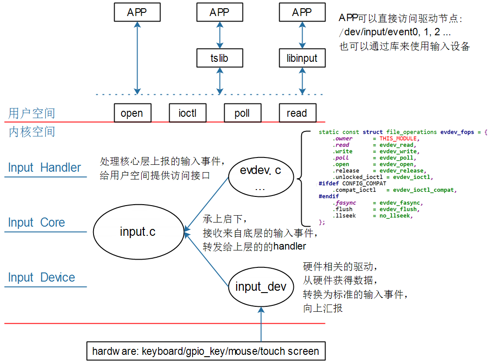
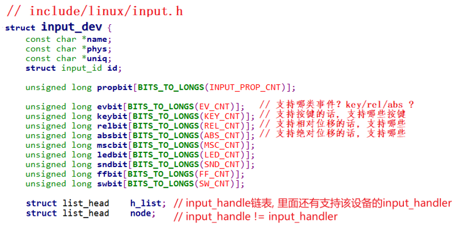
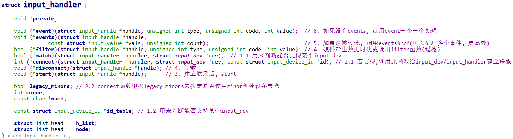
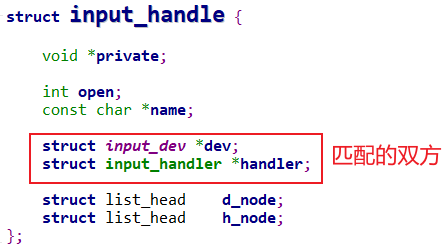
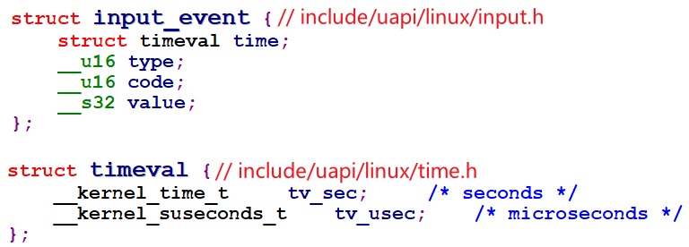

## Input子系统框架详解

参考资料：

* Linux 5.x内核文档
* Documentation\input\input-programming.rst
  * Documentation\input\event-codes.rst
* Linux 4.x内核文档
  * Documentation\input\input-programming.txt
  * Documentation\input\event-codes.txt

### 1. 回顾字符设备驱动程序


怎么编写字符设备驱动程序？

* 确定主设备号
* 创建file_operations结构体
  * 在里面填充drv_open/drv_read/drv_ioctl等函数
* 注册file_operations结构体
  * register_chrdev(major, &fops, name)
* 谁调用register_chrdev？在入口函数调用
* 有入口自然就有出口
  * 在出口函数unregister_chrdev
* 辅助函数(帮助系统自动创建设备节点)
  * class_create
  * device_create


### 2. Input子系统框架




### 3. Input子系统内部实现

#### 3.1 重要结构体


* 左边的input_dev表示输入设备
  

* 右边的input_handler表示"处理程序"


* 匹配之后使用input_handle保存2者之间的联系

  

* 设备获取、上报数据：input_event

  

#### 3.2 注册流程演示

看视频。

* 注册input_dev：input_register_device
  * 把input_dev放入input.c的input_dev_list链表
  * 对于input.c的input_handler_list链表中的每一个input_handler，一一比较
  * 如果匹配则调用input_handler.connect
* 注册input_handler: input_register_handler
  * 把input_dev放入input.c的input_handler_list链表
  * 对于input.c的input_dev_list链表中的每一个input_dev，一一比较
  * 如果匹配则调用input_handler.connect

* 怎么判断input_dev和input_handler是否匹配
  * input_handler中有一个id_table，表示它支持哪类设备
  * input_handler还有一个match函数，可以用来进行复杂的判断
  * match函数可以省略
  * 判断是否匹配流程
    * 如果没有match函数：input_dev跟id_table比较即可
    * 如果有match函数：input_dev先跟id_table比较，成功后再用match函数再次判断

* 匹配后做的事情

  * 调用input_handler.connect

    * 创建/注册一个input_handle，把input_dev, input_handler放在里面

      ```shell
      类似：
          evdev->handle.dev = input_get_device(dev);
      	evdev->handle.handler = handler;
      
      	error = input_register_handle(&evdev->handle);
      ```

    * 注册字符设备驱动程序

      ```shell
      类似：
      	cdev_init(&evdev->cdev, &evdev_fops);
      
      	error = cdev_device_add(&evdev->cdev, &evdev->dev);
      ```

      

#### 3.3 读取一个数据的流程演示

* APP调用open函数打开`/dev/input/event0`

  * 在驱动程序evdev_open里，创建一个evdev_client，表示一个"客户"

* APP调用read/poll读取、等待数据

  * 没有数据时休眠：`wait_event_interruptible(evdev->wait, ...)`

* 点击、操作输入设备，产生中断

* 在中断服务程序里

  * 从硬件读取到数据

  * 使用以下函数上报数据

    ```shell
    void input_event(struct input_dev *dev,
    		 unsigned int type, unsigned int code, int value);
    		 
    static inline void input_sync(struct input_dev *dev); // 实质也是 input_event
    ```

* input_event做什么？

  * 从dev->h_list中取出input_handle，从input_handle取出input_handler
  * 优先调用input_handler->filter来处理
  * 如果没有input_handler->filter或者没处理成功
    * 调用input_handler->events
    * 没有input_handler->events的话，调用input_handler->event

* 以evdev.c为例
  * 它有evdev_events：用来处理多个事件
  * 也有evdev_event：实质还是调用evdev_events
  * 唤醒"客户"：wake_up_interruptible(&evdev->wait);