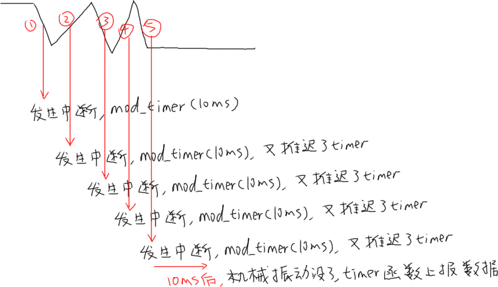

## GPIO按键驱动分析与使用

参考资料：

* Linux 5.x内核

  * Documentation\devicetree\bindings\input\gpio-keys.txt
  * drivers\input\keyboard\gpio_keys.c
* Linux 4.x内核
  * Documentation\devicetree\bindings\input\gpio-keys.txt
  * drivers\input\keyboard\gpio_keys.c

* 设备树

  * IMX6ULL：`Linux-4.9.88/arch/arm/boot/dts/100ask_imx6ull-14x14.dts`
  * STM32MP157：`Linux-5.4/arch/arm/boot/dts/stm32mp15xx-100ask.dtsi`
  * QEMU：`linux-4.9.88/arch/arm/boot/dts/100ask_imx6ull_qemu.dts`
  
  

### 1. 驱动程序框架


### 2. 设备树示例

#### 2.1 设备树讲解

属性：

* 必备：`compatible = "gpio-keys";`

* 可选：

  * `autorepeat`: 表示自动重复，按下按键不松开，驱动会自动重复上报按键值

* 对于每一个GPIO按键，都是一个子节点，有这些属性：
  * `gpios`：使用哪个GPIO
  * `interrupts`：对应的中断
  * `linux,code`：对应的按键值
  * **注意**：`gpios`和`interrupts`至少要保留一个，不能都省略
  * `debounce-interval`:  消除抖动的间隔，单位：ms，默认是5ms

#### 2.2 100ASK_IMX6ULL

```shell
gpio-keys {
	compatible = "gpio-keys";
	pinctrl-names = "default";

	user1 {
		label = "User1 Button";
		gpios = <&gpio5 1 GPIO_ACTIVE_LOW>;
		gpio-key,wakeup;
		linux,code = <KEY_1>;
	};

	user2 {
		label = "User2 Button";
		gpios = <&gpio4 14 GPIO_ACTIVE_LOW>;
		gpio-key,wakeup;
		linux,code = <KEY_2>;
	};
};
```

#### 2.3 100ASK_STM32MP157

```shell
joystick {
		compatible = "gpio-keys";
		#size-cells = <0>;
		button-0 {
				 label = "usr_button0";
				 linux,code = <KEY_A>;
				interrupt-parent = <&gpiog>;
				interrupts = <3 IRQ_TYPE_EDGE_RISING>;
		};
	   button-1 {
				 label = "usr_button1";
				 linux,code = <KEY_ENTER>;
				interrupt-parent = <&gpiog>;
				interrupts = <2 IRQ_TYPE_EDGE_RISING>;
		};

};
```


#### 2.4 QEMU

```shell
gpio-keys@0 {
				compatible = "gpio-keys";
				pinctrl-names = "default";
				pinctrl-0 = <&pinctrl_gpio_keys>;
				status = "okay";

				Key0{
						label = "Key 0";
						gpios = <&gpio5 1 GPIO_ACTIVE_HIGH>;
						linux,code = <KEY_1>;
				};
};

gpio-keys@1 {
				compatible = "gpio-keys";
				pinctrl-names = "default";
				pinctrl-0 = <&pinctrl_gpio_key1>;
				status = "okay";

				Key0{
						label = "Key 1";
						gpios = <&gpio1 18 GPIO_ACTIVE_HIGH>;
						linux,code = <KEY_2>;
				};
};
```


### 3. gpio_keys.c驱动程序分析

#### 3.1 套路

* 根据设备树获得硬件信息：哪个GPIO、对于什么按键
* 分配/设置/注册input_dev结构体
* request_irq: 在中断处理函数中确定按键值、上报按键值
  * 有两种IRQ函数
  * `gpio_keys_gpio_isr`：设备树中的用`gpios`来描述用到的引脚
  * `gpio_keys_irq_isr`：设备树中的用`interrupts`来描述用到的引脚

#### 3.2  gpio_keys_gpio_isr分析

理想状况是：按下、松开按键，各产生一次中断，也只产生一次中断。
但是对于机械开关，它的金属弹片会反复震动。GPIO电平会反复变化，最后才稳定。一般是几十毫秒才会稳定。
如果不处理抖动的话，用户只操作一次按键，会发生多次中断，驱动程序可能会上报多个数据。


怎么处理按键抖动？

* 在按键中断程序中，可以循环判断几十亳秒，发现电平稳定之后再上报
* 使用定时器

显然第1种方法太耗时，违背“中断要尽快处理”的原则，你的系统会很卡。

怎么使用定时器？看下图：



核心在于：在GPIO中断中并不立刻记录按键值，而是修改定时器超时时间，10ms后再处理。
如果10ms内又发生了GPIO中断，那就认为是抖动，这时再次修改超时时间为10ms。
只有10ms之内再无GPIO中断发生，那么定时器的函数才会被调用。
在定时器函数中上报按键值。


#### 3.3 gpio_keys_irq_isr分析

有个变量key_pressed，用来表示当前按键状态：初始值是false，表示按键没有被按下。

* 发生中断

  * 上报"按下的值"：`input_event(input, EV_KEY, button->code, 1); input_sync(input);`

   * 如果不延迟(!bdata->release_delay)
   * 马上上报"松开的值"：`input_event(input, EV_KEY, button->code, 0); input_sync(input);`
  * 如果延迟(bdata->release_delay)
  * 启动定时器，过若干毫秒再上报"松开的值"
  
* 所以，使用gpio_keys_irq_isr时，一次中断就会导致上报2个事件：按下、松开

* 缺点：无法准确判断一个按键确实已经被松开了

### 4. QEMU上机实验

IMX6ULL、STM32MP157的出厂系统都已经配置的GPIO按键。
可以执行以下命令确认设备节点：

```shell
cat /proc/bus/input/devices
```

然后执行`hexdump  /dev/input/event?`(?表示某个数值)，并且操作按键来观察输出信息。

#### 

也可以在QEMU上做实验：原理图如下：


#### 4.1 设置工具链

在Ubuntu中执行：

```shell
export ARCH=arm
export CROSS_COMPILE=arm-linux-gnueabihf-
export PATH=$PATH:/home/book/100ask_imx6ull-qemu/ToolChain/gcc-linaro-6.2.1-2016.11-x86_64_arm-linux-gnueabihf/bin
```

#### 4.2 配置内核

QEMU的内核里已经配置了GPIO按键的设备树，只需要编译出gpio_keys驱动程序即可。
配置内核：执行`make menuconfig`

```shell
-> Device Drivers
  -> Input device support
    -> Generic input layer   
      -> Keyboards
         <M>   GPIO Buttons      
```


#### 4.3 编译驱动
```shell
book@100ask:~/100ask_imx6ull-qemu$ cd linux-4.9.88
book@100ask:~/100ask_imx6ull-qemu/linux-4.9.88$ make modules
```

成功的话，可以得到：

```shell
drivers/input/keyboard/gpio_keys.ko
```

复制到如下目录：

```shell
$ cp drivers/input/keyboard/gpio_keys.ko ~/nfs_rootfs/
```


#### 4.4 启动QEMU

在Ubuntu中执行：

```shell
$ cd ubuntu-18.04_imx6ul_qemu_system
$ ./qemu-imx6ull-gui.sh
```


#### 4.5 挂载NFS、实验

在QEMU中执行：

```shell
$ mount -t nfs -o nolock,vers=3 10.0.2.2:/home/book/nfs_rootfs /mnt
$ insmod /mnt/gpio_keys.ko
$ cat /proc/bus/input/devices   // 确认设备节点
$ hexdump /dev/input/event3
```

在QEMU的GUI界面操作：

