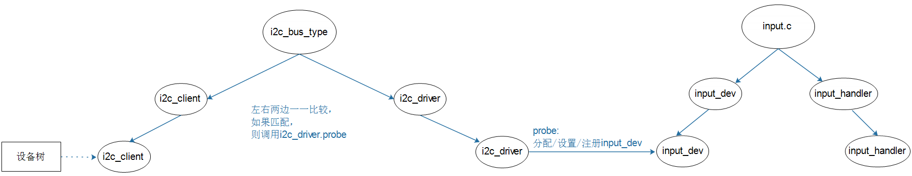

## I2C接口触摸屏驱动分析

参考资料：

* Linux 5.x内核

  * Documentation\devicetree\bindings\input\touchscreen\goodix.txt
  * drivers/input/touchscreen/goodix.c
* Linux 4.x内核
  * Documentation\devicetree\bindings\input\touchscreen\goodix.txt
  * drivers/input/touchscreen/gt9xx/gt9xx.c

* 设备树

  * IMX6ULL：`Linux-4.9.88/arch/arm/boot/dts/100ask_imx6ull-14x14.dts`
  * STM32MP157：`Linux-5.4/arch/arm/boot/dts/stm32mp15xx-100ask.dtsi`
  
  

### 1. 驱动程序框架




### 2. 设备树示例

#### 2.1 设备树讲解

示例：

```shell
i2c@00000000 {
	/* ... */

	gt928@5d {
		compatible = "goodix,gt928";
		reg = <0x5d>;
		interrupt-parent = <&gpio>;
		interrupts = <0 0>;

		irq-gpios = <&gpio1 0 0>;
		reset-gpios = <&gpio1 1 0>;
	};

	/* ... */
};

```


作为一个I2C设备，在某个I2C控制器节点下创建一个子节点。
属性：

* 必备，根据这个属性找到驱动程序：`compatible = "xxxx";`
* 必备，I2C设备地址：`reg = <0xXX>;`
* 可选：

  * 中断
* 复位引脚

#### 2.2 100ASK_IMX6ULL

```shell
&i2c2 {
	gt9xx@5d {
			compatible = "goodix,gt9xx";
			reg = <0x5d>;
			status = "okay";
			interrupt-parent = <&gpio1>;
			interrupts = <5 IRQ_TYPE_EDGE_FALLING>;
			pinctrl-names = "default";
			pinctrl-0 = <&pinctrl_tsc_reset &pinctrl_touchscreen_int>;
			/*pinctrl-1 = <&pinctrl_tsc_irq>;*/
			/*
			 pinctrl-names = "default", "int-output-low", "int-output-high", "int-input";
			 pinctrl-0 = <&ts_int_default>;
			 pinctrl-1 = <&ts_int_output_low>;
			 pinctrl-2 = <&ts_int_output_high>;
			 pinctrl-3 = <&ts_int_input>;
			*/
			reset-gpios = <&gpio5 2 GPIO_ACTIVE_LOW>;
			irq-gpios = <&gpio1 5 IRQ_TYPE_EDGE_FALLING>;
			irq-flags = <2>;                /*1:rising 2: falling*/

			touchscreen-max-id = <5>;
			touchscreen-size-x = <800>;
			touchscreen-size-y = <480>;
			touchscreen-max-w = <1024>;
			touchscreen-max-p = <1024>;
			/*touchscreen-key-map = <172>, <158>;*/ /*KEY_HOMEPAGE, KEY_BACK*/

			goodix,type-a-report = <0>;
			goodix,driver-send-cfg = <0>;
			goodix,create-wr-node = <1>;
			goodix,wakeup-with-reset = <0>;
			goodix,resume-in-workqueue = <0>;
			goodix,int-sync = <0>;
			goodix,swap-x2y = <0>;
			goodix,esd-protect = <0>;
			goodix,pen-suppress-finger = <0>;
			goodix,auto-update = <0>;
			goodix,auto-update-cfg = <0>;
			goodix,power-off-sleep = <0>;
			/* ...... */
	};
};	
```

#### 2.3 100ASK_STM32MP157

```shell
&i2c4 {
    gt911@5d {
		compatible = "goodix,gt928";
		reg = <0x5d>;
		interrupt-parent = <&gpioe>;
		interrupts = <4 IRQ_TYPE_EDGE_FALLING>;
		reset-gpios = <&gpioe 12 GPIO_ACTIVE_LOW>;
		irq-gpios = <&gpioe 4 IRQ_TYPE_EDGE_FALLING>;
		irq-flags = <2>;                /*1:rising 2: falling*/
		touchscreen-max-id = <5>;
		touchscreen-size-x = <1024>;
		touchscreen-size-y = <600>;
	};
};
```


### 3. 驱动程序分析

####  3.1 分配/设置/注册input_dev

* IMX6ULL Linux 4.x

```shell
gtp_probe
	ret = gtp_request_input_dev(ts);
			ts->input_dev = input_allocate_device();
			......
			ret = input_register_device(ts->input_dev);

	ret = gtp_request_irq(ts);			
```


* STM32MP157 Linux 5.x

```shell
goodix_ts_probe
		error = request_firmware_nowait(THIS_MODULE, true, ts->cfg_name,
						&client->dev, GFP_KERNEL, ts,
						goodix_config_cb);

goodix_config_cb
	goodix_configure_dev(ts);
		ts->input_dev = devm_input_allocate_device(&ts->client->dev);
		......
		error = input_register_device(ts->input_dev);
		
		error = goodix_request_irq(ts);		
```

  


#### 3.2 注册中断处理函数

* IMX6ULL Linux 4.x

```shell
		ret = request_threaded_irq(ts->client->irq, NULL,
				gtp_irq_handler,
				ts->pdata->irq_flags | IRQF_ONESHOT,
				ts->client->name,
				ts);
```


* STM32MP157 Linux 5.x

```shell
static int goodix_request_irq(struct goodix_ts_data *ts)
{
	return devm_request_threaded_irq(&ts->client->dev, ts->client->irq,
					 NULL, goodix_ts_irq_handler,
					 ts->irq_flags, ts->client->name, ts);
}
```


#### 3.3 中断处理函数分析

通过I2C函数读取数据、上报数据。

* IMX6ULL Linux 4.x

```shell
gtp_irq_handler
	gtp_work_func(ts);
		point_state = gtp_get_points(ts, points, &key_value);
			gtp_i2c_read
				i2c_transfer
		gtp_mt_slot_report(ts, point_state & 0x0f, points);
			input_mt_slot
			input_mt_report_slot_state
			input_report_abs
```


* STM32MP157 Linux 5.x

```shell
goodix_ts_irq_handler
	goodix_process_events(ts);
		touch_num = goodix_ts_read_input_report(ts, point_data);
			goodix_i2c_read
				i2c_transfer
		goodix_ts_report_touch_9b
			input_mt_slot
			input_mt_report_slot_state
			touchscreen_report_pos
			input_report_abs
```

