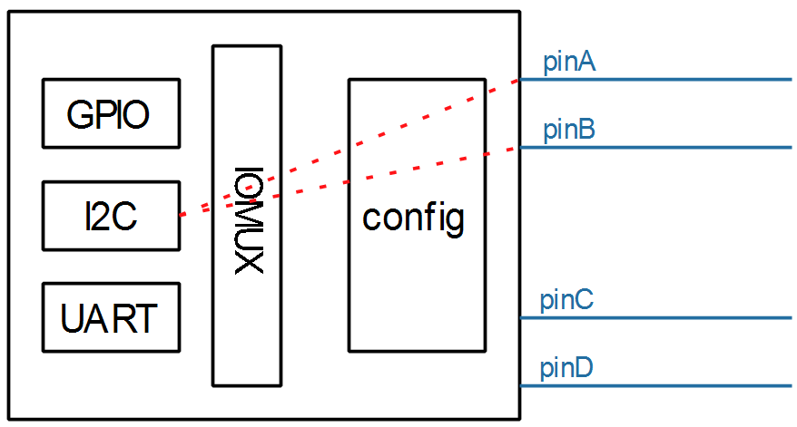

## Pinctrl子系统使用示例_基于STM32MP157

参考资料：

* Linux 5.x内核文档
  * Documentation\devicetree\bindings\pinctrl\pinctrl-bindings.txt
* Linux 4.x内核文档
  * Documentation\pinctrl.txt
  * Documentation\devicetree\bindings\pinctrl\pinctrl-bindings.txt

### 1. 要做什么

以I2C为例：




* 查看原理图确定使用哪些引脚：比如pinA、pinB
* 生成pincontroller设备树信息
  * 选择功能：比如把pinA配置为I2C_SCL、把pinB配置为I2C_SDA
  * 配置：比如把pinA、pinB配置为open drain
* 使用pincontroller设备树信息：比如在i2c节点里定义"pinctrl-names"、"pinctrl-0"


### 2. 生成pincontroller设备树信息

生成pincontroller设备树信息，有3中方法：

* 有些芯片有图形化的工具，可以点点鼠标就可以配置引脚信息，得到pincontroller中的信息
* 有些芯片，只能看厂家给的设备树文档或者参考设备树的例子
* 最差的就是需要阅读驱动代码才能构造设备树信息。

#### 2.1 安装工具

对于STM32MP157，有引脚配置工具/设备树生成工具：

  * 打开：http://download.100ask.net/
  * 找到开发板："100ASK_STM32MP157_PRO开发板"
  * 下载开发板配套资料
  * 下载完后，工具在如下目录里：


#### 2.2 根据原理图生成pinctrl信息

```shell
&pinctrl {
	u-boot,dm-pre-reloc;

	i2c1_pins_mx: i2c1_mx-0 {
		pins {
			pinmux = <STM32_PINMUX('F', 14, AF5)>, /* I2C1_SCL */
					 <STM32_PINMUX('F', 15, AF5)>; /* I2C1_SDA */
			bias-disable;
			drive-open-drain;
			slew-rate = <0>;
		};
	};

	i2c1_sleep_pins_mx: i2c1_sleep_mx-0 {
		pins {
			pinmux = <STM32_PINMUX('F', 14, ANALOG)>, /* I2C1_SCL */
					 <STM32_PINMUX('F', 15, ANALOG)>; /* I2C1_SDA */
		};
	};
}

```


### 3. 在client节点使用pinctrl

```shell
&i2c1{
	pinctrl-names = "default", "sleep";
	pinctrl-0 = <&i2c1_pins_mx>;
	pinctrl-1 = <&i2c1_sleep_pins_mx>;
	status = "okay";

	/* USER CODE BEGIN i2c1 */
	/* USER CODE END i2c1 */
};
```


### 4. 使用过程

这是透明的，我们的驱动基本不用管。当设备切换状态时，对应的pinctrl就会被调用。

比如在platform_device和platform_driver的枚举过程中，流程如下：

