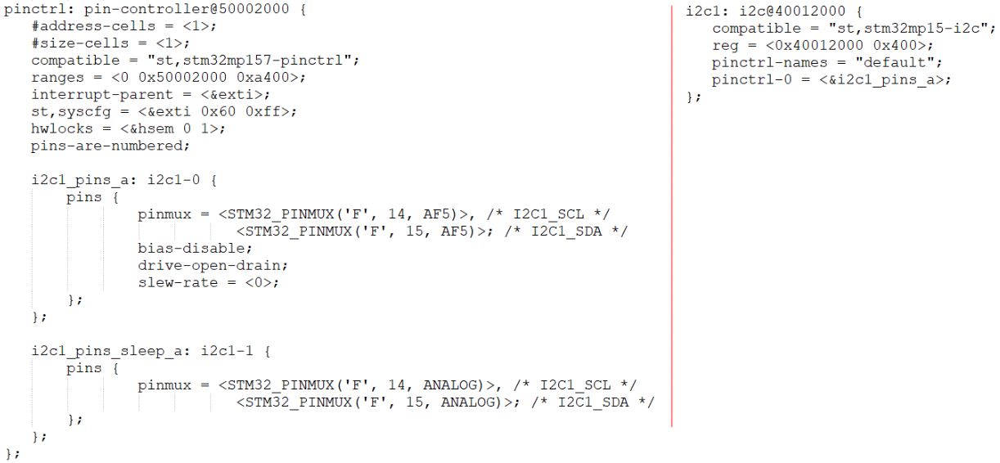

## Pincontroller构造过程情景分析

参考资料：

* Linux 5.x内核
  * Documentation\devicetree\bindings\pinctrl\pinctrl-bindings.txt
  * arch/arm/boot/dts/stm32mp151.dtsi
  * arch/arm/boot/dts/stm32mp157-100ask-pinctrl.dtsi  
  * arch/arm/boot/dts/stm32mp15xx-100ask.dtsi
  * drivers\pinctrl\stm32\pinctrl-stm32mp157.c
  * drivers\pinctrl\stm32\pinctrl-stm32.c

### 1. 设备树



### 2. 驱动代码执行流程

驱动程序位置：

```shell
drivers\pinctrl\stm32\pinctrl-stm32mp157.c
drivers\pinctrl\stm32\pinctrl-stm32.c
```

调用过程：

```c
stm32_pctl_probe
	ret = stm32_pctrl_create_pins_tab(pctl, pctl->pins);

	ret = stm32_pctrl_build_state(pdev);

	pins = devm_kcalloc(&pdev->dev, pctl->npins, sizeof(*pins),
			    GFP_KERNEL);

	for (i = 0; i < pctl->npins; i++)
		pins[i] = pctl->pins[i].pin;

	pctl->pctl_desc.name = dev_name(&pdev->dev);
	pctl->pctl_desc.owner = THIS_MODULE;
	pctl->pctl_desc.pins = pins;
	pctl->pctl_desc.npins = pctl->npins;
	pctl->pctl_desc.link_consumers = true;
	pctl->pctl_desc.confops = &stm32_pconf_ops;
	pctl->pctl_desc.pctlops = &stm32_pctrl_ops;
	pctl->pctl_desc.pmxops = &stm32_pmx_ops;
	pctl->dev = &pdev->dev;
	pctl->pin_base_shift = pctl->match_data->pin_base_shift;

	pctl->pctl_dev = devm_pinctrl_register(&pdev->dev, &pctl->pctl_desc,
					       pctl);
    
```


### 3. 作用1：描述、获得引脚：解析设备树

#### 3.1 单个引脚

```c
	pctl->pctl_desc.pins = pins;
	pctl->pctl_desc.npins = pctl->npins;
```


可以在开发板上查看：

```shell
/sys/kernel/debug/pinctrl/soc:pin-controller@50002000]# cat pins
```


#### 3.2 某组引脚

```c
static const struct pinctrl_ops stm32_pctrl_ops = {
	.dt_node_to_map		= stm32_pctrl_dt_node_to_map,
	.dt_free_map		= pinctrl_utils_free_map,
	.get_groups_count	= stm32_pctrl_get_groups_count,
	.get_group_name		= stm32_pctrl_get_group_name,
	.get_group_pins		= stm32_pctrl_get_group_pins,
};

```

某组引脚中，有哪些引脚？

```shell
/sys/kernel/debug/pinctrl/soc:pin-controller@50002000]# cat pingroups
```


#### 3.3 设备树解析情景分析

分析：stm32_pctrl_create_pins_tab、stm32_pctrl_build_state


### 4. 作用2：引脚复用

下节视频讲解。

### 5. 作用3：引脚配置

下节视频讲解。

