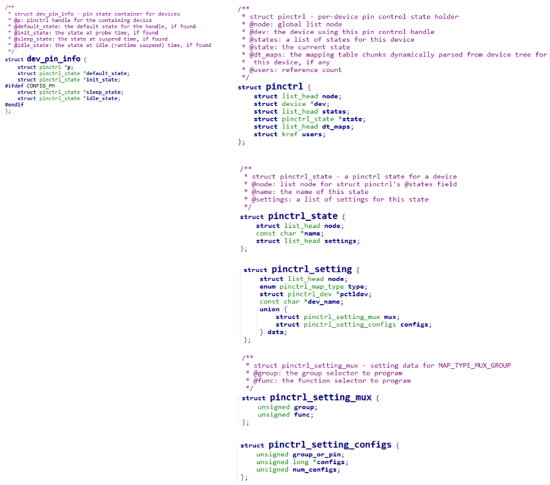

## client端使用pinctrl过程的情景分析_基于STM32MP157

参考资料：
* Linux 5.x内核
  * Documentation\devicetree\bindings\pinctrl\pinctrl-bindings.txt
  * arch/arm/boot/dts/stm32mp151.dtsi
  * arch/arm/boot/dts/stm32mp157-100ask-pinctrl.dtsi  
  * arch/arm/boot/dts/stm32mp15xx-100ask.dtsi
  * drivers\pinctrl\stm32\pinctrl-stm32mp157.c
  * drivers\pinctrl\stm32\pinctrl-stm32.c

* Linux 4.x内核
  * Documentation\pinctrl.txt
  * Documentation\devicetree\bindings\pinctrl\pinctrl-bindings.txt
  * arch/arm/boot/dts/imx6ull-14x14-evk.dts
  * arch/arm/boot/dts/100ask_imx6ull-14x14.dts
  * drivers\pinctrl\freescale\pinctrl-imx6ul.c
  * drivers\pinctrl\freescale\pinctrl-imx.c

### 1. 回顾client的数据结构

在设备树中，使用pinctrl时格式如下：


设备节点要么被转换为platform_device，或者其他结构体(比如i2c_client)，但是里面都会有一个device结构体，比如：


#### 1.1 dev_pin_info

每个device结构体里都有一个dev_pin_info结构体，用来保存设备的pinctrl信息：



#### 1.2 pinctrl

假设芯片上有多个pin controller，那么这个设备使用哪个pin controller？

这需要通过设备树来确定：

* 分析设备树，找到pin controller
* 对于每个状态，比如default、init，去分析pin controller中的设备树节点
  * 使用pin controller的pinctrl_ops.dt_node_to_map来处理设备树的pinctrl节点信息，得到一系列的pinctrl_map
  * 这些pinctrl_map放在pinctrl.dt_maps链表中
  * 每个pinctrl_map都被转换为pinctrl_setting，放在对应的pinctrl_state.settings链表中


#### 1.3 pinctrl_map和pinctrl_setting

设备引用pin controller中的某个节点时，这个节点会被转换为一些列的pinctrl_map：

* 转换为多少个pinctrl_map，完全由具体的驱动决定
* 每个pinctrl_map，又被转换为一个pinctrl_setting
* 举例，设备节点里有：`pinctrl-0 = <&state_0_node_a>`
  * pinctrl-0对应一个状态，会得到一个pinctrl_state
  * state_0_node_a节点被解析为一系列的pinctrl_map
  * 这一系列的pinctrl_map被转换为一系列的pinctrl_setting
  * 这些pinctrl_setting被放入pinctrl_state的settings链表


### 2. client节点的pinctrl构造过程

#### 2.1 函数调用

```shell
really_probe
	pinctrl_bind_pins
		dev->pins = devm_kzalloc(dev, sizeof(*(dev->pins)), GFP_KERNEL);
		
		dev->pins->p = devm_pinctrl_get(dev);
							pinctrl_get
								create_pinctrl(dev);
									ret = pinctrl_dt_to_map(p);
									
                                    for_each_maps(maps_node, i, map) {
	                                    ret = add_setting(p, map);
                                    }
		
		dev->pins->default_state = pinctrl_lookup_state(dev->pins->p,
					PINCTRL_STATE_DEFAULT);			
```


#### 2.2 情景分析

##### 1. 设备树转换为pinctrl_map


##### 2. pinctrl_map转换为pinctrl_setting


### 3. 切换state情景分析

#### 3.1 函数调用过程

涉及pinctrl子系统的其他2个作用：引脚复用、引脚配置

```shell
really_probe
	pinctrl_bind_pins
		pinctrl_select_state
			/* Apply all the settings for the new state */
			list_for_each_entry(setting, &state->settings, node) {
				switch (setting->type) {
				case PIN_MAP_TYPE_MUX_GROUP:
					ret = pinmux_enable_setting(setting);
							ret = ops->set_mux(...);
				break;
				case PIN_MAP_TYPE_CONFIGS_PIN:
				case PIN_MAP_TYPE_CONFIGS_GROUP:
					ret = pinconf_apply_setting(setting);
							ret = ops->pin_config_group_set(...);
					break;
				default:
					ret = -EINVAL;
				break;
			}		
```


#### 3.2 情景分析

