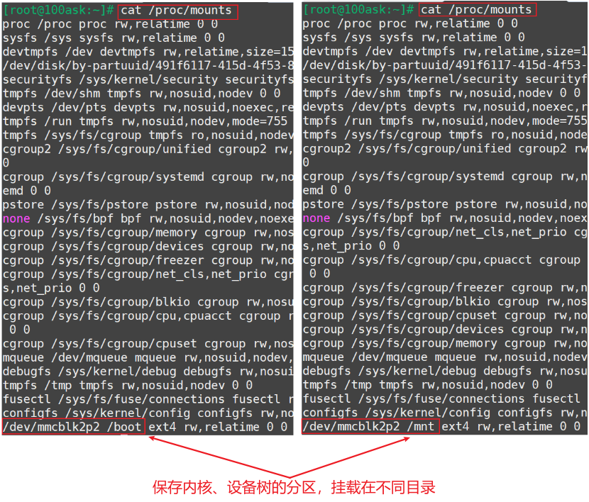

## 调试虚拟的Pinctrl驱动程序

参考资料：
* Linux 5.x内核
  * Documentation\devicetree\bindings\pinctrl\pinctrl-bindings.txt
  * arch/arm/boot/dts/stm32mp151.dtsi
  * arch/arm/boot/dts/stm32mp157-100ask-pinctrl.dtsi  
  * arch/arm/boot/dts/stm32mp15xx-100ask.dtsi
  * drivers\pinctrl\stm32\pinctrl-stm32mp157.c
  * drivers\pinctrl\stm32\pinctrl-stm32.c

* Linux 4.x内核
  * Documentation\pinctrl.txt
  * Documentation\devicetree\bindings\pinctrl\pinctrl-bindings.txt
  * arch/arm/boot/dts/imx6ull-14x14-evk.dts
  * arch/arm/boot/dts/100ask_imx6ull-14x14.dts
  * drivers\pinctrl\freescale\pinctrl-imx6ul.c
  * drivers\pinctrl\freescale\pinctrl-imx.c
  
* 本课对应的源码

  * GIT仓库中

    ```shell
    doc_and_source_for_drivers\IMX6ULL\source\06_Pinctrl\02_virtual_pinctrl_ok
    doc_and_source_for_drivers\STM32MP157\source\A7\06_Pinctrl\02_virtual_pinctrl_ok
    ```

    

### 1. 上机实验

#### 1.1 设置工具链

##### 1. STM32MP157
  **注意**：对于STM32MP157，以前说编译内核/驱动、编译APP的工具链不一样，其实编译APP用的工具链也能用来编译内核。

  ```shell
  export ARCH=arm
  export CROSS_COMPILE=arm-buildroot-linux-gnueabihf-
  export PATH=$PATH:/home/book/100ask_stm32mp157_pro-sdk/ToolChain/arm-buildroot-linux-gnueabihf_sdk-buildroot/bin
  ```

##### 2. IMX6ULL

  ```shell
  export ARCH=arm
  export CROSS_COMPILE=arm-linux-gnueabihf-
  export PATH=$PATH:/home/book/100ask_imx6ull-sdk/ToolChain/gcc-linaro-6.2.1-2016.11-x86_64_arm-linux-gnueabihf/bin
  ```


#### 1.2 编译、替换设备树

##### 1. STM32MP157

  * 修改`arch/arm/boot/dts/stm32mp157c-100ask-512d-lcd-v1.dts`，添加如下代码：

    ```shell
    / {
        virtual_pincontroller {
            compatible = "100ask,virtual_pinctrl";
            i2cgrp: i2cgrp {
                    functions = "i2c", "i2c";
                    groups = "pin0", "pin1";
                    configs = <0x11223344  0x55667788>;
            };
        };
    
        virtual_i2c {
            compatible = "100ask,virtual_i2c";
            pinctrl-names = "default";
            pinctrl-0 = <&i2cgrp>;
        };
    };
    ```

    

  * 编译设备树：
    在Ubuntu的STM32MP157内核目录下执行如下命令,
    得到设备树文件：`arch/arm/boot/dts/stm32mp157c-100ask-512d-lcd-v1.dtb`

    ```shell
    make dtbs
    ```

  * 复制到NFS目录：

    ```shell
    $ cp arch/arm/boot/dts/stm32mp157c-100ask-512d-lcd-v1.dtb ~/nfs_rootfs/
    ```

  * 开发板上挂载NFS文件系统

    * vmware使用NAT(假设windowsIP为192.168.1.100)

      ```shell
      [root@100ask:~]# mount -t nfs -o nolock,vers=3,port=2049,mountport=9999 
      192.168.1.100:/home/book/nfs_rootfs /mnt
      ```

    * vmware使用桥接，或者不使用vmware而是直接使用服务器：假设Ubuntu IP为192.168.1.137

      ```shell
      [root@100ask:~]#  mount -t nfs -o nolock,vers=3 192.168.1.137:/home/book/nfs_rootfs /mnt
      ```

* 确定设备树分区挂载在哪里

  由于版本变化，STM32MP157单板上烧录的系统可能有细微差别。
  在开发板上执行`cat /proc/mounts`后，可以得到两种结果(见下图)：

  * mmcblk2p2分区挂载在/boot目录下(下图左边)：无需特殊操作，下面把文件复制到/boot目录即可

  * mmcblk2p2挂载在/mnt目录下(下图右边)

    * 在视频里、后面文档里，都是更新/boot目录下的文件，所以要先执行以下命令重新挂载：
      * `mount  /dev/mmcblk2p2  /boot`

    

  * 更新设备树

    ```shell
    [root@100ask:~]# cp /mnt/stm32mp157c-100ask-512d-lcd-v1.dtb /boot
    [root@100ask:~]# sync
    ```

* 重启开发板

  


##### 2. IMX6ULL

  * 修改`arch/arm/boot/dts/100ask_imx6ull-14x14.dts`，添加如下代码：

    ```shell
    / {
        virtual_pincontroller {
            compatible = "100ask,virtual_pinctrl";
            i2cgrp: i2cgrp {
                    functions = "i2c", "i2c";
                    groups = "pin0", "pin1";
                    configs = <0x11223344  0x55667788>;
            };
        };
    
        virtual_i2c {
            compatible = "100ask,virtual_i2c";
            pinctrl-names = "default";
            pinctrl-0 = <&i2cgrp>;
        };
    };
    ```

    

  * 编译设备树：
    在Ubuntu的IMX6ULL内核目录下执行如下命令,
    得到设备树文件：`arch/arm/boot/dts/100ask_imx6ull-14x14.dtb`

    ```shell
    make dtbs
    ```

  * 复制到NFS目录：

    ```shell
    $ cp arch/arm/boot/dts/100ask_imx6ull-14x14.dtb ~/nfs_rootfs/
    ```

* 开发板上挂载NFS文件系统

  * vmware使用NAT(假设windowsIP为192.168.1.100)

    ```shell
    [root@100ask:~]# mount -t nfs -o nolock,vers=3,port=2049,mountport=9999 
    192.168.1.100:/home/book/nfs_rootfs /mnt
    ```

  * vmware使用桥接，或者不使用vmware而是直接使用服务器：假设Ubuntu IP为192.168.1.137

    ```shell
    [root@100ask:~]#  mount -t nfs -o nolock,vers=3 192.168.1.137:/home/book/nfs_rootfs /mnt
    ```

  * 更新设备树

    ```shell
    [root@100ask:~]# cp /mnt/100ask_imx6ull-14x14.dtb /boot
    [root@100ask:~]# sync
    ```

* 重启开发板


#### 1.3 编译、安装驱动程序

* 编译：

  * 在Ubuntu上
  * 修改`02_virtual_pinctrl_ok`中的Makefile，指定内核路径`KERN_DIR`，在执行`make`命令即可。

* 安装：

  * 在开发板上

  * 挂载NFS，复制文件，insmod，类似如下命令：

    ```shell
    mount -t nfs -o nolock,vers=3 192.168.1.137:/home/book/nfs_rootfs /mnt
    // 对于IMX6ULL，想看到驱动打印信息，需要先执行
    echo "7 4 1 7" > /proc/sys/kernel/printk
    
    insmod -f /mnt/virtual_pinctrl_driver.ko
    insmod -f /mnt/virtual_pinctrl_client.ko
    ```
* 观察内核打印的信息
  


### 2. Pinctrl调试信息

开发板的`/sys/kernel/debug/pinctrl/`目录下，每一个pin controller都有一个目录，比如virtual_pincontroller。
里面有很多文件，作用如下：

| Pinctrl的虚拟文件 | 作用                                                         | 解释 |
| ----------------- | ------------------------------------------------------------ | ---- |
| pins              | 单个引脚信息                                                 |      |
| pingroups         | 引脚的组信息                                                 |      |
| pinmux-pins       | 单个引脚的复用信息                                           |      |
| pinmux-functions  | function下的group(支持该function的group)                     |      |
| pinconf-pins      | 单个引脚的配置                                               |      |
| pinconf-groups    | 引脚组的配置                                                 |      |
| pinconf-config    | 可以通过写它修改指定设备、指定状态下、指定(组)引脚的config值 |      |


* 单个引脚信息

  ```shell
  cat /sys/kernel/debug/pinctrl/virtual_pincontroller/pins
  registered pins: 4
  pin 0 (pin0) virtual_pincontroller
  pin 1 (pin1) virtual_pincontroller
  pin 2 (pin2) virtual_pincontroller
  pin 3 (pin3) virtual_pincontroller
  ```

  

* 引脚的组信息

  ```shell
  cat /sys/kernel/debug/pinctrl/virtual_pincontroller/pingroups
  registered pin groups:
  group: pin0
  pin 0 (pin0)
  
  group: pin1
  pin 1 (pin1)
  
  group: pin2
  pin 2 (pin2)
  
  group: pin3
  pin 3 (pin3)
  ```

* 单个引脚的复用信息

  ```shell
  cat /sys/kernel/debug/pinctrl/virtual_pincontroller/pinmux-pins
  Pinmux settings per pin
  Format: pin (name): mux_owner gpio_owner hog?
  pin 0 (pin0): virtual_i2c (GPIO UNCLAIMED) function i2c group pin0
  pin 1 (pin1): virtual_i2c (GPIO UNCLAIMED) function i2c group pin1
  pin 2 (pin2): (MUX UNCLAIMED) (GPIO UNCLAIMED)
  pin 3 (pin3): (MUX UNCLAIMED) (GPIO UNCLAIMED)
  ```

* function下的group(支持该function的group)

  ```shell
  cat /sys/kernel/debug/pinctrl/virtual_pincontroller/pinmux-functions
  function: gpio, groups = [ pin0 pin1 pin2 pin3 ]
  function: i2c, groups = [ pin0 pin1 ]
  function: uart, groups = [ pin2 pin3 ]
  ```

* 单个引脚的配置

  ```shell
  cat /sys/kernel/debug/pinctrl/virtual_pincontroller/pinconf-pins
  Pin config settings per pin
  Format: pin (name): configs
  pin 0 (pin0): 0x11223344
  pin 1 (pin1): 0x55667788
  pin 2 (pin2): 0x0
  pin 3 (pin3): 0x0
  ```

* 引脚组的配置

  ```shell
  cat /sys/kernel/debug/pinctrl/virtual_pincontroller/pinconf-groups
  Pin config settings per pin group
  Format: group (name): configs
  0 (pin0): 0x11223344
  1 (pin1): 0x55667788
  2 (pin2): 0x0
  3 (pin3): 0x0
  ```

* 修改配置值
  内核源码：
  ```c
  drivers\pinctrl\pinconf.c
      pinconf_dbg_config_write
  ```
  
  如果pin controller驱动程序中的pinconf_ops提供了pin_config_dbg_parse_modify函数，
就可以通过`pinconf-config`文件修改某个pin或某个group的配置值。
  
  ```shell
  // 格式: modify <config> <devicename> <state> <pin_name|group_name> <newvalue>
  echo "modify config_pin virtual_i2c default pin0 0xaabb" > /sys/kernel/debug/pinctrl/virtual_pincontroller/pinconf-config
  
  cat /sys/kernel/debug/pinctrl/virtual_pincontroller/pinconf-config
  ```
