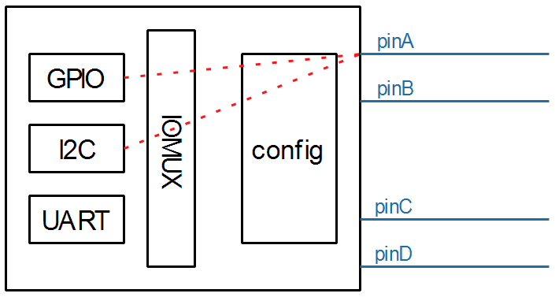

## GPIO子系统视频介绍

参考资料：

* Linux 5.x内核文档
  * Linux-5.4\Documentation\driver-api
  * Linux-5.4\Documentation\devicetree\bindings\gpio\gpio.txt
* Linux 4.x内核文档
  * Linux-4.9.88\Documentation\gpio
  * Linux-4.9.88\Documentation\devicetree\bindings\gpio\gpio.txt

### 1. GPIO子系统的作用

芯片内部有很多引脚，这些引脚可以接到GPIO模块，也可以接到I2C等模块。

通过Pinctrl子系统来选择引脚的功能(mux function)、配置引脚：




当一个引脚被复用为GPIO功能时，我们可以去设置它的方向、设置/读取它的值。

GPIO名为"General Purpose Input/Output"，通用目的输入/输出，就是常用的引脚。

GPIO可能是芯片自带的，也可能通过I2C、SPI接口扩展：


GPIO有一些通用功能、通用属性。

#### 1.1 通用功能

* 可以设为输出：让它输出高低电平；
* 可以设为输入，读取引脚当前电平；
* 可以用来触发中断

对于芯片自带的GPIO，它的访问时很快的，可以在获得spinlocks的情况下操作它。

但是，对于通过I2C、SPI等接口扩展的GPIO，访问它们时可能导致休眠，所以这些"GPIO Expander"就不能在获得spinlocks的情况下使用。


#### 1.2 通用属性

* Active-High and Active-Low

  以LED为例，需要设置GPIO电平。但是有些电路可能是高电平点亮LED，有些是低电平点亮LED。

  可以使用如下代码：

  ```c
  gpiod_set_value(gpio, 1);  // 输出高电平点亮LED
  gpiod_set_value(gpio, 0);  // 输出低电平点亮LED
  ```

  对应同一个目标：点亮LED，对于不同的LED，就需要不同的代码，原因在于上面的代码中1、0表示的是"物理值"。

  如果能使用"逻辑值"，同样的逻辑值在不同的配置下输出对应的物理值，就可以保持代码一致，比如：

  ```c
  gpiod_set_value(gpio, 1);  // 输出逻辑1
                             // 在Active-High的情况下它会输出高电平
                             // 在Active-Low的情况下它会输出低电平
  ```

  

* Open Drain and Open Source

  有多个GPIO驱动同时驱动一个电路时，就需要设置Open Drain或Open Source。

  * Open Drain：引脚被设置为低电平时才会驱动电路，典型场景是I2C接口。
  * Open Source：引脚被设置为高电平时才会驱动电路


#### 1.3 GPIO子系统的作用

管理GPIO，既能支持芯片本身的GPIO，也能支持扩展的GPIO。

提供统一的、简便的访问接口，实现：输入、输出、中断。


### 2. 预计录制的内容

* 使用GPIO子系统要掌握的重要概念
* 基于GPIO子系统的LED驱动程序
* LED驱动程序上机实验(分为多个单板)
* GPIO子系统层次与数据结构
* 具体单板上GPIO子系统源码分析(分为多个单板)
* 编写一个GPIO扩展芯片的驱动程序
* GPIO子系统与Pinctrl子系统的交互
* GPIO子系统的sysfs接口

