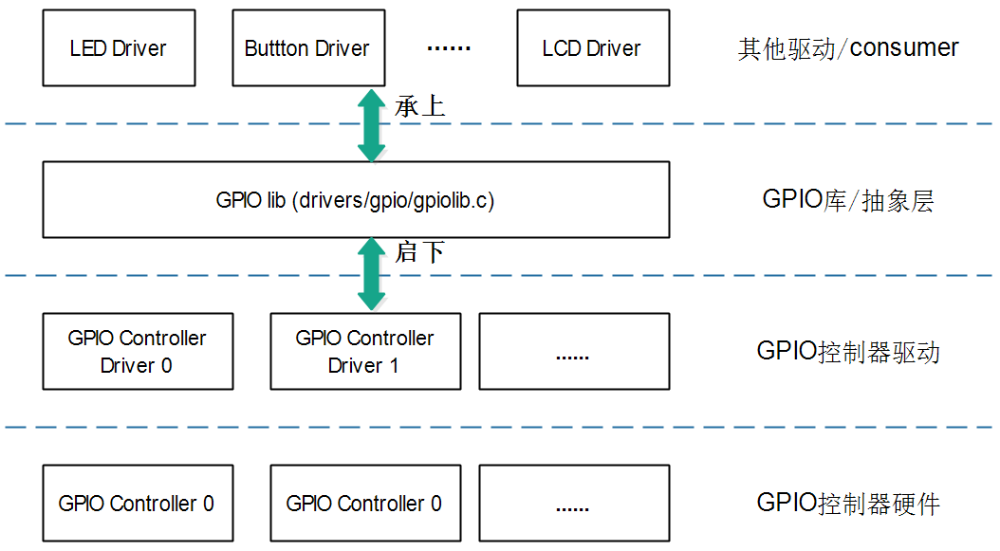
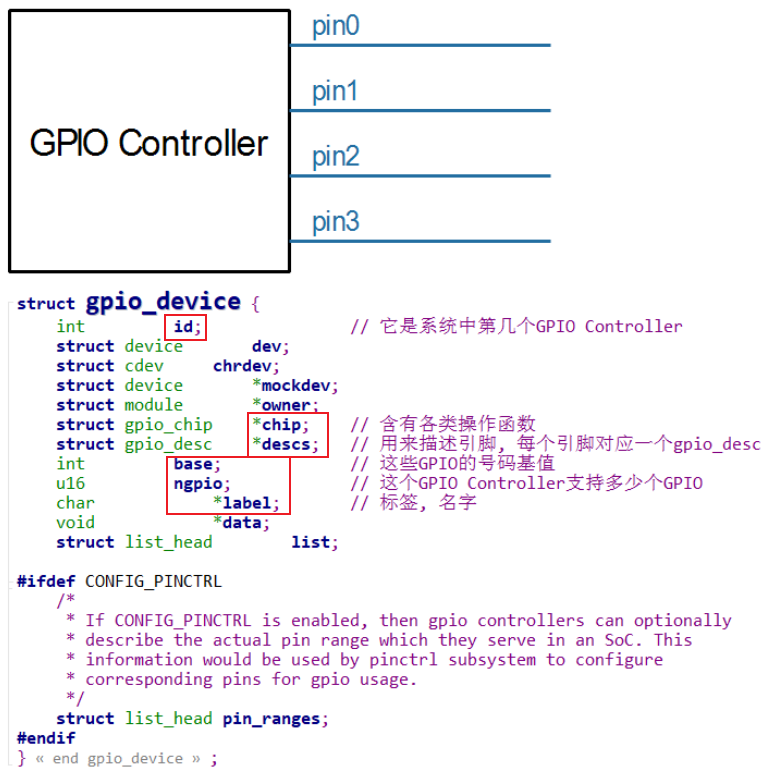
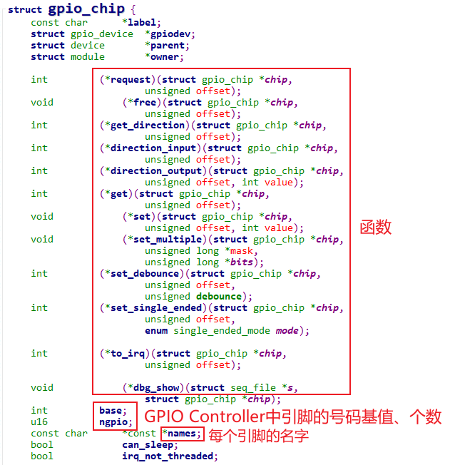
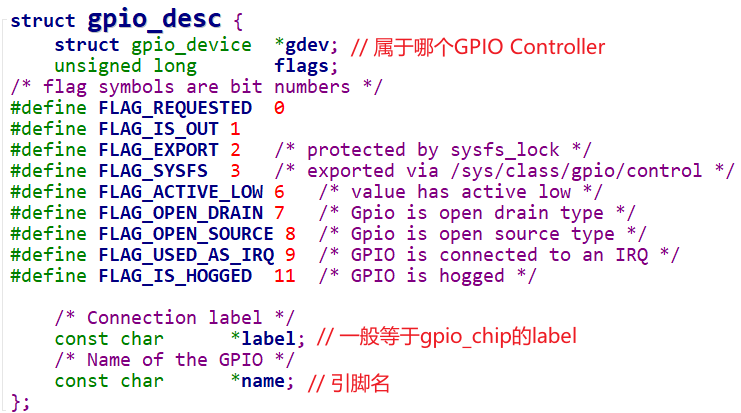
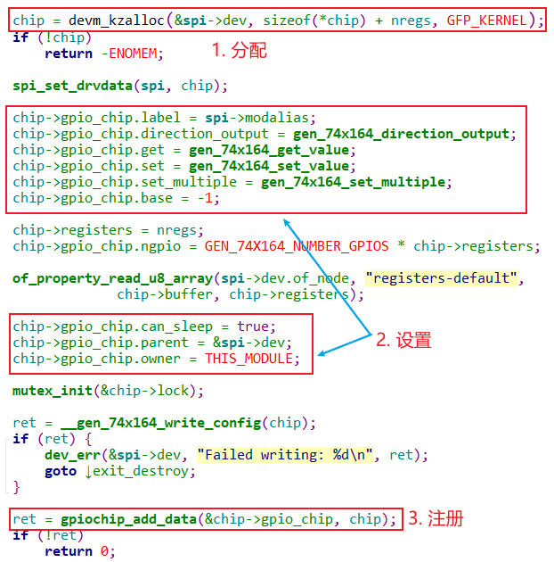

## GPIO子系统层次与数据结构

参考资料：

* Linux 5.x内核文档
  * Linux-5.4\Documentation\driver-api
  * Linux-5.4\Documentation\devicetree\bindings\gpio\gpio.txt
  * Linux-5.4\drivers\gpio\gpio-74x164.c
* Linux 4.x内核文档
  * Linux-4.9.88\Documentation\gpio
  * Linux-4.9.88\Documentation\devicetree\bindings\gpio\gpio.txt
  * Linux-4.9.88\drivers\gpio\gpio-74x164.c

### 1. GPIO子系统的层次

#### 1.1 层次

#### 1.2 GPIOLIB向上提供的接口

| descriptor-based       | legacy                | 说明 |
| ---------------------- | --------------------- | ---- |
| 获得GPIO               |                       |      |
| gpiod_get              | gpio_request          |      |
| gpiod_get_index        |                       |      |
| gpiod_get_array        | gpio_request_array    |      |
| devm_gpiod_get         |                       |      |
| devm_gpiod_get_index   |                       |      |
| devm_gpiod_get_array   |                       |      |
| 设置方向               |                       |      |
| gpiod_direction_input  | gpio_direction_input  |      |
| gpiod_direction_output | gpio_direction_output |      |
| 读值、写值             |                       |      |
| gpiod_get_value        | gpio_get_value        |      |
| gpiod_set_value        | gpio_set_value        |      |
| 释放GPIO               |                       |      |
| gpio_free              | gpio_free             |      |
| gpiod_put              | gpio_free_array       |      |
| gpiod_put_array        |                       |      |
| devm_gpiod_put         |                       |      |
| devm_gpiod_put_array   |                       |      |

#### 1.3 GPIOLIB向下提供的接口

### 2. 重要的3个核心数据结构

记住GPIO Controller的要素，这有助于理解它的驱动程序：

* 一个GPIO Controller里有多少个引脚？有哪些引脚？
* 需要提供函数，设置引脚方向、读取/设置数值
* 需要提供函数，把引脚转换为中断

以Linux面向对象编程的思想，一个GPIO Controller必定会使用一个结构体来表示，这个结构体必定含有这些信息：

* GPIO引脚信息
* 控制引脚的函数
* 中断相关的函数

#### 2.1 gpio_device

每个GPIO Controller用一个gpio_device来表示：

* 里面每一个gpio引脚用一个gpio_desc来表示
* gpio引脚的函数(引脚控制、中断相关)，都放在gpio_chip里

#### 2.2 gpio_chip

我们并不需要自己创建gpio_device，编写驱动时要创建的是gpio_chip，里面提供了：

* 控制引脚的函数
* 中断相关的函数
* 引脚信息：支持多少个引脚？各个引脚的名字？

#### 2.3 gpio_desc

我们去使用GPIO子系统时，首先是获得某个引脚对应的gpio_desc。

gpio_device表示一个GPIO Controller，里面支持多个GPIO。

在gpio_device中有一个gpio_desc数组，每一引脚有一项gpio_desc。

### 3. 怎么编写GPIO Controller驱动程序

分配、设置、注册gpioc_chip结构体，示例：`drivers\gpio\gpio-74x164.c`

