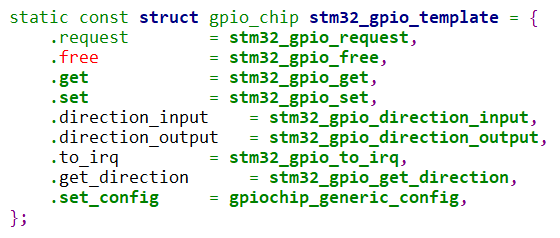

## STM32MP157的GPIO驱动源码分析

参考资料：

* Linux 5.x内核文档
    * Linux-5.4\Documentation\driver-api
    * Linux-5.4\Documentation\devicetree\bindings\gpio\gpio.txt
    * Linux-5.4\drivers\pinctrl\stm32\pinctrl-stm32mp157.c
    * Linux-5.4\arch\arm\boot\dts\stm32mp151.dtsi
    * Linux-5.4\arch\arm\boot\dts\stm32mp15xxac-pinctrl.dtsi

### 1. 设备树

把这2个文件的内容合并起来：

```shell
Linux-5.4\arch\arm\boot\dts\stm32mp151.dtsi
Linux-5.4\arch\arm\boot\dts\stm32mp15xxac-pinctrl.dtsi
```

可以得到：

```shell
pinctrl: pin-controller@50002000 {
		#address-cells = <1>;
		#size-cells = <1>;
		compatible = "st,stm32mp157-pinctrl";
		ranges = <0 0x50002000 0xa400>;
		interrupt-parent = <&exti>;
		st,syscfg = <&exti 0x60 0xff>;
		hwlocks = <&hsem 0 1>;
		pins-are-numbered;

		gpioa: gpio@50002000 {
				gpio-controller;
				#gpio-cells = <2>;
				interrupt-controller;
				#interrupt-cells = <2>;
				reg = <0x0 0x400>;
				clocks = <&rcc GPIOA>;
				st,bank-name = "GPIOA";
                status = "okay";
                ngpios = <16>;
                gpio-ranges = <&pinctrl 0 0 16>;
		};
		
        gpiob: gpio@50003000 {
                gpio-controller;
                #gpio-cells = <2>;
                interrupt-controller;
                #interrupt-cells = <2>;
                reg = <0x1000 0x400>;
                clocks = <&rcc GPIOB>;
                st,bank-name = "GPIOB";
                status = "okay";
                ngpios = <16>;
                gpio-ranges = <&pinctrl 0 16 16>;
        };

```


GPIO控制器的设备树中，有两项是必须的：

* gpio-controller : 表明这是一个GPIO控制器
* gpio-cells : 指定使用多少个cell(就是整数)来描述一个引脚


当解析设备节点中的GPIO信息时，需要用到上面的属性。

比如下面的`led-gpios`，在`#gpio-cells = <2>`的情况下，它表示的引脚数量是1。

```shell
        myled {
            compatible = "100ask,leddrv";
            led-gpios = <&gpioa 10 GPIO_ACTIVE_LOW>;
        };
```


### 2. 驱动程序

STM32MP157的GPIO Controller驱动程序放在Pinctrl驱动程序里实现了：

Linux-5.4\drivers\pinctrl\stm32\pinctrl-stm32mp157.c

#### 2.1 分配gpio_chip

```c
stm32_pctl_probe
   	for_each_available_child_of_node(np, child) {
		if (of_property_read_bool(child, "gpio-controller")) {
			ret = stm32_gpiolib_register_bank(pctl, child);

stm32_gpiolib_register_bank
    struct stm32_gpio_bank *bank = &pctl->banks[pctl->nbanks];  // 里面含有gpio_chip
```


#### 2.2 设置gpio_chip

```shell
stm32_pctl_probe
	stm32_gpiolib_register_bank
	
        bank->gpio_chip = stm32_gpio_template;  // 见下图

        of_property_read_string(np, "st,bank-name", &bank->gpio_chip.label);

        if (!of_parse_phandle_with_fixed_args(np, "gpio-ranges", 3, 0, &args)) {
            bank_nr = args.args[1] / STM32_GPIO_PINS_PER_BANK;
            bank->gpio_chip.base = args.args[1];
        } else {
            bank_nr = pctl->nbanks;
            bank->gpio_chip.base = bank_nr * STM32_GPIO_PINS_PER_BANK;
            range->name = bank->gpio_chip.label;
            range->id = bank_nr;
            range->pin_base = range->id * STM32_GPIO_PINS_PER_BANK;
            range->base = range->id * STM32_GPIO_PINS_PER_BANK;
            range->npins = npins;
            range->gc = &bank->gpio_chip;
            pinctrl_add_gpio_range(pctl->pctl_dev,
                           &pctl->banks[bank_nr].range);
        }

```





#### 2.3 注册gpio_chip

```c
stm32_pctl_probe
    stm32_gpiolib_register_bank	
        err = gpiochip_add_data(&bank->gpio_chip, bank);
        if (err) {
            dev_err(dev, "Failed to add gpiochip(%d)!\n", bank_nr);
            return err;
        }
```

