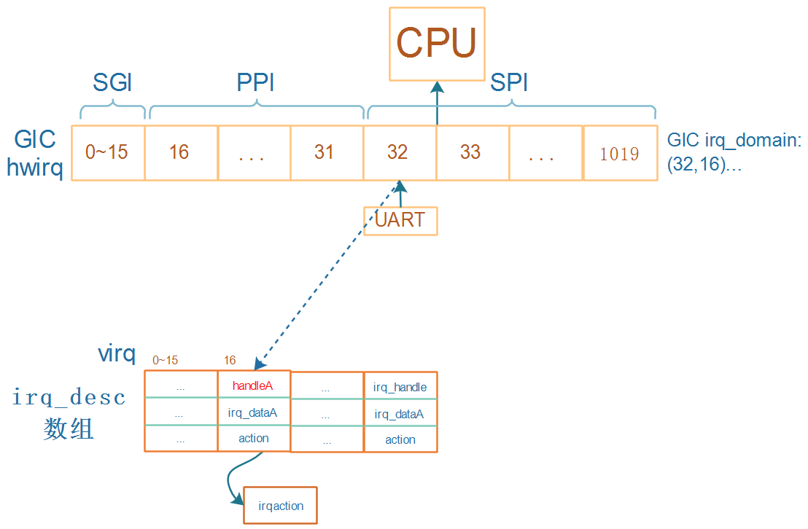
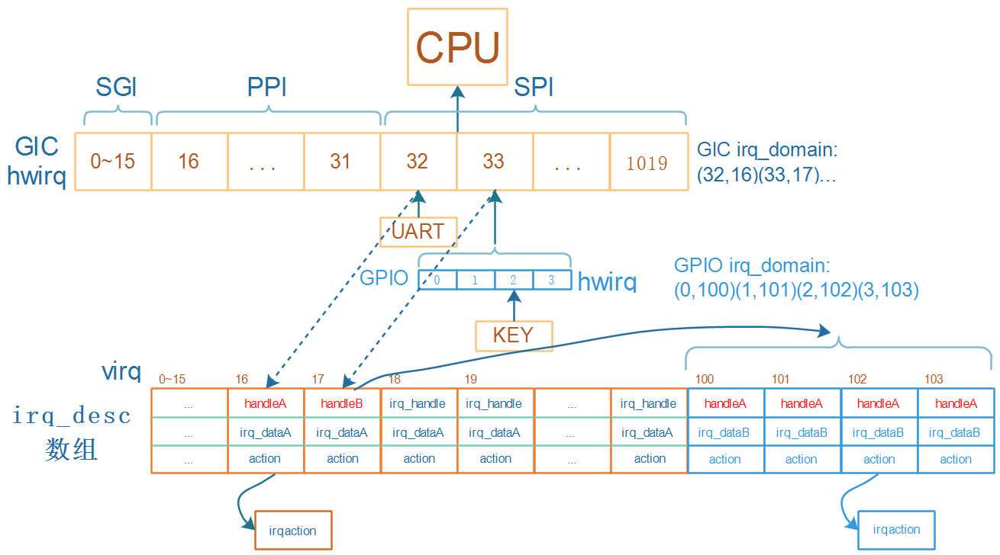

## GIC驱动程序分析

参考资料：

* [linux kernel的中断子系统之（七）：GIC代码分析](http://www.wowotech.net/irq_subsystem/gic_driver.html)

* Linux 4.9.88内核源码

  * `Linux-4.9.88\drivers\irqchip\irq-gic.c`
  * `Linux-4.9.88/arch/arm/boot/dts/imx6ull.dtsi`

* Linux 5.4内核源码
  
  * `Linux-5.4\drivers\irqchip\irq-gic.c`
  * `Linux-5.4/arch/arm/boot/dts/stm32mp151.dtsi`
  
  

### 1. 回顾GIC中断处理流程

使用逐步演进的方法才能形象地理解。

#### 1.1 一级中断控制器处理流程

对于irq_desc，内核有两种分配方法：

* 一次分配完所有的irq_desc
* 按需分配(用到某个中断才分配它的irq_desc

现在的内核基本使用第1种方法。



* 假设GIC可以向CPU发出16~1019号中断，这些数字被称为hwirq。0~15用于Process之间通信，比较特殊。
* 假设要使用UART模块，它发出的中断连接到GIC的32号中断，分配的irq_desc序号为16
* 在GIC domain中会记录(32, 16)
* 那么注册中断时就是：`request_irq(16, ...)`
* 发生UART中断时
  * 程序从GIC中读取寄存器知道发生了32号中断，通过GIC irq_domain可以知道virq为16
  * 调用irq_desc[16]中的handleA函数，它的作用是调用action链表中用户注册的函数


#### 1.2 多级中断控制器处理流程



* 假设GPIO模块下有4个引脚，都可以产生中断，都连接到GIC的33号中断
* GPIO也可以看作一个中断控制器，对于它的4个中断
* 对于GPIO模块中0~3这四个hwirq，一般都会一下子分配四个irq_desc
* 假设这4个irq_desc的序号为100~103，在GPIO domain中记录(0,100) (1,101)(2,102) (3,103)
* 对于KEY，注册中断时就是：`request_irq(102, ...)`
* 按下KEY时：
  * 程序从GIC中读取寄存器知道发生了33号中断，通过GIC irq_domain可以知道virq为16
  * 调用irq_desc[16]中的handleB函数
    * handleB读取GPIO寄存器，确定是GPIO里2号引脚发生中断
    * 通过GPIO irq_domain可以知道virq为102
    * 调用irq_desc[102]中的handleA函数，它的作用是调用action链表中用户注册的函数


### 2. GIC中的重要函数和结构体

沿着中断的处理流程，GIC涉及这4个重要部分：

* CPU从异常向量表中调用handle_arch_irq，这个函数指针是有GIC驱动设置的
  * GIC才知道怎么判断发生的是哪个GIC中断
* 从GIC获得hwirq后，要转换为virq：需要有GIC Domain
* 调用irq_desc[virq].handle_irq函数：这也应该由GIC驱动提供
* 处理中断时，要屏蔽中断、清除中断等：这些函数保存在irq_chip里，由GIC驱动提供


从硬件上看，GIC的功能是什么？

* 可以使能、屏蔽中断
* 发生中断时，可以从GIC里判断是哪个中断

在内核里，使用gic_chip_data结构体表示GIC，gic_chip_data里有什么？

* irq_chip：中断使能、屏蔽、清除，放在irq_chip中的各个函数里实现
  

* irq_domain
  * 申请中断时
    * 在设备树里指定hwirq、flag，可以使用irq_domain的函数来解析设备树
    * 根据hwirq可以分配virq，把(hwirq, virq)存入irq_domain中
  * 发生中断时，从GIC读出hwirq，可以通过irq_domain找到virq，从而找到处理函数


所以，GIC用gic_chip_data来表示，gic_chip_data中重要的成员是：irq_chip、irq_domain。


### 3. GIC初始化过程

```c
start_kernel (init\main.c)
    init_IRQ (arch\arm\kernel\irq.c)
    	irqchip_init (drivers\irqchip\irqchip.c)
    		of_irq_init (drivers\of\irq.c)
    			desc->irq_init_cb = match->data;

                ret = desc->irq_init_cb(desc->dev,
                            desc->interrupt_parent);

```

#### 2.1 内核支持多种GIC

按照设备树的套路：

* 驱动程序注册platform_driver
* 它的of_match_table里有多个of_device_id，表示能支持多个设备
* 有多种版本的GIC，在内核为每一类GIC定义一个结构体of_device_id，并放在一个段里：

```c
// drivers\irqchip\irq-gic.c
IRQCHIP_DECLARE(gic_400, "arm,gic-400", gic_of_init);
IRQCHIP_DECLARE(arm11mp_gic, "arm,arm11mp-gic", gic_of_init);
IRQCHIP_DECLARE(arm1176jzf_dc_gic, "arm,arm1176jzf-devchip-gic", gic_of_init);
IRQCHIP_DECLARE(cortex_a15_gic, "arm,cortex-a15-gic", gic_of_init);
IRQCHIP_DECLARE(cortex_a9_gic, "arm,cortex-a9-gic", gic_of_init);
IRQCHIP_DECLARE(cortex_a7_gic, "arm,cortex-a7-gic", gic_of_init);
IRQCHIP_DECLARE(msm_8660_qgic, "qcom,msm-8660-qgic", gic_of_init);
IRQCHIP_DECLARE(msm_qgic2, "qcom,msm-qgic2", gic_of_init);
IRQCHIP_DECLARE(pl390, "arm,pl390", gic_of_init);
```

把宏`IRQCHIP_DECLARE`展开：

```c
// include\linux\irqchip.h
#define IRQCHIP_DECLARE(name, compat, fn) OF_DECLARE_2(irqchip, name, compat, fn)

#define OF_DECLARE_2(table, name, compat, fn) \
		_OF_DECLARE(table, name, compat, fn, of_init_fn_2)

#define _OF_DECLARE(table, name, compat, fn, fn_type)			\
	static const struct of_device_id __of_table_##name		\
		__used __section(__irqchip_of_table)			\
		 = { .compatible = compat,				\
		     .data = (fn == (fn_type)NULL) ? fn : fn  }
```

展开示例：

```c
IRQCHIP_DECLARE(cortex_a7_gic, "arm,cortex-a7-gic", gic_of_init);
展开后得到：
static const struct of_device_id __of_table_cortex_a7_gic		\
	__used __section(__irqchip_of_table)			\
	 = { .compatible = "arm,cortex-a7-gic",				\
		 .data = gic_of_init  }
```


#### 2.2 在设备树里指定GIC

在设备树中指定GIC，内核驱动程序根据设备树来选择、初始化GIC。

`drivers\irqchip\irqchip.c`中并没有定义一个platform_driver，但是套路是一样的。


调用过程：


of_irq_init:

* 内核有一个__irqchip_of_table数组，里面有多个of_device_id，表示多种GIC
* 要使用哪类GIC？在设备树里指定
* 根据设备树，找到__irqchip_of_table树组中对应的项，调用它的初始化函数
  * `IRQCHIP_DECLARE(cortex_a7_gic, "arm,cortex-a7-gic", gic_of_init);` 


#### 2.3 gic_of_init分析

看视频


### 3. 申请GIC中断

#### 3.1 在设备树里指定中断


#### 3.2 内核对设备树的处理

函数调用过程如下，使用图片形式可以一目了然：


函数调用过程如下，使用文字格式方便复制：

* 为设备树节点分配设备   

        of_device_alloc (drivers/of/platform.c)
            dev = platform_device_alloc("", -1);  // 分配 platform_device   
            num_irq = of_irq_count(np);  // 计算中断数    
        	
        	// drivers/of/irq.c, 根据设备节点中的中断信息, 构造中断资源
        	of_irq_to_resource_table(np, res, num_irq) 
                of_irq_to_resource // drivers\of\irq.c
                	int irq = irq_of_parse_and_map(dev, index);  // 获得virq, 中断号
* 解析设备树映射中断: irq_of_parse_and_map

  ```c
  // drivers/of/irq.c, 解析设备树中的中断信息, 保存在of_phandle_args结构体中
  of_irq_parse_one(dev, index, &oirq)
  
  // kernel/irq/irqdomain.c, 创建中断映射
  irq_create_of_mapping(&oirq);             
  	irq_create_fwspec_mapping(&fwspec);
  		// 调用irq_domain->ops的translate或xlate,把设备节点里的中断信息解析为hwirq, type
  		irq_domain_translate(domain, fwspec, &hwirq, &type)  
  		
  		// 看看这个hwirq是否已经映射, 如果virq非0就直接返回
  		virq = irq_find_mapping(domain, hwirq); 
  		
  		// 否则创建映射	
  		if (irq_domain_is_hierarchy(domain)) {
  			// 返回未占用的virq
  			// 并用irq_domain->ops->alloc函数设置irq_desc
  			virq = irq_domain_alloc_irqs(domain, 1, NUMA_NO_NODE, fwspec);
  			if (virq <= 0)
  				return 0;
  		} else {
  			/* Create mapping */
  			// 返回未占用的virq
  			// 并通过irq_domain_associate调用irq_domain->ops->map设置irq_desc
  			virq = irq_create_mapping(domain, hwirq);
			if (!virq)
  				return virq;
  		}
  ```
  


### 4. GIC中断处理流程源码分析

看视频。

