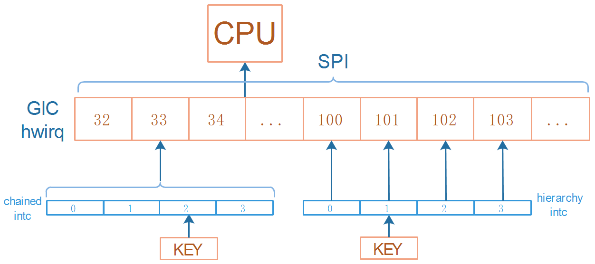
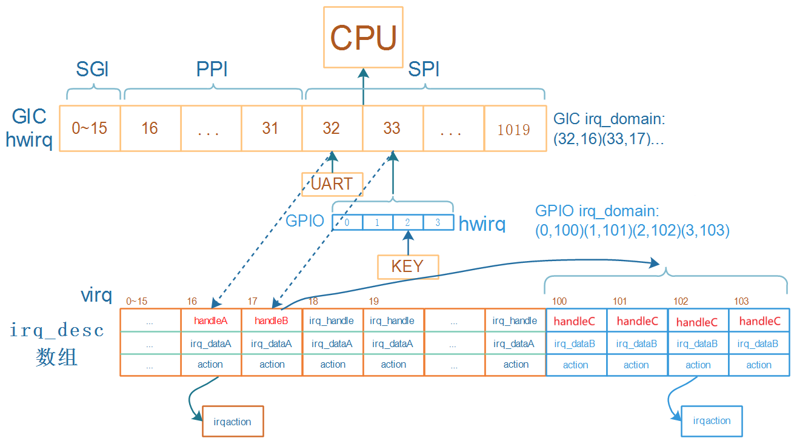
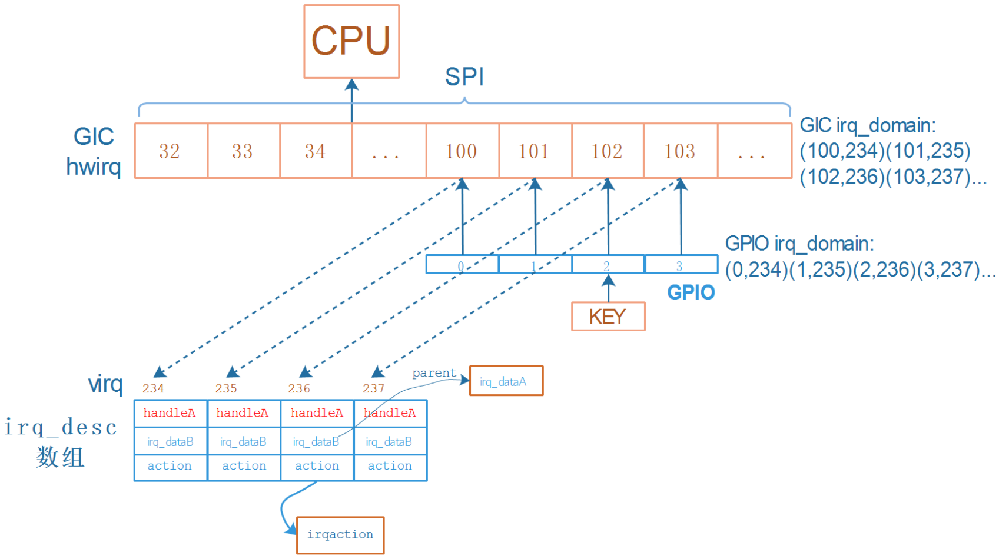
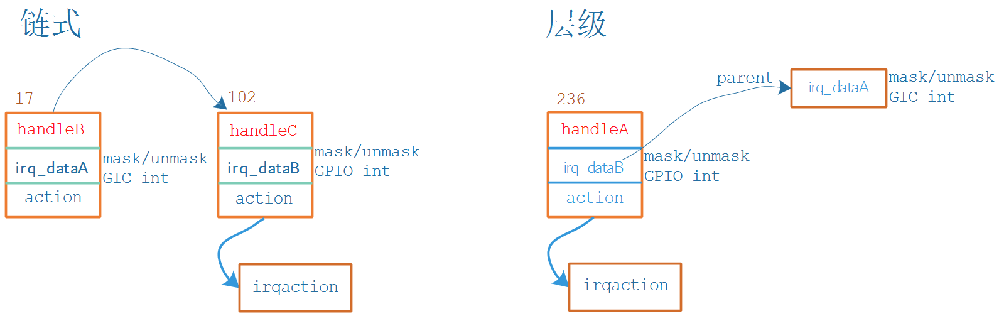

## 两类中断控制器处理流程_链式和层级

参考资料：

* [linux kernel的中断子系统之（七）：GIC代码分析](http://www.wowotech.net/irq_subsystem/gic_driver.html)

* Linux 4.9.88内核源码

  * `Linux-4.9.88\drivers\gpio\gpio-mxc.c`
  * `Linux-4.9.88\arch\arm\boot\dts\imx6ull.dtsi`

* Linux 5.4内核源码
  
  * `Linux-5.4\drivers\pinctrl\stm32\pinctrl-stm32mp157.c`
  * `Linux-5.4\drivers\irqchip\irq-stm32-exti.c`
  * `Linux-5.4\arch\arm\boot\dts\stm32mp151.dtsi`
  
  

### 1. 下级中断控制器的类别

在后续课程中我们把GIC之下的中断控制器分为两类：链式(chained)、层级(hierarchy)。

这个分类并没有官方定义，是我们根据代码概括出来的(Linux内核本来就缺乏文档)。

#### 1.1 链式中断控制器(chained)

上图中，左边的"chained intc"就是链式中断控制器。

它底下的4个中断触发时，都会导致GIC的33号中断被触发。

处理中断时，需要**分辨**：是谁触发了GIC 33号中断？这需要读取"chained intc"中的寄存器。

#### 1.2 层级中断控制器(hierarchy)

上图中，右边边的"hierarchy intc"就是链式中断控制器。

它底下的4个中断，跟GIC中的4个中断一一对应。

处理GIC 100~103号中断时，不需要读取"hierarchy intc"的寄存器来**分辨**是谁触发了中断。

### 2. 链式中断控制器的处理流程

下图中：

* handleA、irq_dataA由GIC驱动提供
* handleB、irq_dataB由GPIO驱动提供
* handleC也是GPIO驱动提供

* 假设GPIO模块下有4个引脚，都可以产生中断，都连接到GIC的33号中断
* GPIO就是一个链式中断控制器，它底下有4个中断
* 对于GPIO模块中0~3这四个hwirq，分配四个irq_desc
  * 可以一下子分配4个：legacy，老方法
  * 也可以用到时再分配：linear，新方法
* 假设这4个irq_desc的序号为100~103，在GPIO domain中记录(0,100) (1,101)(2,102) (3,103)
* 对于KEY，注册中断时就是：`request_irq(102, ...)`
* 按下KEY时：
  * 程序从GIC中读取寄存器知道发生了33号中断，通过GIC irq_domain可以知道virq为17
  * 处理virq 17号中断：调用irq_desc[17].handle_irq，即handleB
    * mask/ack中断: 调用irq_desc[17].irq_data->irq_chip的函数，即irq_dataA
    * 细分中断源、处理
      * 读取GPIO寄存器，确定是GPIO里2号引脚发生中断
      * 通过GPIO irq_domain可以知道virq为102
      * 处理virq 102号中断：调用irq_desc[102].handle_irq，即handleC
        * mask/ack中断: 调用irq_desc[102].irq_data->irq_chip的函数
        * 调用irq_desc[102].action链表中用户注册的函数
        * unmask中断: 调用irq_desc[102].irq_data->irq_chip的函数
    * unmask中断: 调用irq_desc[17].irq_data->irq_chip的函数

### 3. 层级中断控制器的处理流程

下图中：

* handleA、irq_dataA由GIC驱动提供
* irq_dataB由GPIO驱动提供，不需要handleB

* 假设GPIO模块下有4个引脚，都可以产生中断，分别链接到GIC的100~103号中断
* GPIO就是一个层级中断控制器
* 对于GPIO模块中0~3这四个hwirq，分配四个irq_desc，用到时再分配
* 假设这4个irq_desc的序号为234~237
  * 在GIC domain中记录(100,234) (101,235)(102,236) (103,237)
  * 在GPIO domain中记录(0,234) (1,235)(2,236) (3,237)
* 对于KEY，注册中断时就是：`request_irq(236, ...)`
* 按下KEY时：
  * 程序从GIC中读取寄存器知道发生了102号中断，通过GIC irq_domain可以知道virq为236
  * 处理virq 236号中断：调用irq_desc[236].handle_irq，即handleA
    * mask/ack中断: 
      * 调用irq_desc[236].irq_data->irq_chip的函数，即irq_dataB
        * 它会调用父级irq_dataA->irq_chip的函数
    * 调用irq_desc[236].action链表中用户注册的函数
    * unmask中断: 
      * 调用irq_desc[236].irq_data->irq_chip的函数，即irq_dataB
        * 它会调用父级irq_dataA->irq_chip的函数

### 4. 处理流程对比

