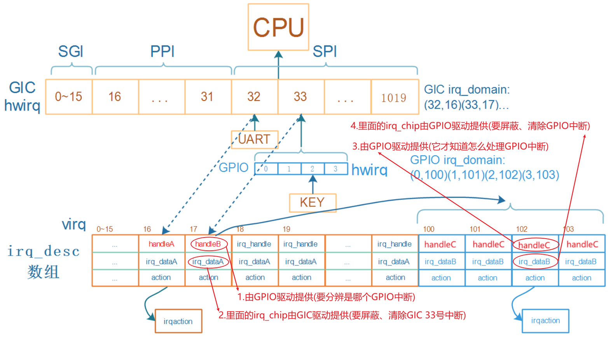

## 链式中断控制器驱动程序编写

参考资料：

* [linux kernel的中断子系统之（七）：GIC代码分析](http://www.wowotech.net/irq_subsystem/gic_driver.html)

* Linux 4.9.88内核源码

  * `Linux-4.9.88\drivers\gpio\gpio-mxc.c`
  * `Linux-4.9.88\arch\arm\boot\dts\imx6ull.dtsi`

* Linux 5.4内核源码
  
  * `Linux-5.4\drivers\pinctrl\stm32\pinctrl-stm32mp157.c`
  * `Linux-5.4\drivers\irqchip\irq-stm32-exti.c`
  * `Linux-5.4\arch\arm\boot\dts\stm32mp151.dtsi`
  
* 本节视频源码在GIT仓库里

  ```shell
  doc_and_source_for_drivers\IMX6ULL\source\08_Interrupt\03_virtual_int_controller_legacy
  doc_and_source_for_drivers\STM32MP157\source\A7\08_Interrupt\03_virtual_int_controller_legacy
  ```

  

### 1. 链式中断控制器的重要函数和结构体

#### 1.1 回顾处理流程

为方便描述，假设下级的链式中断控制器就是GPIO控制器。



沿着中断的处理流程，GIC之下的中断控制器涉及这4个重要部分：handleB、GPIO Domain、handleC、irq_chip

* **handleB**：处理GIC 33号中断，handleB由GPIO驱动提供

  * 屏蔽GIC 33号中断：调用irq_dataA的irq_chip的函数，irq_dataA由GIC驱动提供
  * 细分并处理某个GPIO中断：
    * 读取GPIO寄存器得到hwirq，通过**GPIO Domain**转换为virq，假设是102
    * 调用irq_desc[102].handle_irq，即handleC
  * 清除GIC 33号中断：调用irq_dataA的irq_chip的函数，由GIC驱动提供

* **handleC**：处理GPIO 2号中断，handleC由GPIO驱动提供

  * 屏蔽GPIO 2号中断：调用irq_dataB的**irq_chip**的函数，由GPIO驱动提供
  * 处理：调用actions链表中用户注册的函数
  * 清除GPIO 2号中断：调用irq_dataB的irq_chip的函数，由GPIO驱动提供


#### 1.2 irq_domain的核心作用

怎么把handleB、GPIO Domain、handleC、irq_chip这4个结构体组织起来，irq_domain是核心。

我们从使用中断的流程来讲解。

* 在设备树里指定使用哪个中断

  ```shell
      gpio_keys_100ask {
          compatible = "100ask,gpio_key";
  		interrupt-parent = <&gpio5>;
  		interrupts = <3 IRQ_TYPE_EDGE_BOTH>,
      };
  ```

* 内核解析、处理设备树的中断信息

  * 根据`interrupt-parent`找到驱动程序注册的irq_domain
  * 使用irq_domain.ops中的translate或xlate函数解析设备树，得到hwirq和type
  
  * 分配/找到irq_desc，得到virq
    * 把(hwirq, virq)的关系存入irq_domain
    * 把virq存入platform_device的resource中
  * 使用irq_domain.ops中的alloc或map函数进行设置
    * 可能是替换irq_desc[virq].handle_irq函数
    * 可能是替换irq_desc[virq].irq_data，里面有irq_chip

* 用户的驱动程序注册中断
  
  * 从platform_device的resource中得到中断号virq
  * request_irq(virq, ..., func)
  
* 发生中断、处理中断：处理流程见上面。
  
  
  
### 2. 硬件模型

下图中列出了链式中断控制器、层级中断控制器，本节课程只涉及左边的链式中断控制器。

内核中有各类中断控制器的驱动程序，它们涉及的硬件过于复杂，从这些杂乱的代码中去讲清楚中断体系，比较难。

我们实现一些虚拟的中断控制器，如下图所示。

实际板子中，我们可以通过按键触发中断。

对于这些虚拟的中断控制器，我们没有真实按键，通过devmem指令写GIC的PENDING寄存器触发中断。

  

  

###  3. 编程

会涉及2个驱动程序：虚拟的中断控制器驱动程序，按键驱动程序，以及对应的设备树。


