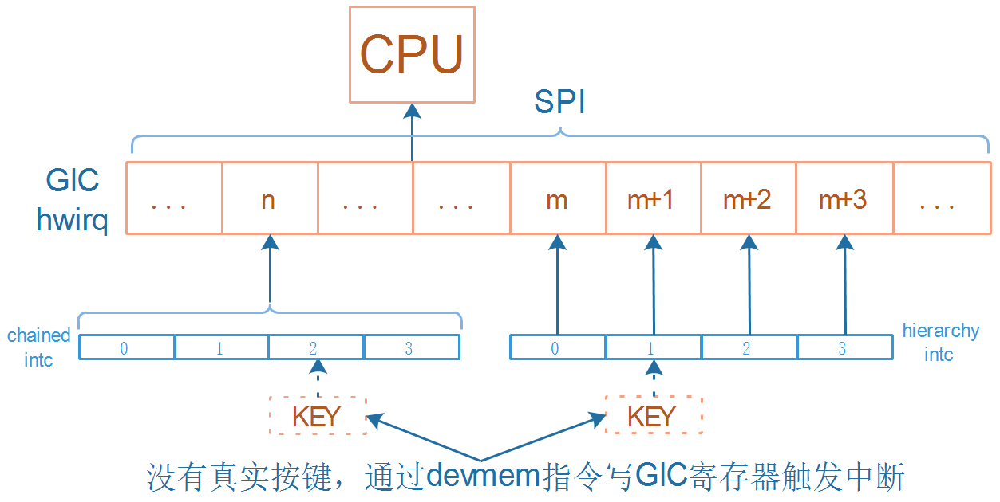

## legacy方式代码的上机实验

参考资料：

* [linux kernel的中断子系统之（七）：GIC代码分析](http://www.wowotech.net/irq_subsystem/gic_driver.html)

* Linux 4.9.88内核源码

  * `Linux-4.9.88\drivers\gpio\gpio-mxc.c`
  * `Linux-4.9.88\arch\arm\boot\dts\imx6ull.dtsi`

* Linux 5.4内核源码
  
  * `Linux-5.4\drivers\pinctrl\stm32\pinctrl-stm32mp157.c`
  * `Linux-5.4\drivers\irqchip\irq-stm32-exti.c`
  * `Linux-5.4\arch\arm\boot\dts\stm32mp151.dtsi`
  
* 芯片手册

  * IMX6ULL: imx6ullrm.pdf
  * STM32MP157: DM00327659.pdf
  
* 本节视频源码在GIT仓库里

  ```shell
  doc_and_source_for_drivers\
  	IMX6ULL\source\08_Interrupt\
  		04_virtual_int_controller_legacy_ok
			
  doc_and_source_for_drivers\
  	STM32MP157\source\A7\08_Interrupt\
  		04_virtual_int_controller_legacy_ok
  ```
  
  

### 1. 确定中断号n



查看芯片手册，选择一个保留的、未使用的GIC SPI中断即可。

#### 1.1 IMX6ULL

看芯片手册第3章：


看上图，选择122号中断，它是SPI里的122号中断，GIC里的编号是(32+122)=154。


#### 1.2 STM32MP157

看芯片手册第21.2节：


看上图，选择210号中断，它是SPI里的210号中断，GIC里的编号是(32+210)=242。

### 2. 怎么触发中断

可以通过devmem命令直接写GIC的PENDING寄存区。


GICD_ISPENDRn有多个寄存器，每个寄存器中每一位对应一个GIC中断，写入1就可以触发该中断。

写哪一个GICD_ISPENDRn寄存器？写哪一位？使用下列公式来确定：


查看内核设备树文件imx6ull.dtsi、stm32mp151.dtsi，可以知道：

* IMX6ULL的GIC Distributor 地址是：0x00a01000
  
* STM32MP157的GIC Distributor 地址是：0xa0021000
  

| 芯片       | SPI中断号 | GIC中断号 | n,bit | GICD_ISPENDRn地址 | 命令                         |
| ---------- | --------- | --------- | ----- | ----------------- | ---------------------------- |
| IMX6LLL    | 122       | 154       | 4,26  | 0xa01210          | devmem 0xa01210 32 0x4000000 |
| STM32MP157 | 210       | 242       | 7,18  | 0xa002121c        | devmem 0xa002121c 32 0x40000 |


### 3. 上机实验

#### 3.1 设置工具链

##### 1. STM32MP157

  ```shell
  export ARCH=arm
  export CROSS_COMPILE=arm-buildroot-linux-gnueabihf-
  export PATH=$PATH:/home/book/100ask_stm32mp157_pro-sdk/ToolChain/arm-buildroot-linux-gnueabihf_sdk-buildroot/bin
  ```

##### 2. IMX6ULL

  ```shell
  export ARCH=arm
  export CROSS_COMPILE=arm-linux-gnueabihf-
  export PATH=$PATH:/home/book/100ask_imx6ull-sdk/ToolChain/gcc-linaro-6.2.1-2016.11-x86_64_arm-linux-gnueabihf/bin
  ```


#### 3.2 编译、替换设备树

##### 1. STM32MP157

  * 修改`arch/arm/boot/dts/stm32mp157c-100ask-512d-lcd-v1.dts`，添加如下代码：

    ```shell
    / {
    	virtual_intc: virtual_intc_100ask {
    		compatible = "100ask,virtual_intc";
    		
    		interrupt-controller;
    		#interrupt-cells = <2>;
    
    		interrupt-parent = <&intc>;
    		interrupts = <GIC_SPI 210 IRQ_TYPE_LEVEL_HIGH>;
    		
    	};
    	
        gpio_keys_100ask {
            compatible = "100ask,gpio_key";
    		interrupt-parent = <&virtual_intc>;
    		interrupts = <0 IRQ_TYPE_LEVEL_HIGH>,
    		             <1 IRQ_TYPE_LEVEL_HIGH>,
    					 <2 IRQ_TYPE_LEVEL_HIGH>,
    					 <3 IRQ_TYPE_LEVEL_HIGH>;
        };
    };
    ```

    

  * 编译设备树：
    在Ubuntu的STM32MP157内核目录下执行如下命令,
    得到设备树文件：`arch/arm/boot/dts/stm32mp157c-100ask-512d-lcd-v1.dtb`

    ```shell
    make dtbs
    ```

  * 复制到NFS目录：

    ```shell
    $ cp arch/arm/boot/dts/stm32mp157c-100ask-512d-lcd-v1.dtb ~/nfs_rootfs/
    ```

  * 开发板上挂载NFS文件系统

    * vmware使用NAT(假设windowsIP为192.168.1.100)

      ```shell
      [root@100ask:~]# mount -t nfs -o nolock,vers=3,port=2049,mountport=9999 
      192.168.1.100:/home/book/nfs_rootfs /mnt
      ```

    * vmware使用桥接，或者不使用vmware而是直接使用服务器：假设Ubuntu IP为192.168.1.137

      ```shell
      [root@100ask:~]#  mount -t nfs -o nolock,vers=3 192.168.1.137:/home/book/nfs_rootfs /mnt
      ```

* 更新设备树

  ```shell
  [root@100ask:~]# mount  /dev/mmcblk2p2  /boot
  [root@100ask:~]# cp /mnt/stm32mp157c-100ask-512d-lcd-v1.dtb /boot
  [root@100ask:~]# sync
  ```

* 重启开发板

  


##### 2. IMX6ULL

  * 修改`arch/arm/boot/dts/100ask_imx6ull-14x14.dts`，添加如下代码：

    ```shell
    / {
    	virtual_intc: virtual_intc_100ask {
    		compatible = "100ask,virtual_intc";
    		
    		interrupt-controller;
    		#interrupt-cells = <2>;
    
    		interrupt-parent = <&intc>;
    		interrupts = <GIC_SPI 122 IRQ_TYPE_LEVEL_HIGH>;
    		
    	};
    	
        gpio_keys_100ask {
            compatible = "100ask,gpio_key";
    		interrupt-parent = <&virtual_intc>;
    		interrupts = <0 IRQ_TYPE_LEVEL_HIGH>,
    		             <1 IRQ_TYPE_LEVEL_HIGH>,
    					 <2 IRQ_TYPE_LEVEL_HIGH>,
    					 <3 IRQ_TYPE_LEVEL_HIGH>;
        };
    };
    ```

    

  * 编译设备树：
    在Ubuntu的IMX6ULL内核目录下执行如下命令,
    得到设备树文件：`arch/arm/boot/dts/100ask_imx6ull-14x14.dtb`

    ```shell
    make dtbs
    ```

  * 复制到NFS目录：

    ```shell
    $ cp arch/arm/boot/dts/100ask_imx6ull-14x14.dtb ~/nfs_rootfs/
    ```

* 开发板上挂载NFS文件系统

  * vmware使用NAT(假设windowsIP为192.168.1.100)

    ```shell
    [root@100ask:~]# mount -t nfs -o nolock,vers=3,port=2049,mountport=9999 
    192.168.1.100:/home/book/nfs_rootfs /mnt
    ```

  * vmware使用桥接，或者不使用vmware而是直接使用服务器：假设Ubuntu IP为192.168.1.137

    ```shell
    [root@100ask:~]#  mount -t nfs -o nolock,vers=3 192.168.1.137:/home/book/nfs_rootfs /mnt
    ```

  * 更新设备树

    ```shell
    [root@100ask:~]# cp /mnt/100ask_imx6ull-14x14.dtb /boot
    [root@100ask:~]# sync
    ```

* 重启开发板


#### 3.3 编译、安装驱动程序

* 编译：

  * 在Ubuntu上
  * 修改`04_virtual_int_controller_legacy_ok`中的Makefile，指定内核路径`KERN_DIR`，在执行`make`命令即可。

* 安装：

  * 在开发板上

  * 挂载NFS，复制文件，insmod，类似如下命令：

    ```shell
    mount -t nfs -o nolock,vers=3 192.168.1.137:/home/book/nfs_rootfs /mnt
    // 对于IMX6ULL，想看到驱动打印信息，需要先执行
    echo "7 4 1 7" > /proc/sys/kernel/printk
    
    insmod -f /mnt/virtual_int_controller.ko
    // 安装virtual_int_controller之后即可进入/sys/kernel/irq目录查看分配的中断号
    
    insmod -f /mnt/gpio_key_drv.ko
    cat /proc/interrupts
    
    // 触发中断
    devmem 0xa01210 32 0x4000000 // imx6ull
    devmem 0xa002121c 32 0x40000 // stm32mp157
    ```

* 观察内核打印的信息
