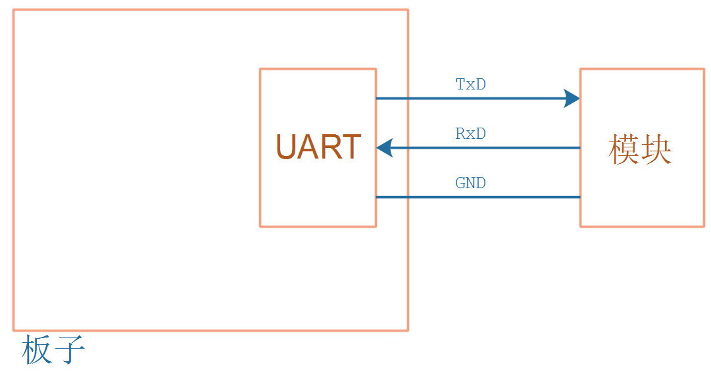
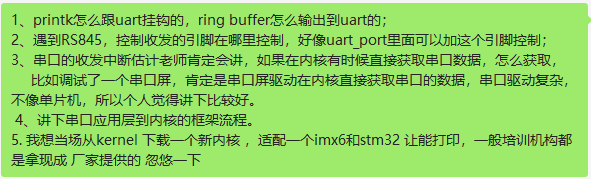

## UART子系统视频介绍

### 1. UART的作用

UART：通用异步收发传输器（Universal Asynchronous Receiver/Transmitter)，简称串口。

* 调试：移植u-boot、内核时，主要使用串口查看打印信息

* 外接各种模块

  

### 2. 预计录制的内容

本教程听取了学员的建议，增加了很多功能：

* UART协议
* UART应用程序编程
* TTY驱动程序体系
* /dev/tty、/dev/tty0、/dev/tty1、/dev/console的关系
* UART驱动程序分析
* 实现一个虚拟的UART驱动程序
* 内核printk打印系统分析
  * early print
  * printk
* 实现一个虚拟的printk功能
* 485的使用

