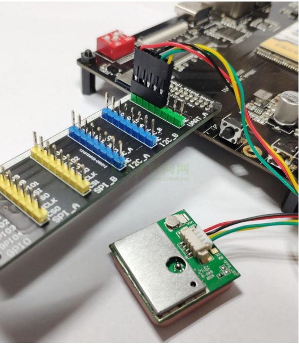

## Linux串口应用编程

参考资料

* [Serial Programming Guide for POSIX Operating Systems](https://digilander.libero.it/robang/rubrica/serial.htm)

* [Linux串口编程](https://www.cnblogs.com/feisky/archive/2010/05/21/1740893.html)：有参考代码

* [Linux串口—struct termios结构体](https://blog.csdn.net/yemingzhu163/article/details/5897156)
  
  * 这个是转载，排版更好看: https://www.cnblogs.com/sky-heaven/p/9675253.html
  
* 本节课程源码在GIT仓库里

  ```shell
  doc_and_source_for_drivers\IMX6ULL\source\09_UART
  	01_app_send_recv
  	02_gps
  doc_and_source_for_drivers\STM32MP157\source\A7\09_UART
  	01_app_send_recv
  	02_gps	
  ```

  

### 1. 串口API


在Linux系统中，操作设备的统一接口就是：open/ioctl/read/write。

对于UART，又在ioctl之上封装了很多函数，主要是用来设置行规程。

所以对于UART，编程的套路就是：

* open
* 设置行规程，比如波特率、数据位、停止位、检验位、RAW模式、一有数据就返回
* read/write


怎么设置行规程？行规程的参数用结构体termios来表示，可以参考[Linux串口—struct termios结构体](https://blog.csdn.net/yemingzhu163/article/details/5897156)


这些函数在名称上有一些惯例：

* tc：terminal contorl
* cf: control flag

下面列出一些函数：

| 函数名      | 作用                                      |
| ----------- | ----------------------------------------- |
| tcgetattr   | get terminal attributes，获得终端的属性   |
| tcsetattr   | set terminal attributes，修改终端参数     |
| tcflush     | 清空终端未完成的输入/输出请求及数据       |
| cfsetispeed | sets the input baud rate，设置输入波特率  |
| cfsetospeed | sets the output baud rate，设置输出波特率 |
| cfsetspeed  | 同时设置输入、输出波特率                  |

函数不多，主要是需要设置好termios中的参数，这些参数很复杂，可以参考[Linux串口—struct termios结构体](https://blog.csdn.net/yemingzhu163/article/details/5897156)。


### 2. 串口收发实验

本实验用过把串口的发送、接收引脚短接，实现自发自收：使用write函数发出字符，使用read函数读取字符。

#### 2.1 接线

##### 2.1.1 IMX6ULL


##### 2.1.2 STM32MP157


#### 2.2 编程

#### 2.3 上机实验

##### 2.3.1 IMX6ULL

先设置工具链：

```shell
export ARCH=arm
export CROSS_COMPILE=arm-buildroot-linux-gnueabihf-
export PATH=$PATH:/home/book/100ask_imx6ull-sdk/ToolChain/arm-buildroot-linux-gnueabihf_sdk-buildroot/bin
```


编译、执行程序:

```shell
1. Ubuntu上
arm-buildroot-linux-gnueabihf-gcc -o serial_send_recv serial_send_recv.c

2. 板子上
/mnt/serial_send_recv  /dev/ttymxc5
```


##### 2.3.2 STM32MP157

先设置工具链：

```shell
export ARCH=arm
export CROSS_COMPILE=arm-buildroot-linux-gnueabihf-
export PATH=$PATH:/home/book/100ask_stm32mp157_pro-sdk/ToolChain/arm-buildroot-linux-gnueabihf_sdk-buildroot/bin
```


编译、执行程序:

```shell
1. Ubuntu上
arm-buildroot-linux-gnueabihf-gcc -o serial_send_recv serial_send_recv.c

2. 板子上
/mnt/serial_send_recv  /dev/ttySTM3
```


### 3. GPS模块实验

#### 3.1 GPS简介

全球定位系统(Global Positioning System，GPS)是一种以空中卫星为基础的高精度无线电导航的定位系统，它在全球任何地方以及近地空间都能够提供准确的地理位置、车行速度及精确的时间信息。GPS主要由三大组成部分：空间部分、地面监控部分和用户设备部分。GPS系统具有高精度、全天候、用广泛等特点。

太空卫星部分由多颗卫星组成，分成多个轨道，绕行地球一周约12小时。每个卫星均持续发射载有卫星轨道数据及时间的无线电波，提供地球上的各种接收机来应用。

地面管制部分，这是为了追踪及控制太空卫星运行所设置的地面管制站，主要工作为负责修正与维护每个卫星能够正常运转的各项参数数据，以确保每个卫星都能够提供正确的讯息给使用者接收机来接收

使用者接收机（即用户设备），追踪所有的GPS卫星，并实时的计算出接收机所在位置的坐标、移动速度及时间。我们日常接触到的是用户设备部分，这里使用到的GPS模块即为用户设备接收机部分。

 

#### 3.2 GPS模块硬件

GPS模块与外部控制器的通讯接口有多种方式，这里我们使用串口进行通讯，波特率为9600bps,1bit停止位，无校验位，无流控，默认每秒输出一次标准格式数据。

GPS模块外观如下图所示，通过排线与控制器进行供电和通讯。该模块为集成模块，没有相关原理图。


#### 3.3 GPS模块数据格式

GPS使用多种标准数据格式，目前最通用的GNSS格式是NMEA0183格式。NMEA0183是最终定位格式，即将二进制定位格式转为统一标准定位格式，与卫星类型无关。这是一套定义接收机输出的标准信息，有几种不同的格式，每种都是独立相关的ASCII格式，逗点隔开数据流，数据流长度从30-100字符不等，通常以每秒间隔持续输出。

NVMEA0183格式主要针对民用定位导航，与专业RTCM2.3/3.0和CMR+的GNSS数据格式不同。通过NMEA0183格式，可以实现GNSS接收机与PC或PDA之间的数据交换，可以通过USB和COM口等通用数据接口进行数据传输，其兼容性高，数据传输稳定。这里我们使用串口进行是通讯，通信框图如下图所示。

 

我们使用串口接收数据，收到的数据包含：$GPGGA（GPS定位数据）、$GPGLL（地理定位信息）、$GPGSA（当前卫星信息）、$GPGSV（可见卫星状态信息）、$GPRMC（推荐最小定位信息）、$GPVTG（地面速度信息）。

这里我们只分析$GPGGA (Global Positioning System Fix Data)即可，它包含了GPS定位经纬度、质量因子、HDOP、高程、参考站号等字段。其标准格式如下：

$GPGGA，<1>，<2>，<3>，<4>，<5>，<6>，<7>，<8>，<9>，M，<10>，M，<11>，<12>*hh<CR><LF>　

$XXGGA语句各字段的含义和取值范围各字段的含义和取值范围见下表所示，XX取值有：

* GPGGA：单GPS
* BDGGA：单北斗
* GLGGA：单GLONASS 
* GNGGA：多星联合定位 

| 字段 | 含义                                         | 取值范围                                                     |
| ---- | -------------------------------------------- | ------------------------------------------------------------ |
| <1>  | UTC时间hhmmss.ss                             | 000000.00~235959.99                                          |
| <2>  | 纬度，格式：ddmm.mmmm                        | 000.00000~8959.9999                                          |
| <3>  | 南北半球                                     | N北纬  S南纬                                                 |
| <4>  | 经度格式dddmm.mmmm                           | 00000.0000~17959.9999                                        |
| <5>  | 东西半球                                     | E表示东经  W表示西经                                         |
| <6>  | GPS状态                                      | 0=未定位  1=GPS单点定位固定解  2=差分定位  3=PPS解  4=RTK固定解  5=RTK浮点解  6=估计值  7=手工输入模式  8=模拟模式 |
| <7>  | 应用解算位置的卫星数                         | 00~12                                                        |
| <8>  | HDOP  水平图形强度因子                       | 0.500~99.000（大于6不可用)                                   |
| <9>  | 海拔高度                                     | -9999.9~99999.9                                              |
| <l0> | 地球椭球面相对大地水准面的高度  （高程异常） | -9999.9~99999.9                                              |
| <11> | 差分时间                                     | 从最近一次接收到差分信号开始的秒数，如果不是差分定位将为空   |
| <12> | 参考站号                                     | 0000~1023；不使用DGPS时为空                                  |

 

例子：$GPGGA，074529.82，2429.6717，N，11804.6973，E，1，8，1.098，42.110，，，M，，*76。


#### 3.4 编程


#### 3.5 接线

##### 3.5.1 IMX6ULL




##### 3.5.2 STM32MP157


#### 3.6 上机实验

##### 3.6.1 IMX6ULL

先设置工具链：

```shell
export ARCH=arm
export CROSS_COMPILE=arm-buildroot-linux-gnueabihf-
export PATH=$PATH:/home/book/100ask_imx6ull-sdk/ToolChain/arm-buildroot-linux-gnueabihf_sdk-buildroot/bin
```


编译、执行程序:

```shell
1. Ubuntu上
arm-buildroot-linux-gnueabihf-gcc -o gps_read gps_read.c

2. 板子上
/mnt/gps_read  /dev/ttymxc5
```


##### 3.6.2 STM32MP157

先设置工具链：

```shell
export ARCH=arm
export CROSS_COMPILE=arm-buildroot-linux-gnueabihf-
export PATH=$PATH:/home/book/100ask_stm32mp157_pro-sdk/ToolChain/arm-buildroot-linux-gnueabihf_sdk-buildroot/bin
```


编译、执行程序：

```shell
1. Ubuntu上
arm-buildroot-linux-gnueabihf-gcc -o gps_read gps_read.c

2. 板子上
/mnt/gps_read  /dev/ttySTM3
```


