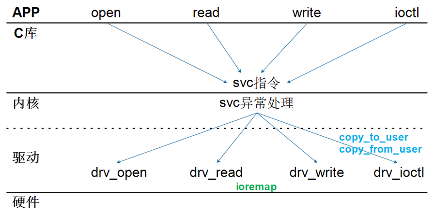

## 字符设备驱动程序的另一种注册方法

参考资料

* 参考代码：`drivers\char\pc8736x_gpio.c`

* 本节课程源码在GIT仓库里

  ```shell
  驱动大全:
  doc_and_source_for_drivers\IMX6ULL\source\09_UART\
  	03_char_dev_driver\
  		01b_hello_drv
  doc_and_source_for_drivers\STM32MP157\source\A7\09_UART\
  	03_char_dev_driver\
  		01b_hello_drv

  快速入门:
  01_all_series_quickstart\05_嵌入式Linux驱动开发基础知识\source\
  	01b_hello_drv
  ```
  
  

### 1. 字符设备驱动程序框架




编写驱动程序的套路：
* 确定主设备号，也可以让内核分配
* 定义自己的file_operations结构体
* 实现对应的drv_open/drv_read/drv_write等函数，填入file_operations结构体
* 把file_operations结构体告诉内核：register_chrdev
* 谁来注册驱动程序啊？得有一个入口函数：安装驱动程序时，就会去调用这个入口函数
* 有入口函数就应该有出口函数：卸载驱动程序时，出口函数调用unregister_chrdev
* 其他完善：提供设备信息，自动创建设备节点：class_create, device_create


### 2. 新的注册方法

参考代码：`drivers\char\pc8736x_gpio.c`

* 注册字符设备区域
  * 有主设备号：register_chrdev_region
  * 无主设备号：alloc_chrdev_region
* 分配/设置/注册cdev
  * cdev_alloc
  * cdev_init
  * cdev_add


### 3. 上机实验

#### 3.1 IMX6ULL

先设置工具链：

```shell
export ARCH=arm
export CROSS_COMPILE=arm-buildroot-linux-gnueabihf-
export PATH=$PATH:/home/book/100ask_imx6ull-sdk/ToolChain/arm-buildroot-linux-gnueabihf_sdk-buildroot/bin
```


编译、执行程序:

```shell
Ubuntu:
cd 01_hello_drv\
make

开发板:
insmod hello_drv.ko
./hello_drv_test  -w abcd
./hello_drv_test  -r
```


#### 3.2 STM32MP157

先设置工具链：

```shell
export ARCH=arm
export CROSS_COMPILE=arm-buildroot-linux-gnueabihf-
export PATH=$PATH:/home/book/100ask_stm32mp157_pro-sdk/ToolChain/arm-buildroot-linux-gnueabihf_sdk-buildroot/bin
```


编译、执行程序:

```shell
Ubuntu:
cd 01_hello_drv\
make

开发板:
insmod hello_drv.ko
./hello_drv_test  -w abcd
./hello_drv_test  -r
```


