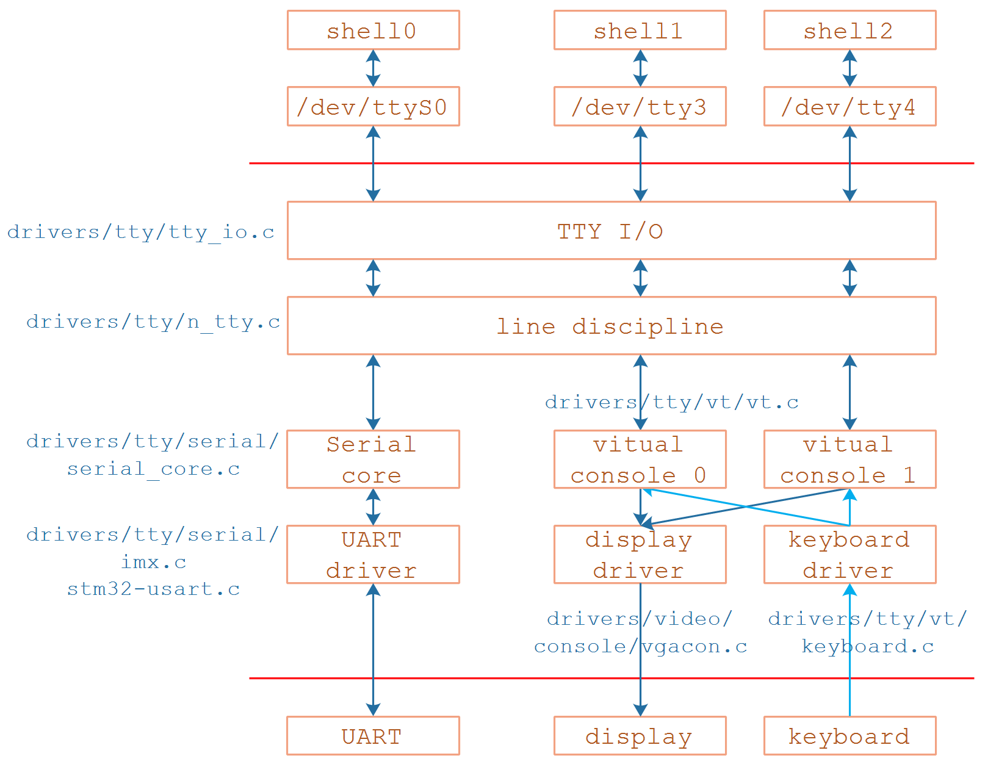
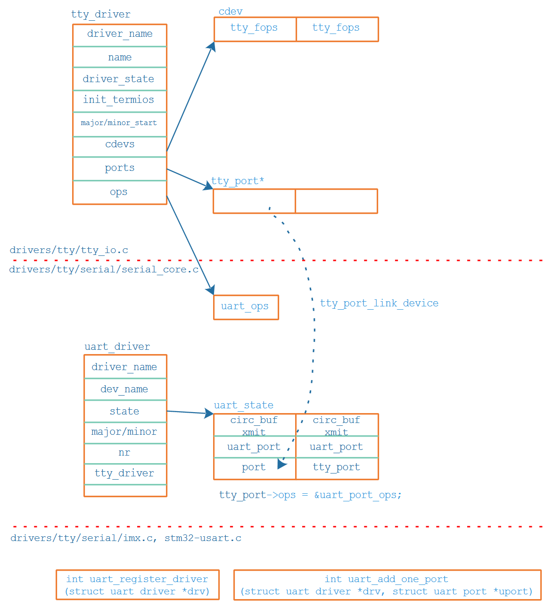

## UART驱动情景分析_注册

参考资料

* 参考代码：

  ```shell
  硬件相关：
  drivers/tty/serial/imx.c
  drivers/tty/serial/stm32-usart.c
  
  串口核心层：
  drivers/tty/serial/serial_core.c
  
  TTY层:
  drivers/tty/tty_io.c
  ```

  


### 1. 情景分析大纲

* 注册过程分析
* open过程分析
* read过程分析
* write过程分析


### 2. 源码框架回顾




### 3. 注册过程分析

