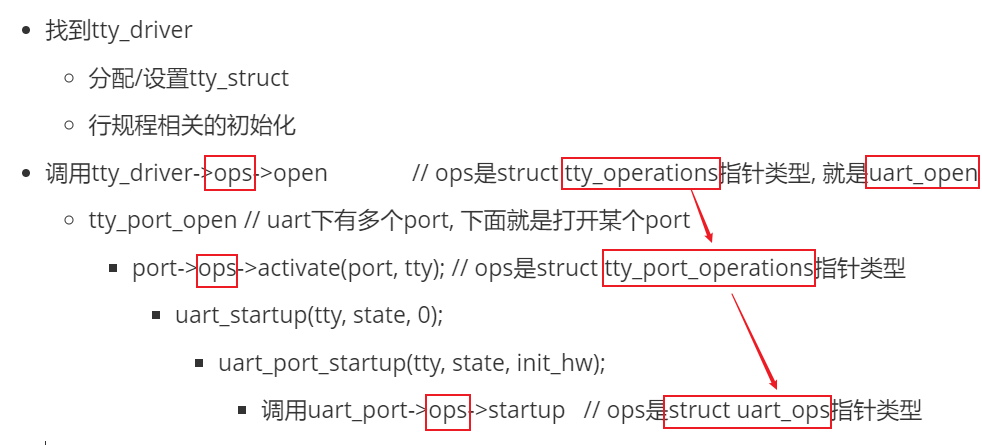

## UART驱动情景分析_open

参考资料

* 参考代码：

  ```shell
  硬件相关：
  drivers/tty/serial/imx.c
  drivers/tty/serial/stm32-usart.c
  
  串口核心层：
  drivers/tty/serial/serial_core.c
  
  TTY层:
  drivers/tty/tty_io.c
  ```

  


### 1. 情景分析大纲

* 注册过程分析
* open过程分析
* read过程分析
* write过程分析


### 2. 源码框架回顾


### 3. 设备节点是哪个

* 为什么是/dev/ttymxc、/dev/ttySTM？

* 为什么是/dev/ttymxc5、/dev/ttySTM3？

  

### 4. open过程分析

它要做的事情：

* 找到tty_driver

  * 分配/设置tty_struct
  * 行规程相关的初始化

* 调用tty_driver->ops->open              // ops是struct tty_operations指针类型, 就是uart_open

  * tty_port_open // uart下有多个port, 下面就是打开某个port
    * port->ops->activate(port, tty); // ops是struct tty_port_operations指针类型
      * uart_startup(tty, state, 0);
        * uart_port_startup(tty, state, init_hw);
          * 调用uart_port->ops->startup   // ops是struct uart_ops指针类型

  
  
  图形化说明：有3种ops：
  
  
  
  

#### 4.1 tty_open

```c
tty_open
    // 如果设备节点是(5,0)也就是/dev/tty, 表示当前TTY
    // 对于普通串口, 第一次open时必定失败
    tty = tty_open_current_tty(device, filp);

	// 第一次open串口时走这个分支
	if (!tty)
        // 通过driver来open tty，就是找到tty_driver，然后分配/设置tty_struct
		tty = tty_open_by_driver(device, inode, filp);
				// 1. 先找到对应的tty_driver
				driver = tty_lookup_driver(device, filp, &index);

				// 2. 如果曾经open过，会有对应的tty_struct
				tty = tty_driver_lookup_tty(driver, filp, index);

				// 3. 第1打开这个串口时肯定没有对应的tty_struct
                //    所以使用下面的函数初始化设备
				tty = tty_init_dev(driver, index);
							// 3.1 分配tty_strct
							tty = alloc_tty_struct(driver, idx);
										tty->ops = driver->ops;
							
							// 3.2 安装tty: 也就是driver->ttys[tty->index] = tty;
							retval = tty_driver_install_tty(driver, tty);

							// 3.3 调用行规程的open函数, 过于复杂，不分析
							//     n_tty.c中的n_tty_open函数
							retval = tty_ldisc_setup(tty, tty->link);


	......
    
    // ops是tty_operations类型
    // 对于串口ops就是serial_core.c中的uart_ops
    // uart_open
	if (tty->ops->open)
		retval = tty->ops->open(tty, filp);
	else
		retval = -ENODEV;
        
```


#### 4.2 uart_open

```c
uart_open
    tty_port_open
    	// ops是tty_port_operations类型，对应serial_core.c中的uart_port_ops
    	// uart_port_activate
		if (port->ops->activate) {
			int retval = port->ops->activate(port, tty);
			if (retval) {
				mutex_unlock(&port->mutex);
				return retval;
			}
		}

uart_port_activate
	uart_startup
    	uart_port_startup
    		// ops是uart_ops类型，在硬件驱动中设置
    		// 硬件相关的驱动中uart_port的uart_ops里必须提供startup函数
    		retval = uport->ops->startup(uport);
```


