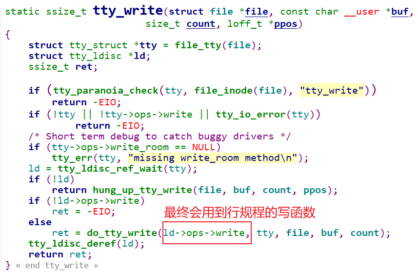
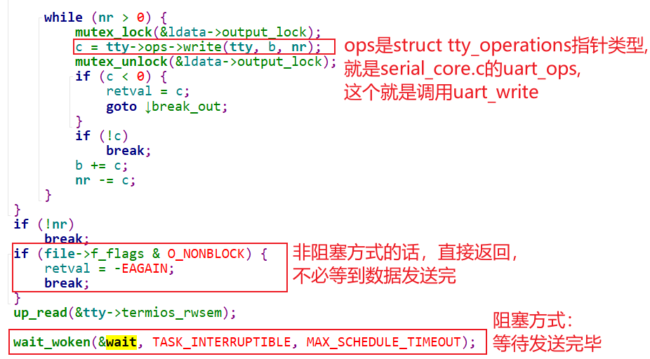
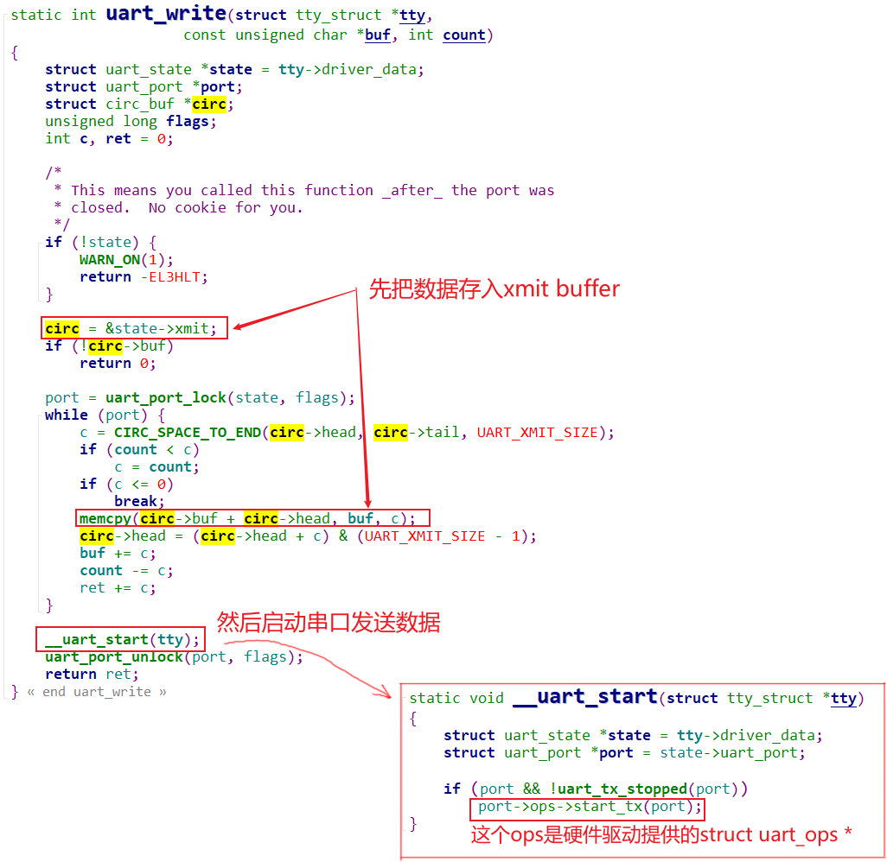
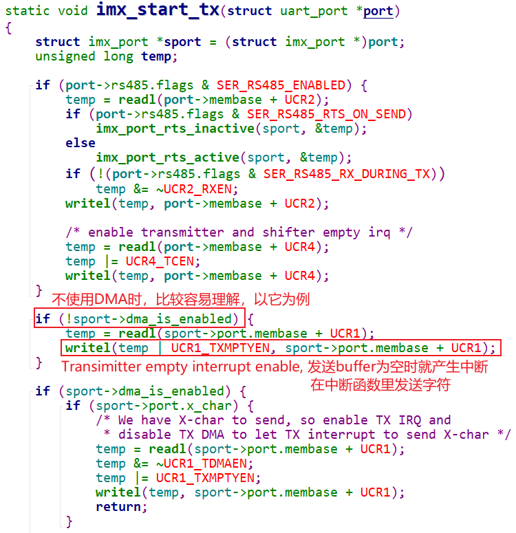
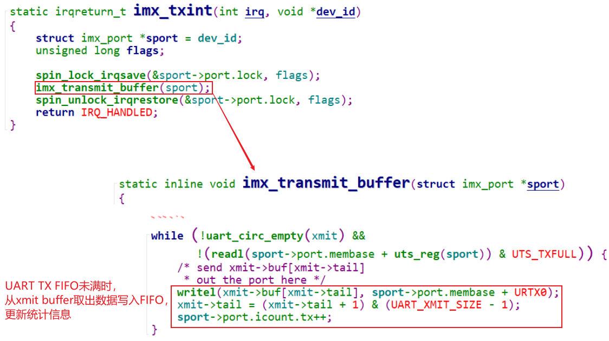
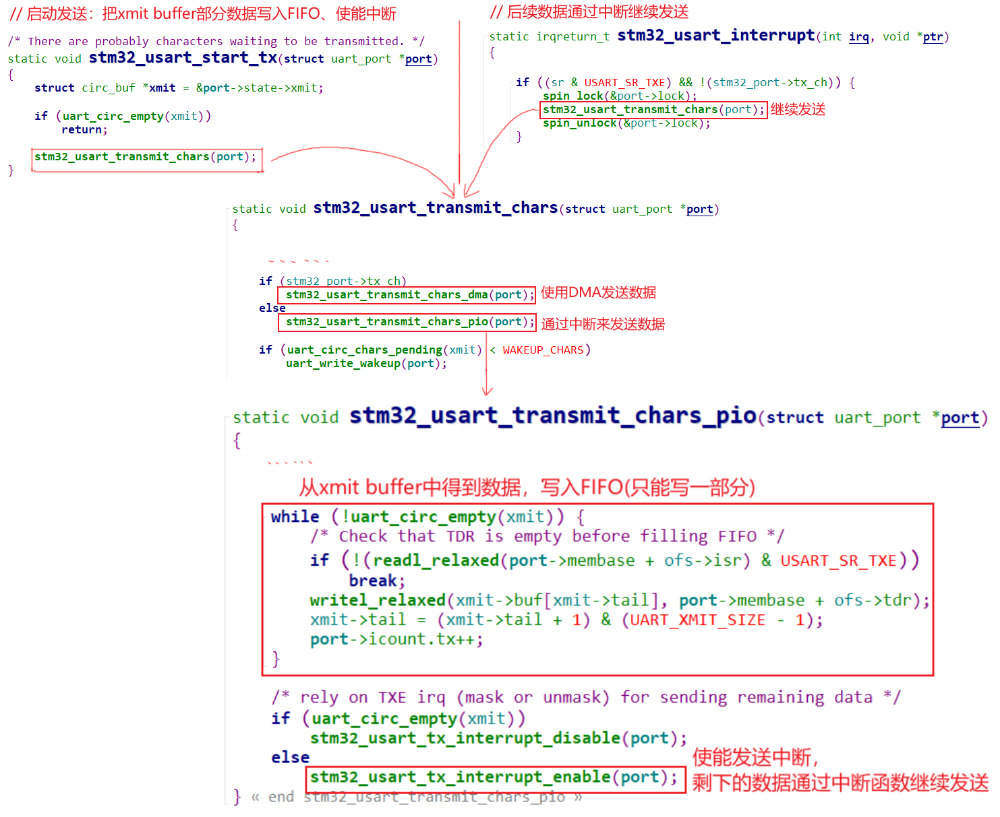

## UART驱动情景分析_write

参考资料

* 参考代码：

  ```shell
  硬件相关：
  drivers/tty/serial/imx.c
  drivers/tty/serial/stm32-usart.c
  
  串口核心层：
  drivers/tty/serial/serial_core.c
  
  TTY层:
  drivers/tty/tty_io.c
  ```

  


### 1. 情景分析大纲

* 注册过程分析
* open过程分析
* read过程分析
* write过程分析


### 2. 源码框架回顾


### 3. write过程分析

流程为：

* APP写

  * 使用行规程来写
  * 数据最终存入uart_state->xmit的buffer里

  

* 硬件发送：怎么发送数据？

  * 使用硬件驱动中uart_ops->start_tx开始发送
  * 具体的发送方法有2种：通过DMA，或通过中断

* 中断方式

  * 方法1：直接使能 tx empty中断，一开始tx buffer为空，在中断里填入数据
  * 方法2：写部分数据到tx fifo，使能中断，剩下的数据再中断里继续发送

  

#### 3.1 tty_write

文件：`drivers\tty\tty_io.c`




#### 3.2 ldisk write

文件：`drivers\tty\n_tty.c`

函数：`n_tty_write` 




#### 3.3 uart_write

文件：`drivers\tty\serial\serial_core.c`

函数：`uart_write` 



#### 3.3 硬件相关的发送

##### 3.3.1 IMX6ULL
文件：`drivers\tty\serial\imx.c`

函数：`imx_start_tx`和`imx_txint`




一开始时，发送buffer肯定为空，会立刻产生中断：




##### 3.3.2 STM32MP157
  文件：`drivers\tty\serial\stm32-usart.c`

  函数：`stm32_usart_threaded_interrupt`

STM32MP157发送串口数据时，有两种方法：DMA、中断。

我们来分析第二种方式：通过中断来发送数据。

* UART有Tx FIFO，可以往里面写入若干个数据，然后使能中断
* 剩下的数据通过中断函数继续发送：

