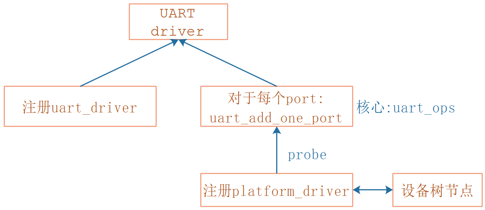
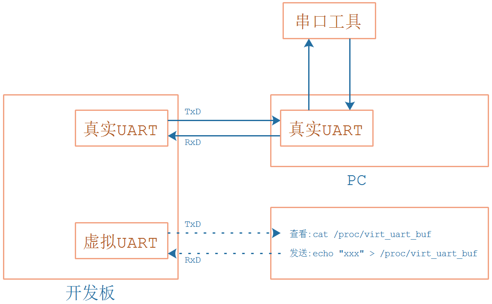

## 编写虚拟UART驱动程序\_实现uart_ops

* 参考代码

  ```shell
  硬件相关：
  drivers/tty/serial/imx.c
  drivers/tty/serial/stm32-usart.c
  
  串口核心层：
  drivers/tty/serial/serial_core.c
  
  TTY层:
  drivers/tty/tty_io.c
  ```

  

* 本节课程源码在GIT仓库里

  ```shell
  doc_and_source_for_drivers\IMX6ULL\source\09_UART
  	05_virtual_uart_driver_uart_ops
  doc_and_source_for_drivers\STM32MP157\source\A7\09_UART
  	05_virtual_uart_driver_uart_ops
  ```
  
  

### 1. 虚拟UART的驱动组成




### 2. 虚拟UART的数据流程



为了做实验，我们还要创建一个虚拟文件：/proc/virt_uart_buf

* 要发数据给虚拟串口时，执行：echo "xxx" > /proc/virt_uart_buf
* 要读取虚拟串口的数据时，执行：cat /proc/virt_uart_buf


### 3. 编写uart_ops

