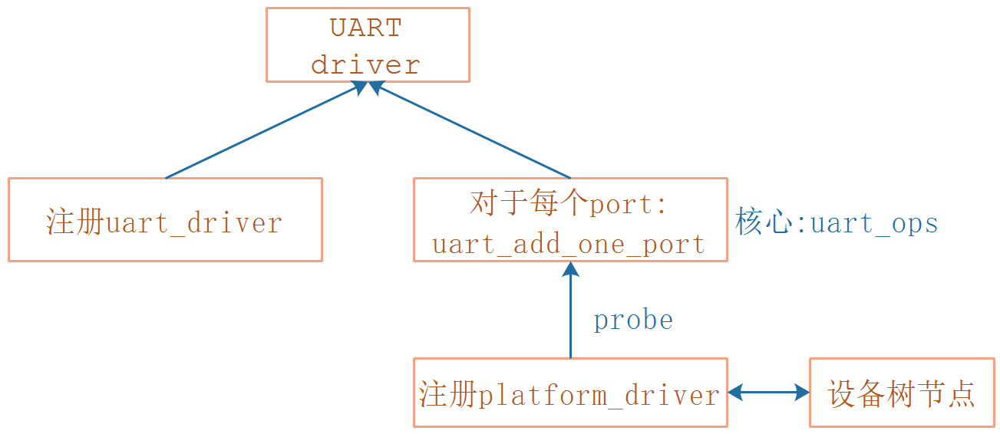
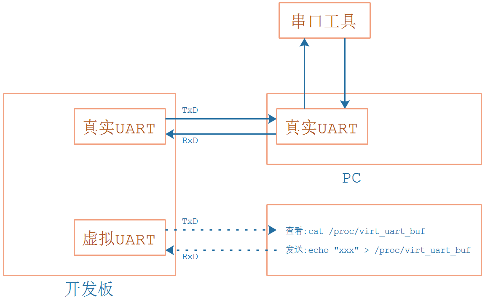

## 编写虚拟UART驱动程序\_实现数据传输

* 参考代码

  ```shell
  硬件相关：
  drivers/tty/serial/imx.c
  drivers/tty/serial/stm32-usart.c
  
  串口核心层：
  drivers/tty/serial/serial_core.c
  
  TTY层:
  drivers/tty/tty_io.c
  ```

  

* 本节课程源码在GIT仓库里

  ```shell
  doc_and_source_for_drivers\IMX6ULL\source\09_UART
  	06_virtual_uart_driver_txrx
  doc_and_source_for_drivers\STM32MP157\source\A7\09_UART
  	06_virtual_uart_driver_txrx
  ```
  
  

### 1. 虚拟UART的驱动组成




### 2. 虚拟UART的数据流程



为了做实验，我们还要创建一个虚拟文件：/proc/virt_uart_buf

* 要发数据给虚拟串口时，执行：echo "xxx" > /proc/virt_uart_buf
* 要读取虚拟串口的数据时，执行：cat /proc/virt_uart_buf


### 3. 实现/proc文件

参考`/proc/cmdline`，怎么找到它对应的驱动？在Linux内核源码下执行以下命令搜索：

```shell
grep "cmdline" * -nr | grep proc
```

得到：

```shell
fs/proc/cmdline.c:26:   proc_create("cmdline", 0, NULL, &cmdline_proc_fops);
```


### 4. 触发中断

使用如下函数：

```c
int irq_set_irqchip_state(unsigned int irq, enum irqchip_irq_state which,
			  bool val);
```

怎么找到它的？在中断子系统中，我们知道往GIC寄存器GICD_ISPENDRn写入某一位就可以触发中断。内核代码中怎么访问这些寄存器？
在`drivers\irqchip\irq-gic.c`中可以看到irq_chip中的"irq_set_irqchip_state"被用来设置中断状态：

```c
static struct irq_chip gic_chip = {
	.irq_mask		= gic_mask_irq,
	.irq_unmask		= gic_unmask_irq,
	.irq_eoi		= gic_eoi_irq,
	.irq_set_type		= gic_set_type,
	.irq_get_irqchip_state	= gic_irq_get_irqchip_state,
	.irq_set_irqchip_state	= gic_irq_set_irqchip_state, /* 2. 继续搜"irq_set_irqchip_state" */
	.flags			= IRQCHIP_SET_TYPE_MASKED |
				  IRQCHIP_SKIP_SET_WAKE |
				  IRQCHIP_MASK_ON_SUSPEND,
};

static int gic_irq_set_irqchip_state(struct irq_data *d,
				     enum irqchip_irq_state which, bool val)
{
	u32 reg;

	switch (which) {
	case IRQCHIP_STATE_PENDING:
		reg = val ? GIC_DIST_PENDING_SET : GIC_DIST_PENDING_CLEAR; /* 1. 找到寄存器 */
		break;

	case IRQCHIP_STATE_ACTIVE:
		reg = val ? GIC_DIST_ACTIVE_SET : GIC_DIST_ACTIVE_CLEAR;
		break;

	case IRQCHIP_STATE_MASKED:
		reg = val ? GIC_DIST_ENABLE_CLEAR : GIC_DIST_ENABLE_SET;
		break;

	default:
		return -EINVAL;
	}

	gic_poke_irq(d, reg);
	return 0;
}
```


继续搜"irq_set_irqchip_state"，在`drivers\irqchip\irq-gic.c`中可以看到：

```c
int irq_set_irqchip_state(unsigned int irq, enum irqchip_irq_state which,
			  bool val)
{
    ......
}

EXPORT_SYMBOL_GPL(irq_set_irqchip_state);
```


以后就可与使用如下代码触发某个中断：

```c
irq_set_irqchip_state(irq, IRQCHIP_STATE_PENDING, 1);
```

