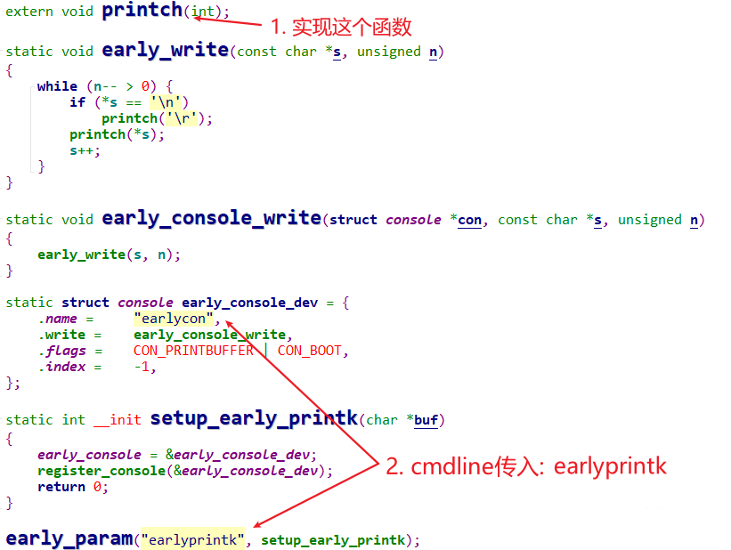

## early_printk和earlycon

* 参考代码

  * Linux 4.9.88
  
    ```shell
    arch\arm\kernel\early_printk.c
    drivers\tty\serial\earlycon.c
    ```
    
    
  
  * Linux 5.4
  
    ```shell
    arch\arm\kernel\early_printk.c
    drivers\tty\serial\earlycon.c
    ```
  
  
  

### 1.  回顾printk的使用


### 2. 内核信息的早期打印

在上节视频里我们实现了console驱动，它属于uart_driver的一部分。

注册了uart_driver、并调用uart_add_one_port后，它里面才注册console，在这之后才能使用printk。

如果想更早地使用printk函数，比如在安装UART驱动之前就使用printk，这时就需要自己去注册console。

更早地、单独地注册console，有两种方法：

* early_printk：自己实现write函数，不涉及设备树，简单明了
* earlycon：通过设备树传入硬件信息，跟内核中驱动程序匹配

earlycon是新的、推荐的方法，在内核已经有驱动的前提下，通过设备树或cmdline指定寄存器地址即可。

### 3. early_printk

源码为：`arch\arm\kernel\early_printk.c`，要使用它，必须实现这几点：

* 配置内核，选择：CONFIG_EARLY_PRINTK
* 内核中实现：printch函数
* cmdline中添加：earlyprintk




### 4. earlycon

#### 4.1 提供硬件信息的2种方法

earlycon就是early console的意思，实现的功能跟earlyprintk是一样的，只是更灵活。

我们知道，对于console，最主要的是里面的write函数：它不使用中断，相对简单。

所以很多串口console的write函数，只要确定寄存器的地址就很容易实现了。

假设芯片的串口驱动程序，已经在内核里实现了，我们需要根据板子的配置给它提供寄存器地址。

怎么提供？

* 设备树
* cmdline参数


#### 4.2 设置write函数

在Linux内核中，已经有完善的earlycon驱动程序，它们使用OF_EARLYCON_DECLARE宏来定义：


问题在于，使用哪一个？

* 如果cmdline中只有"earlycon"，不带更多参数：对应`early_init_dt_scan_chosen_stdout`函数

  * 使用"/chosen"下的"stdout-path"找到节点

  * 或使用"/chosen"下的"linux,stdout-path"找到节点

  * 节点里有"compatible"和"reg"属性

    * 根据"compatible"找到`OF_EARLYCON_DECLARE`，里面有setup函数，它会提供write函数
    * write函数写什么寄存器？在"reg"属性里确定

* 如果cmdline中"earlycon=xxx"，带有更多参数：对应`setup_earlycon`函数

  * earlycon=xxx格式为：

    ```shell
  <name>,io|mmio|mmio32|mmio32be,<addr>,<options>
    <name>,0x<addr>,<options>
    <name>,<options>
    <name>
    ```
  
  * 根据"name"找到`OF_EARLYCON_DECLARE`，里面有setup函数，它会提供write函数
  
  * write函数写什么寄存器？在"addr"参数里确定
  
    
  
#### 4.3 register_console

  

​    

​    