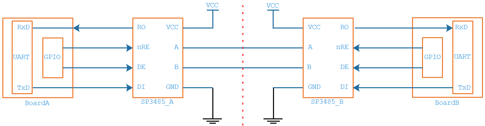
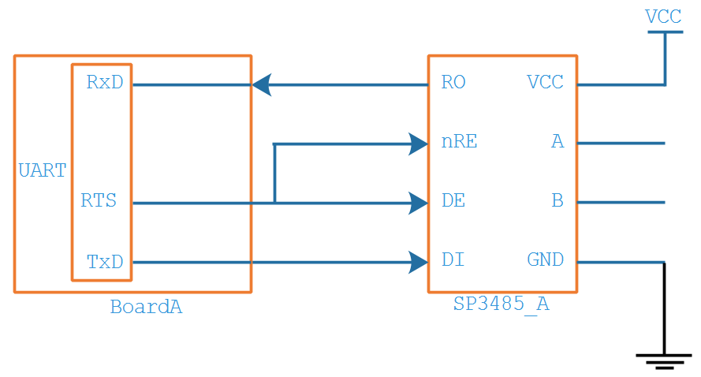
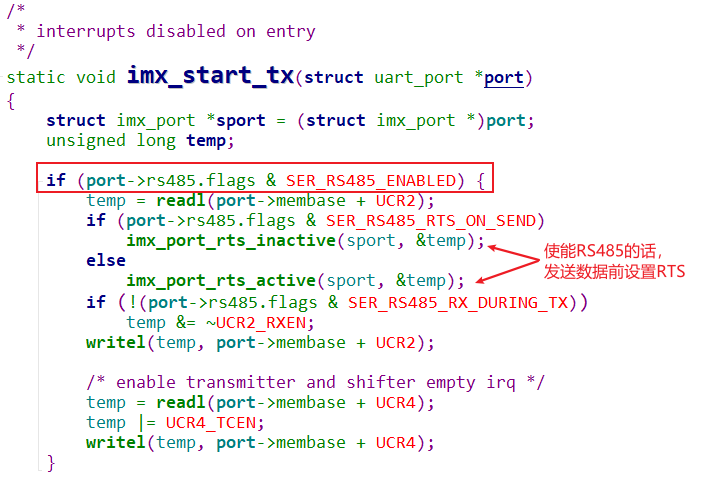
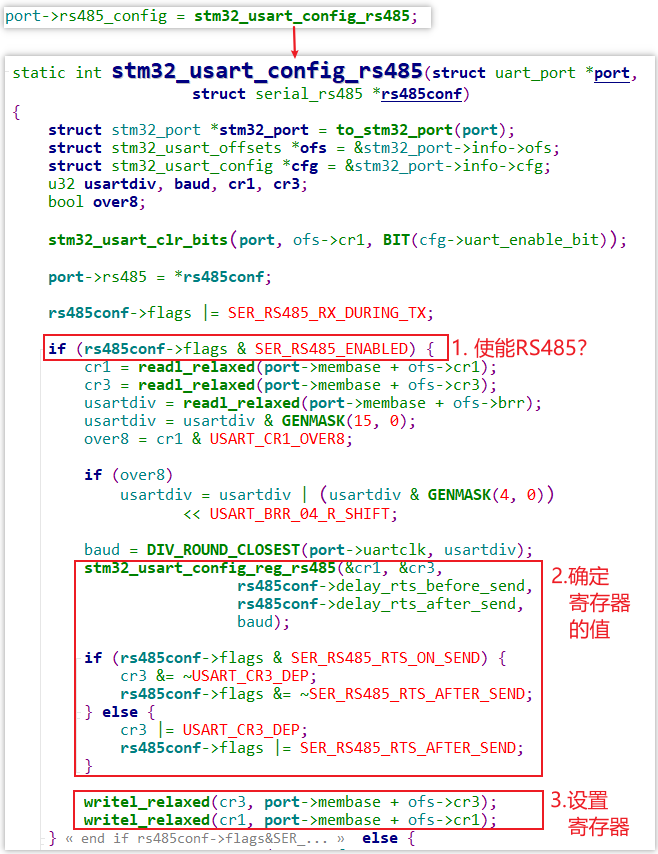
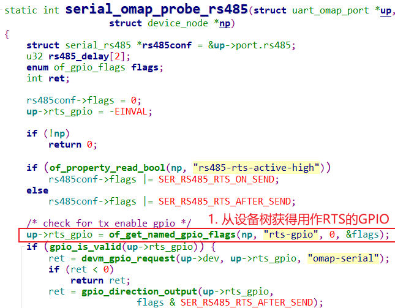
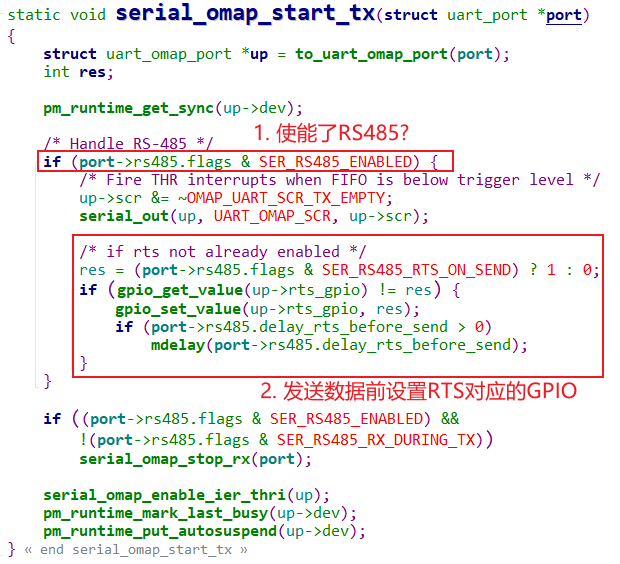

## RS485简单讲解

* 参考代码

  * Linux 4.9.88
  
    ```shell
    Documentation\serial\serial-rs485.txt
    ```
    
  * Linux 5.4
  
    ```shell
    Documentation\driver-api\serial\serial-rs485.rst
    ```
  
  
  

### 1.  RS485线路图

RS485使用A、B两条差分线传输数据：

* 要发送数据时
  * 把SP3485的DE(Driver output Enable)引脚设置为高
  * 通过TxD引脚发送`1`给SP3485，SP3485会驱动A、B引脚电压差为`+2~+6V`
  * 通过TxD引脚发送`0`给SP3485，SP3485会驱动A、B引脚电压差为`-6~-2V`
  * SP3485自动把TxD信号转换为AB差分信号
  * 对于软件来说，通过RS485发送数据时，跟一般的串口没区别，只是多了DE引脚的设置
* 要读取数据时
  * 把SP3485的nRE(Receiver Output Enable)引脚设置为低
  * SP3485会根据AB引脚的电压差驱动RO为1或0
  * RO的数据传入UART的RxD引脚
  * 对于软件来说，通过RS485读取数据时，跟一般的串口没区别，只是多了nRE引脚的设置
* nRE和DE使用同一个引脚时，可以简化成这样：
  * 发送：设置DE为高，发送，设置DE为低
  * 接收：无需特殊设置



### 2. RS485应用编程

#### 2.1 标准用法

在Linux的串口驱动中，它已经支持RS485，可以使用RTS引脚控制RS485芯片的DE引脚，分两种情况

* 有些UART驱动：使用UART的RTS引脚
* 有些UART驱动：使用GPIO作为RTS引脚，可以通过设备树指定这个GPIO



在使用RS485发送数据前，把RTS设置为高电平就可以。

通过`serial_rs485`结构体控制RTS，示例代码如下：

```c
#include <linux/serial.h>

/* 用到这2个ioctl: TIOCGRS485, TIOCSRS485 */
#include <sys/ioctl.h>

struct serial_rs485 rs485conf;

/* 打开串口设备 */
int fd = open ("/dev/mydevice", O_RDWR);
if (fd < 0) {
	/* 失败则返回 */
    return -1;
}

/* 读取rs485conf */
if (ioctl (fd, TIOCGRS485, &rs485conf) < 0) {
	/* 处理错误 */
}

/* 使能RS485模式 */
rs485conf.flags |= SER_RS485_ENABLED;

/* 当发送数据时, RTS为1 */
rs485conf.flags |= SER_RS485_RTS_ON_SEND;

/* 或者: 当发送数据时, RTS为0 */
rs485conf.flags &= ~(SER_RS485_RTS_ON_SEND);

/* 当发送完数据后, RTS为1 */
rs485conf.flags |= SER_RS485_RTS_AFTER_SEND;

/* 或者: 当发送完数据后, RTS为0 */
rs485conf.flags &= ~(SER_RS485_RTS_AFTER_SEND);

/* 还可以设置: 
 * 发送数据之前先设置RTS信号, 等待一会再发送数据
 * 等多久? delay_rts_before_send(单位ms)
 */
rs485conf.delay_rts_before_send = ...;

/* 还可以设置: 
 * 发送数据之后, 等待一会再清除RTS信号
 * 等多久? delay_rts_after_send(单位ms)
 */
rs485conf.delay_rts_after_send = ...;

/* 如果想在发送RS485数据的同时也接收数据, 还可以这样设置 */
rs485conf.flags |= SER_RS485_RX_DURING_TX;

if (ioctl (fd, TIOCSRS485, &rs485conf) < 0) {
	/* 处理错误 */
}

/* 使用read()和write()就可以读、写数据了 */

/* 关闭设备 */
if (close (fd) < 0) {
	/* 处理错误 */
}
```


#### 2.2 自己控制引脚

发送之前，自己设置GPIO控制DE引脚。


### 3. 驱动速览

#### 3.1 IMX6ULL

源码为：`Linux-4.9.88\drivers\tty\serial\imx.c`：




#### 3.2 STM32MP157

源码为：`Linux-5.4\drivers\tty\serial\stm32-usart.c`。

STM32MP157的UART功能强大，可以配置它：

* 发送数据时自动设置RTS信号
* 设置时间值：RTS使能后过多久发送数据，发送完数据后过多久取消RTS
* 配置好后，在发送RS485数据时就不需要显示地控制RTS了




#### 3.3 使用GPIO的RS485驱动

这里只是举个例子。

源码为：`Linux-4.9.88\drivers\tty\serial\omap-serial.c`。

##### 1. 从设备树获得用作RTS的GPIO




##### 2. 发送数据前设置GPIO

