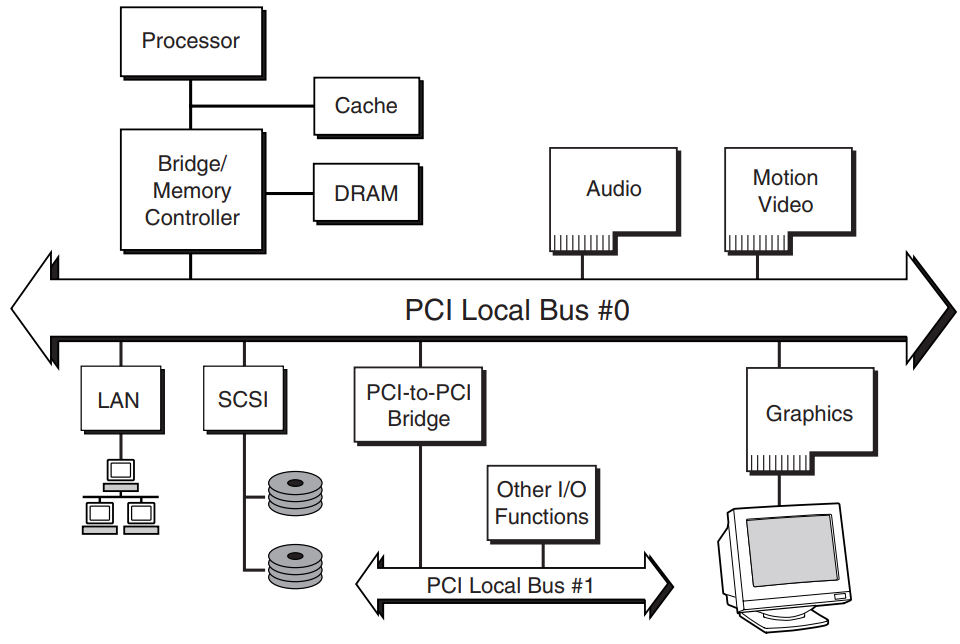
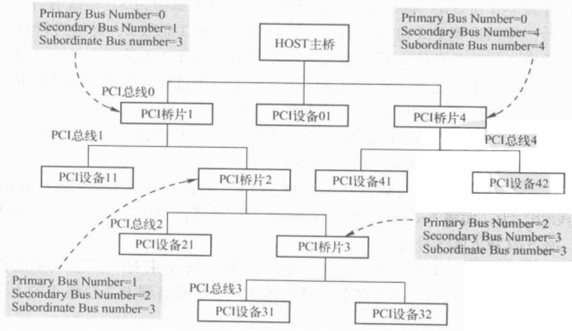
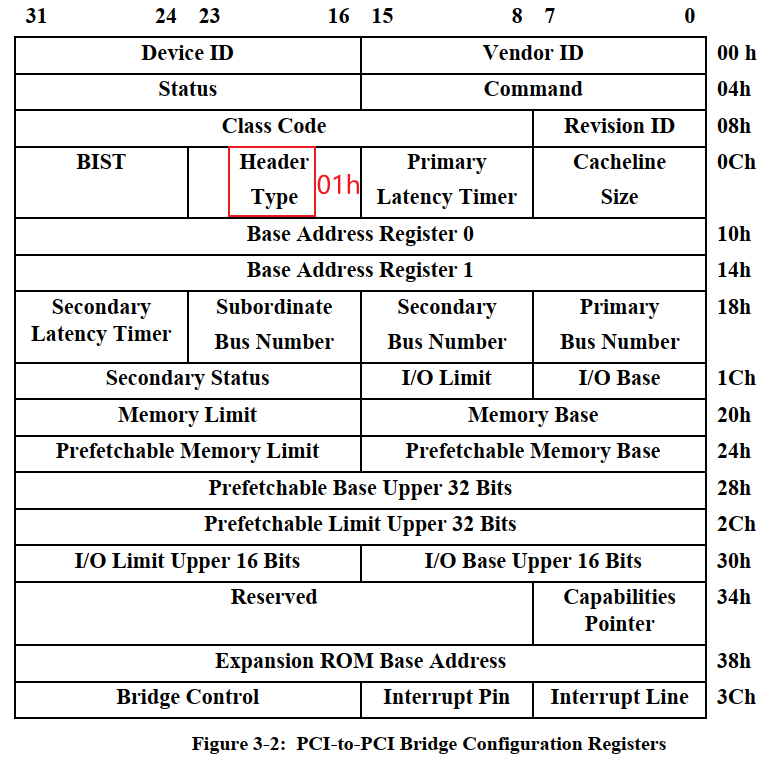

## PCI设备的访问方法_桥设备(type1)

参考资料：

* GIT仓库

```shell
doc_and_source_for_drivers\IMX6ULL\doc_pic\10_PCI_PCIe\
	01_pci接口引脚电路示例.pdf
	
	协议\PCI\
		PCI_SPEV_V3_0.pdf
		pci-pci_bridge.pdf

	芯片手册\PCI-UART\MCS9865.pdf
```

* 《PCI EXPRESS体系结构导读 (王奇)》


### 1. 硬件结构

PCI系统框图：



怎么访问到某个PCI设备？

需要理解PCI本地总线信号。


### 2. PCI设备类别及配置方法

PCI设备可以简单地分为PCI Agent、PCI Bridge、Cardbus Bridge：

* PCI Agent：真正的PCI设备(比如网卡)，是PCI树的最末端
* PCI Bridge：桥，用来扩展PCI设备，必定有一个Root Bridge，下面还可以有其他Bridge。
* Cardbus Bridge：用得不多，不介绍

怎么判读设备的类别？设备的配置空间里有`Header Type`，它的取值有：

* 00h：PCI Agent
* 01h：PCI Bridge
* 02h：Cardbus Bridge


#### 2.2 配置设备时怎么选中它

* 跟Root Bridge直接相连的PCI Agent、PCI Bridge，使用`Configuration Command type 0`
  

* 桥之后的设备，Root Brdige使用`Configuration Command type 1`
  

* 桥：接收到`Configuration Command type 1`后，有2个选择
  * 对于跟它直连的PCI Agent
    * 把`Configuration Command type 1`转换为`Configuration Command type 1`
    * 使用IDSEL选择设备
  * 如果还需要通过下一级的桥才能访问此设备
    * 转发`Configuration Command type 1`


### 3. 配置示例

#### 3.1 示例：配置PCI Agent设备

* 选中：通过IDSEL来选中某个设备

* 怎么访问配置空间：发起一个type 0的配置命令

  * PCI设备最多有8个功能，每个功能都有自己的配置空间(配置寄存器)
  * 你要访问哪个功能？哪个寄存器？发起
    

* CPU读取配置空间的BAR，得知：这个PCI设备想申请多大空间

* CPU分配PCI地址，写到PCI设备的BAR里


PCI Agent设备的配置空间：


#### 3.2 示例：配置PCI桥

* 跟一般的PCI设备一样，通过IDSEL来选中它
* 通过type 0配置命令读取配置空间，发现它是PCI桥设备，把分配的总线号写给它



PCI桥的配置空间：




#### 3.3 示例：配置PCI桥后面的设备

* 发起一个type 1的配置命令
  

* 通过Bus Number访问到PCI桥
* PCI桥根据Device Number去驱动IDSEL，选中下一级的PCI设备
* 通过Function Number、Register Number访问PCI设备的配置空间


### 4. 访问PCI设备

* CPU发出addr_cpu，被PCI Host桥转换为addr_pci
* 某个PCI设备发现这个addr_pci是自己的，就驱动DEVSEL#，表示说：是我是我
* PCI设备参与传输：接收数据、返回数据


