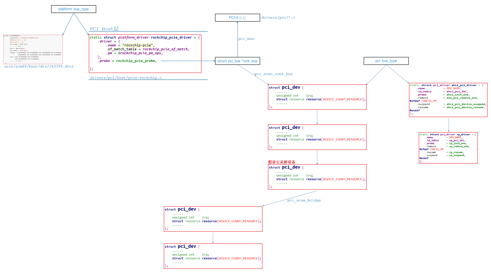

## PCI驱动程序框架

参考资料：

* 《PCI Express Technology 3.0》，Mike Jackson, Ravi Budruk; MindShare, Inc.
* [《PCIe扫盲系列博文》](http://blog.chinaaet.com/justlxy/p/5100053251)，作者Felix，这是对《PCI Express Technology》的理解与翻译
* 《PCI EXPRESS体系结构导读 (王齐)》
* 《PCI Express_ Base Specification Revision 4.0 Version 0.3 ( PDFDrive )》
* 《NCB-PCI_Express_Base_5.0r1.0-2019-05-22》
* [SOC中AXI总线是如何连接的](https://zhuanlan.zhihu.com/p/157137488)
* [AXI总线整理总结](https://blog.csdn.net/tristan_tian/article/details/89393045)
* [PCIe中MSI和MSI-X中断机制](https://blog.csdn.net/pieces_thinking/article/details/119431791)

开发板资料：

* https://wiki.t-firefly.com/zh_CN/ROC-RK3399-PC-PLUS/


### 1. PCI驱动框架




### 2. RK3399驱动

怎么找到驱动？

* 在内核目录下根据芯片名字找到文件：`drivers\pci\host\pcie-rockchip.c`

  * 看到如下代码：

    ```c
    static const struct of_device_id rockchip_pcie_of_match[] = {
    	{ .compatible = "rockchip,rk3399-pcie", },
    	{}
    };
    ```

* 在内核`arch/arm64/boot/dts`下搜：`grep "rockchip,rk3399-pcie" * -nr`

  * 找到设备树文件：`arch/arm64/boot/dts/rk3399.dtsi`，代码如下：

    ```shell
            pcie0: pcie@f8000000 {
                    compatible = "rockchip,rk3399-pcie";
                    #address-cells = <3>;
                    #size-cells = <2>;
                    bus-range = <0x0 0x1f>;
                    ...... /* 省略 */
                    phys = <&pcie_phy>;
                    phy-names = "pcie-phy";
                    ranges = <0x83000000 0x0 0xfa000000 0x0 0xfa000000 0x0 0x1e00000
                              0x81000000 0x0 0xfbe00000 0x0 0xfbe00000 0x0 0x100000>;
                    reg = <0x0 0xf8000000 0x0 0x2000000>,
                          <0x0 0xfd000000 0x0 0x1000000>;
                    ...... /* 省略 */
              };
    ```

