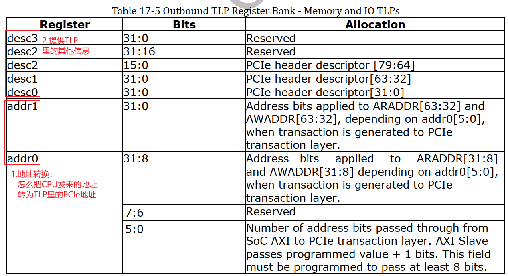

## RK3399_PCIe芯片手册解读

参考资料：

* 《PCI Express Technology 3.0》，Mike Jackson, Ravi Budruk; MindShare, Inc.
* [《PCIe扫盲系列博文》](http://blog.chinaaet.com/justlxy/p/5100053251)，作者Felix，这是对《PCI Express Technology》的理解与翻译
* 《PCI EXPRESS体系结构导读 (王齐)》
* 《PCI Express_ Base Specification Revision 4.0 Version 0.3 ( PDFDrive )》
* 《NCB-PCI_Express_Base_5.0r1.0-2019-05-22》
* [SOC中AXI总线是如何连接的](https://zhuanlan.zhihu.com/p/157137488)
* [AXI总线整理总结](https://blog.csdn.net/tristan_tian/article/details/89393045)
* [PCIe中MSI和MSI-X中断机制](https://blog.csdn.net/pieces_thinking/article/details/119431791)

开发板资料：

* 芯片手册：Rockchip RK3399TRM V1.3 Part2.pdf 《Chapter 17 PCIe Controller》

  ```shell
  doc_and_source_for_drivers\IMX6ULL\doc_pic\
  	10_PCI_PCIe\芯片手册\RK3399
  		Rockchip RK3399TRM V1.3 Part2.pdf
  ```

* https://wiki.t-firefly.com/zh_CN/ROC-RK3399-PC-PLUS/

AXI相关：

* ug1037-vivado-axi-reference-guide.pdf

  ```shell
  doc_and_source_for_drivers\IMX6ULL\doc_pic\10_PCI_PCIe\协议\AXI
  	ug1037-vivado-axi-reference-guide.pdf
  ```

* [AXI总线你需要知道的事儿](https://zhuanlan.zhihu.com/p/96804919)

* [AXI总线整理总结](https://blog.csdn.net/tristan_tian/article/details/89393045)

* [AMBA、AHB、APB、AXI总线介绍及对比](https://zhuanlan.zhihu.com/p/161077476)	

### 1. AXI总线

#### 1.1 连接方式

我们一直使用这个图来简化CPU与外设之间的连接：


实际芯片中，CPU与外设之间的连接更加复杂，高速设备之间通过AXI总线连接。AXI总线总传输数据的双方分为Master和Slave，Master发起传输，Slave回应传输。Master和Slave是多对多的关系，它们之间读、写可以同时进行的，内部结构图如下：


#### 1.2 五个通道

 在AXI总线中，读写可以同时进行，有5个通道：

* 读：
  * 读地址通道：传输读操作的地址
  * 读数据通道：传输读到的数据
* 写：
  * 写地址通道：传输写操作的地址
  * 写数据通道：传输要写的数据
  * 写响应通道：传输写操作的结果


| 通道名称       | 通道功能                               | 数据流向   |
| -------------- | -------------------------------------- | ---------- |
| read address   | 读地址通道                             | 主机->从机 |
| read data      | 读数据通道（包括数据通道和读响应通道） | 从机->主机 |
| write address  | 写地址通道                             | 主机->从机 |
| write data     | 写数据通道                             | 主机->从机 |
| write response | 写响应通道                             | 从机->主机 |


#### 1.3 信号线

我们只列出本节视频关心的信号线：

| 信号   | AXI4                             | AXI4-Lite                        |
| ------ | -------------------------------- | -------------------------------- |
| AWADDR | 写地址通道：地址线，最多可达64位 | 写地址通道：地址线，最多可达64位 |
| WDATA  | 写数据通道：数据线，32~1024位    | 写数据通道：数据线，32位         |
| ARADDR | 读地址通道：地址线，最多可达64位 | 读地址通道：地址线，最多可达64位 |
| RDATA  | 读数据通道：数据线，32~1024位    | 写数据通道：数据线，32位         |


#### 1.4 PCIe控制器

RK3399的PCIe控制器就是挂在AXI总线上，在芯片手册中可以看到：

* AWADDR：AXI总线的写地址通道地址线，简单理解就是CPU要写PCIe控制器时发出的地址线
* ARADDR ：AXI总线的读地址通道地址线，简单理解就是CPU要读PCIe控制器时发出的地址线


### 2. 地址空间和寄存器介绍

#### 2.1 想达到的目的

使用PCIe时，我们编程时想达到这个目的：

* CPU读写某个地址，就可以读写某个PCIe设备的配置空间：
  

* CPU读写某个地址，就可以读写某个PCIe设备的内存、寄存器：
  


简单地说，就是把CPU发出的addr，转换为右边的TLP头部：PCI地址、头部的其他信息。

这涉及两部分：

* 怎么把CPU地址转换为PCI地址
* 怎么提供TLP头部信息中的其他部分


#### 2.2 地址空间

RK3399访问PCIe控制器时，CPU地址空间可以分为：

* Client Register Set：地址范围 0xFD000000~0xFD7FFFFF，比如选择PCIe协议的版本(Gen1/Gen2)、电源控制等
* Core Register Set  ：地址范围 0xFD800000~0xFDFFFFFF，所谓核心寄存器就是用来进行设置地址映射的寄存器等
* Region 0：0xF8000000~0xF9FFFFFF , 32MB，用于访问外接的PCIe设备的配置空间
* Region 1：0xFA000000~0xFA0FFFFF，1MB，用于地址转换
* Region 2：0xFA100000~0xFA1FFFFF，1MB，用于地址转换
* ……
* Region 32：0xFBF00000~0xFBFFFFFF，1MB，用于地址转换

其中Region 0大小为32MB，Region1~31大小分别为1MB。


CPU访问Region 0的地址时，将会导致PCIe控制器发出读写配置空间的TLP。

CPU访问Region 1~32的地址时，将会导致PCIe控制器发出读写内存、IO空间的TLP。


#### 2.3 寄存器介绍

 CPU访问一个地址，导致PCIe控制器发出TLP。TLP里含有PCIe地址、其他信息。

这些寄存器必定涉及这2部分：

* 地址转换：把CPU地址转换为PCIe地址
* 提供TLP的其他信息

Region0、Region1~32，每个Region都有类似的寄存器。

一个Region，可以用于读写配置空间，可以用于读写内存空间、可以用于读写IO空间，还可以用于读写消息。

这由Region对应的寄存器决定。

每个Region都有一样寄存器，以Region 0为例，有6个寄存器：


CPU访问某个Region时，它是想干嘛？

* 读写配置空间、发出对应TLP？
* 读写内存空间、发出对应TLP？
* 读写IO空间、发出对应TLP？
* 读写消息、发出对应TLP？

到底是发出哪种TLP，由Region对应的ob_desc0寄存器决定：

| ob_desc0[3:0] | 作用                                |
| ------------- | ----------------------------------- |
| 1010          | 发出的TLP用于访问Type 0的配置空间   |
| 1011          | 发出的TLP用于访问Type 1的配置空间   |
| 0010          | 发出的TLP用于读写内存空间           |
| 0110          | 发出的TLP用于读写IO空间             |
| 1100          | 发出的TLP是"Normal Message"         |
| 1101          | 发出的TLP是"Vendor-Defined Message" |


CPU访问某个Region时，最终都是要发出TLP，TLP的内容怎么确定？

* 地址信息：ob_addr0/1把CPU地址转换为PCIe地址，提供TLP里面的地址信息

* 其他信息：ob_desc0/1/2/3提供TLP的其他信息

  

##### 2.3.1 用于配置空间

Region0一般用于读写配置空间，它对应的寄存器如下：


##### 2.3.2 用于内存和IO




### 3. 访问示例

#### 3.1 配置空间读写示例

要读写设备的配置空间，首先要定位：Bus/Dev/Function/Reg：


怎么发出这些"Bus/Dev/Function/Register"信息？如下图所示：


当Region 0的寄存器ob_desc0[3:0]被配置为读写配置空间时， CPU发出Region 0的地址，地址里面隐含有这些信息：

* Bus：cpu_addr[27:20]
* Dev：cpu_addr[19:15]
* Fun：cpu_addr[14:12]
* Reg：cpu_addr[11:0]


使用过程步骤如下。

##### 3.1.1 配置Region 0用于读写配置空间


##### 3.1.2 配置Region 0地址转换

比如我们可以设置bit[5:0]为27，意味着cpu_addr[27:0]这28条地址线都会传入TLP。


##### 3.1.3 CPU读写Region 0的地址

Region 0的地址范围是：0xF8000000~0xF9FFFFFF。

CPU想访问这个设备：Bus=bus,Dev=dev,Fun=fun,Reg=reg，那么CPU读写这个地址即可：

```shell
0xF8000000 + (bus<<20) | (dev<<15) | (fun<<12) | (reg)
```


#### 3.2 MEM/IO读写示例


##### 3.2.1 配置Region 1用于内存读写


##### 3.2.2 配置Region 1地址转换


addr0、addr1寄存器里保存的是PCIe地址，也就是CPU发出这个Region的CPU地址后，将会转换为某个PCI地址。

怎么转换？由addr0、addr1决定。

Region 1的CPU地址范围是：0xFA000000~0xFA0FFFFF，是1M空间。

我们一般会让PCI地址等于CPU地址，所以这样设置：

* addr0：
  * [5:0]等于19，表示CPU_ADDR[19:0]共20位地址传入TLP
  * [31:8]等于0xFA0000
* addr1：设置为0


如上设置后，CPU读写地址时0xFA0?????，就会转换为PCI地址：0xFA0?????，转换过程如下：

```shell
pci_addr = cpu_addr[19:0] | (addr0[31:20] << 20) | (addr1<<32)
         = 0x????? + (0xFA0 << 20) | (0 << 32)
         = 0xFA0?????
```


