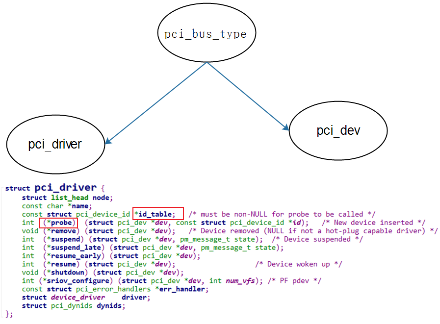
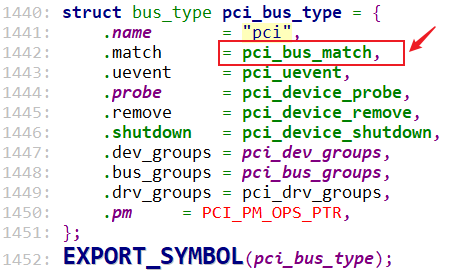
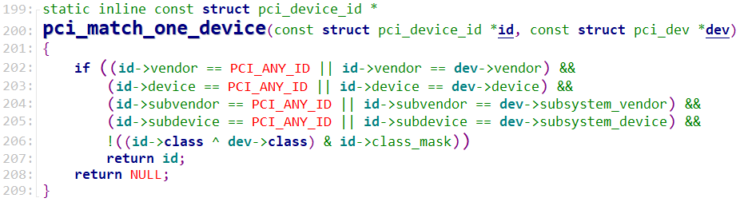
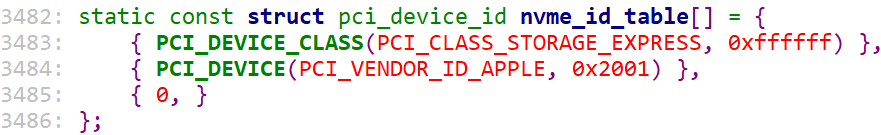
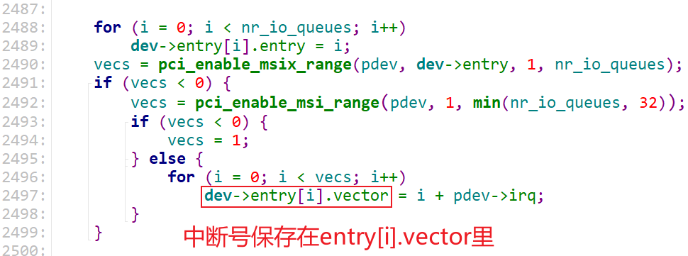
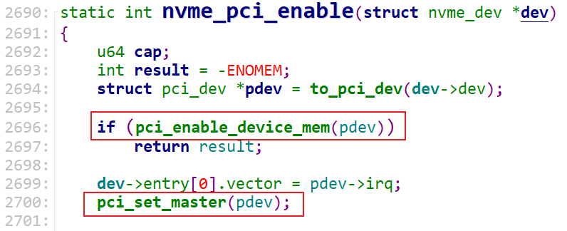

## 怎么编写PCIe设备驱动程序

参考内核文件：

* `Documentation\PCI\MSI-HOWTO.txt`
* `drivers\nvme\host\pci.c`


### 1. PCI总线设备驱动模型




PCI总线设备驱动模型：

* 右边是pci_dev，由PCIe控制器的驱动程序扫描PCIe总线，识别出设备，并构造、注册pci_dev
  * pci_dev结构体含有丰富的信息，比如vid、pid、class、已经分配得到的mem/io资源、INTx中断资源
* 左边是PCIe设备驱动程序pci_driver，需要我们编写、注册
  * 使用函数pci_register_driver来注册
  * pci_driver结构体里含有id_table，表示它能支持哪些设备
  * pci_driver结构体里含有probe函数，表示发现能匹配的pci_dev后，这个probe函数将被调用

怎么判断pci_driver和pci_dev是否匹配？使用如下图所示函数：



`pci_bus_match`核心代码如下：

```c
pci_bus_match
    found_id = pci_match_device(pci_drv, pci_dev);
			found_id = pci_match_id(drv->id_table, dev);
				pci_match_one_device(ids, dev)
```




示例，下图表示支持这样的pci_dev：

* pci_dev的class & 0xffffff == PCI_CLASS_STORAGE_EXPRESS
* pci_dev的VID为PCI_VENDOR_ID_APPLE、DID为0x2001




### 2. 获得PCIe设备的资源

PCIe控制器扫描出PCIe设备后，会为这个设备分配资源、并记录在对应的pci_dev里：

* struct resource resource[DEVICE_COUNT_RESOURCE]：含有mem/io资源
* irq：含有INTx中断号

#### 2.1 获得内存/IO空间

参考代码：`kernel\drivers\scsi\3w-9xxx.c`


判断资源类型，参考代码：


#### 2.2 获得中断号

##### 2.2.1 获得INTx中断号

直接使用pci_dev->irq。


##### 2.2.2 获得MSI-X/MSI中断号

参考代码：`drivers\nvme\host\pci.c`




### 3. 使能设备

参考代码：`drivers\nvme\host\pci.c`



