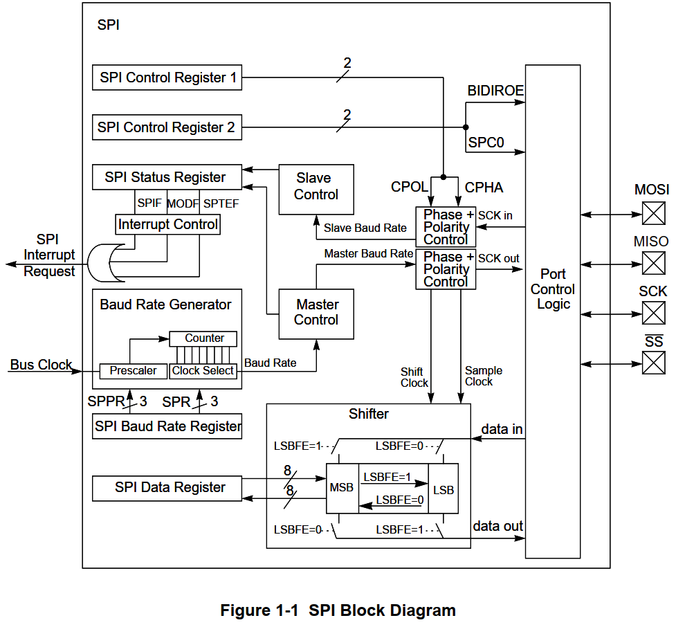
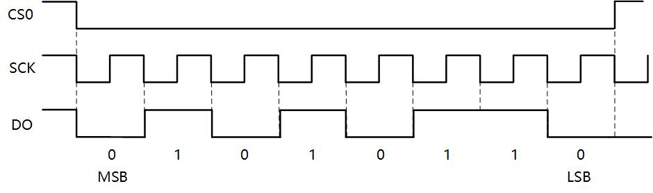

# SPI协议介绍 #

参考资料：

* 《SPI Block Guide V04.01.pdf》
* 《S3C2440A_UserManual_Rev13.pdf》

## 1. SPI硬件知识

### 1.1 硬件连线

引脚含义如下：

| 引脚     | 含义                                                         |
| -------- | ------------------------------------------------------------ |
| DO(MOSI) | Master Output, Slave Input， SPI主控用来发出数据，SPI从设备用来接收数据 |
| DI(MISO) | Master Input, Slave Output， SPI主控用来发出数据，SPI从设备用来接收数据 |
| SCK      | Serial Clock，时钟                                           |
| CS       | Chip Select，芯片选择引脚                                    |

### 1.2 SPI控制器内部结构

这个图等我们看完后面的SPI协议，再回过头来讲解：

## 2. SPI协议

### 2.1 传输示例

假设现在主控芯片要传输一个0x56数据给SPI Flash，时序如下：

首先CS0先拉低选中SPI Flash，0x56的二进制就是0b0101 0110，因此在每个SCK时钟周期，DO输出对应的电平。
SPI Flash会在每个时钟周期的上升沿读取D0上的电平。

### 2.2 SPI模式

在SPI协议中，有两个值来确定SPI的模式。
CPOL:表示SPICLK的初始电平，0为电平，1为高电平
CPHA:表示相位，即第一个还是第二个时钟沿采样数据，0为第一个时钟沿，1为第二个时钟沿

| CPOL | CPHA | 模式 |                      含义                      |
| :--: | :--: | :--: | :--------------------------------------------: |
|  0   |  0   |  0   | SPICLK初始电平为低电平，在第一个时钟沿采样数据 |
|  0   |  1   |  1   | SPICLK初始电平为低电平，在第二个时钟沿采样数据 |
|  1   |  0   |  2   | SPICLK初始电平为高电平，在第一个时钟沿采样数据 |
|  1   |  1   |  3   | SPICLK初始电平为高电平，在第二个时钟沿采样数据 |
我们常用的是模式0和模式3，因为它们都是在上升沿采样数据，不用去在乎时钟的初始电平是什么，只要在上升沿采集数据就行。

极性选什么？格式选什么？通常去参考外接的模块的芯片手册。比如对于OLED，查看它的芯片手册时序部分：

SCLK的初始电平我们并不需要关心，只要保证在上升沿采样数据就行。